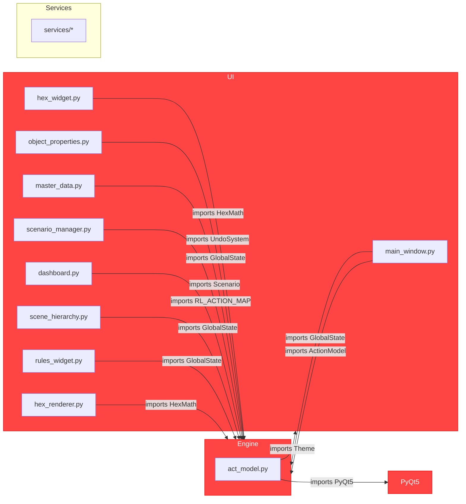
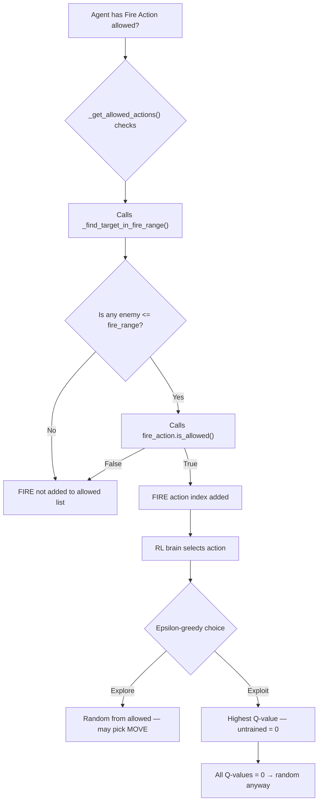
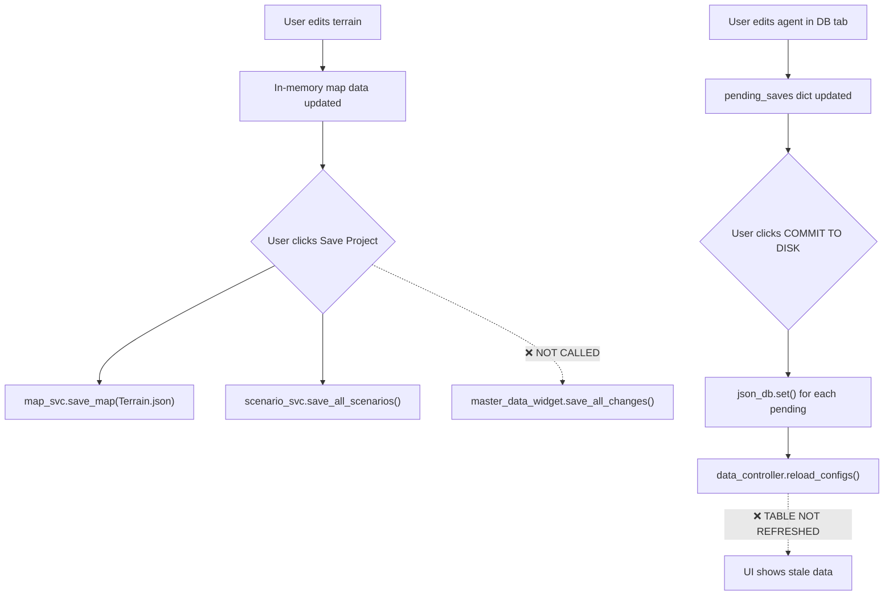
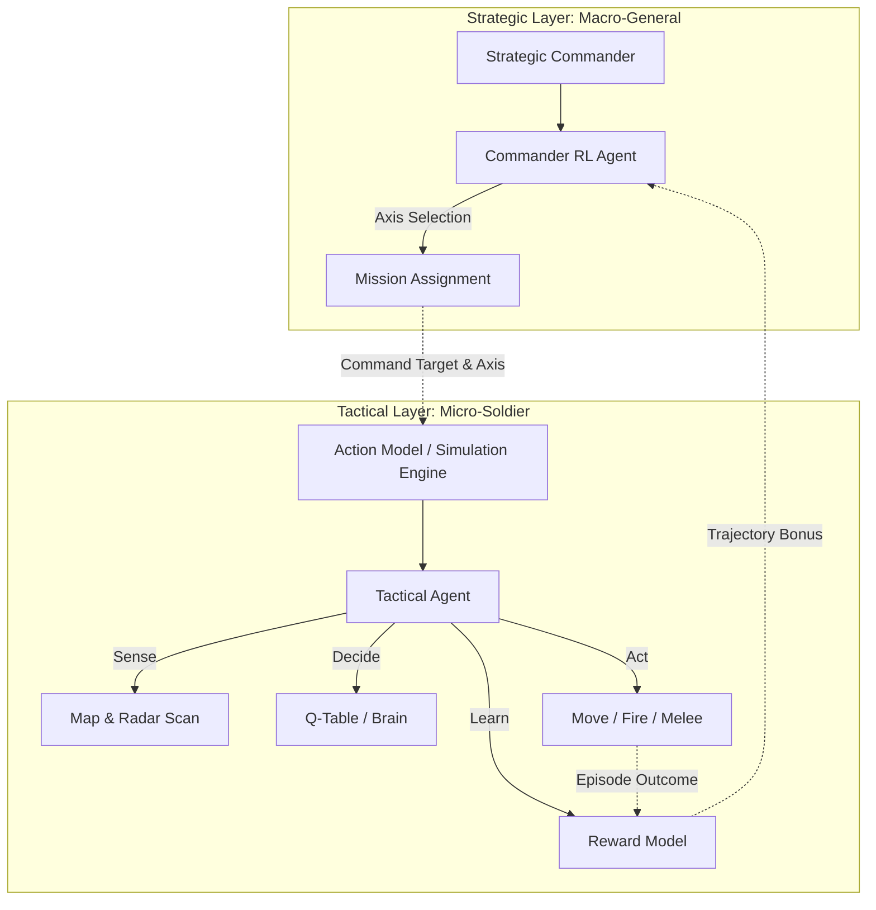
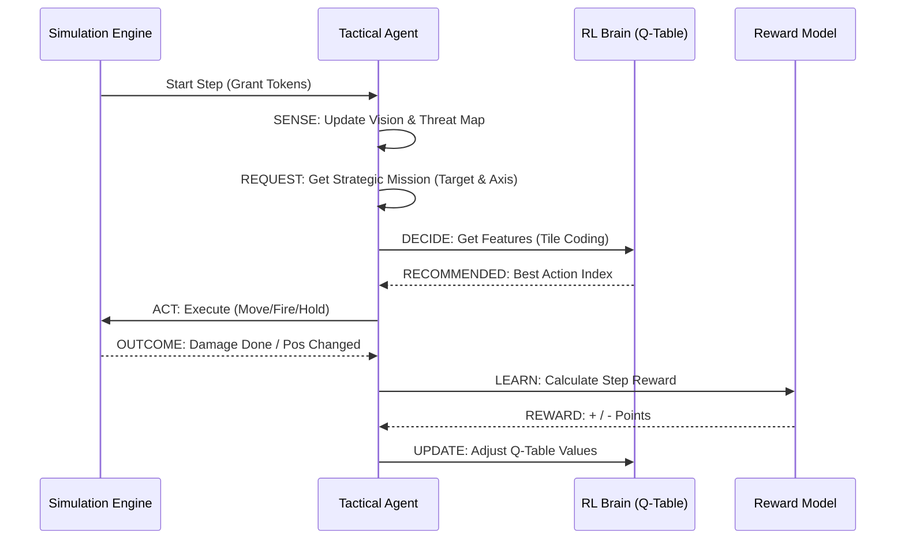
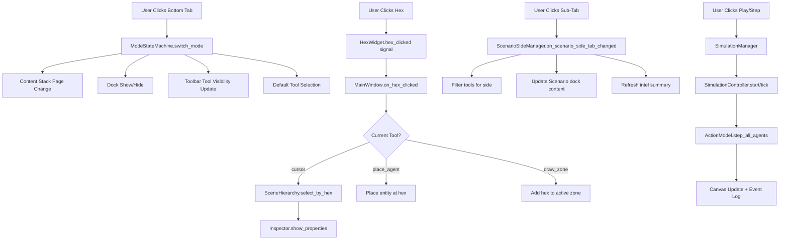
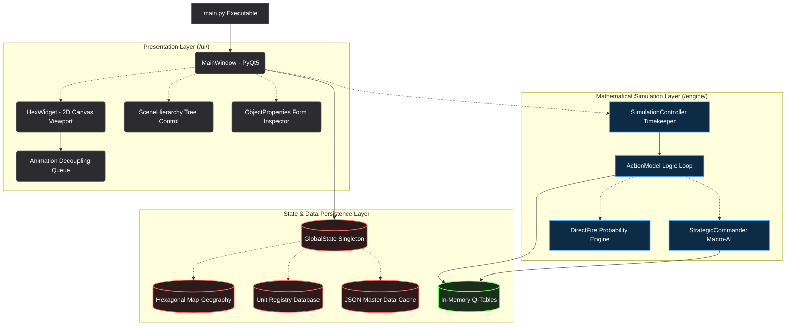
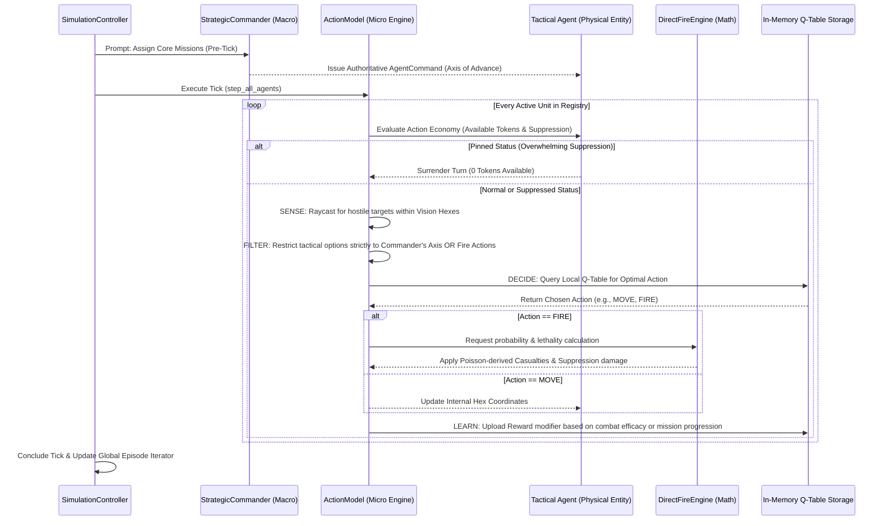
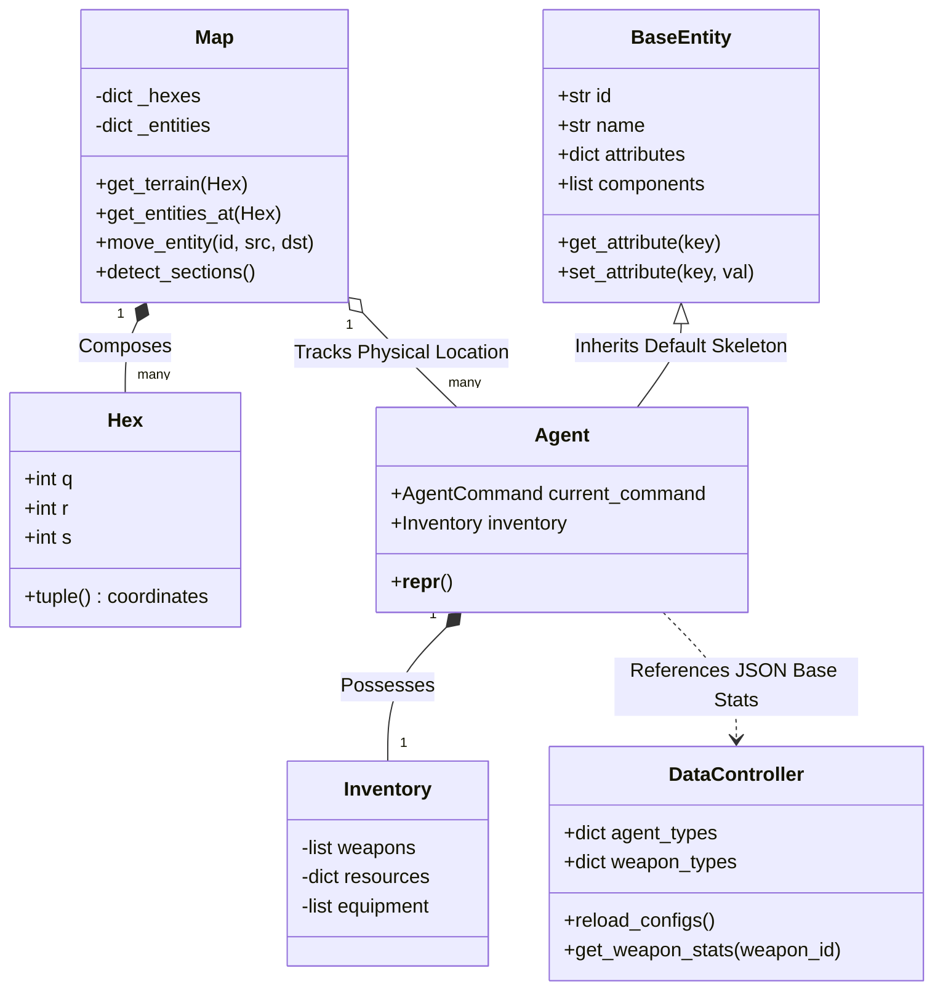

# technical_presentation.md
# The War Project: Complete Technical Reference

> A comprehensive document for anyone who knows how to code and wants to fully understand every layer of this system — from state management and mathematics to how an episode plays out and what each UI tab does.

---

## Part I: What This System Is

The **War** project is a **Multi-Agent Reinforcement Learning (MARL)** research environment built on a hexagonal tactical map. It is not a game in the entertainment sense. It is a **simulation engine** where:
- Multiple autonomous agents exist on a map, each belonging to a faction (`Attacker` or `Defender`).
- Each agent independently perceives its surroundings, reasons using a learned Q-table, and executes actions (Move, Fire, Close Combat, Hold).
- A two-tier AI hierarchy guides both *macro-level strategy* (the Commander) and *micro-level tactics* (each agent).
- The system learns through thousands of episodes, saving Q-tables to disk so that learned knowledge carries over between sessions.

The environment can run **fully headlessly** (no screen) via `xvfb-run` on servers for high-speed training, or with a full **PyQt5 desktop UI** for human analysis and scenario editing.

---

## Part II: Technology Stack

| Component | Technology | Why |
|---|---|---|
| Core Language | **Python 3.12** | Rapid iteration, strong NumPy ecosystem |
| Desktop UI | **PyQt5 + PyQtWebEngine** | Cross-platform, mature widget library |
| Web UI | **Flask** | Lightweight REST/streaming server for browser-based access |
| Math & RL Memory | **NumPy** | Q-tables stored as `.npy` matrices; tile coding uses vectorized ops |
| RL Storage | **MemoryDatabase** (Redis-compatible) | Rapid read/write during training episodes |
| Backend Platform | **Supabase** | Optional cloud data sync |
| Dev Environment | **Nix (`shell.nix`)** | Hermetic, reproducible builds; eliminates "works on my machine" |
| Testing | **pytest** | Unit and integration tests in `/test/` |

---

## Part III: Directory Architecture

The entire project enforces a **strict three-layer boundary**. No layer may import above itself.

```
/currentActive
  /engine           ← Backend: pure math, simulation, AI, state
    /ai             ← Q-tables, encoder, commander, reward models
    /combat         ← Direct fire, mine negotiation, weapon data
    /core           ← Hex math, map, entity manager, pathfinding, undo
    /data           ← Data loaders, content paths, memory database
    /simulation     ← ActionModel (sim loop), move/fire/commit actions
    /state          ← WorldState, GlobalState, ThreatMap, UISettings
  /services         ← Middle-End: the only bridge between UI and engine
  /ui               ← Frontend: PyQt5 widgets, tools, canvas, views
  /web_ui           ← Alternate Frontend: Flask routes + browser canvas
  /content          ← JSON: unit definitions, weapon stats, terrain, zones
  /data/models      ← Persisted AI Q-tables (.npy + .json)
  /infra            ← Nix environment files
  /test             ← pytest test suite
  main.py           ← Entry point: launches PyQt5 app
```

### The Three Hard Rules

1. `engine/` never imports from `services/`, `ui/`, or `web_ui/`.
2. `services/` never imports from `ui/` or `web_ui/`.
3. `ui/` should call `services/` for state mutations. Read-only imports from `engine/` (e.g., `GlobalState`, `HexMath`) are permitted for performance-critical rendering paths.

---

## Part IV: State Architecture

### 4.1 Agent State

Every agent (`BaseEntity → Agent`) tracks a 4-component state that drives all RL decisions.

| Component | Storage | Description |
|---|---|---|
| **x, y (Spatial)** | `Map._entity_positions[entity.id] → Hex(q, r, s)` | Position in cube coordinates, displayed as offset `(col, row)` to the user |
| **Time (Temporal)** | `step_number * time_per_step` (default: `10 min/step`) | Total elapsed simulation time, e.g., Step 5 = 50 game-world minutes |
| **Status** | `entity.get_attribute("suppression")`, `entity.tokens`, `entity.get_attribute("personnel")` | Combat condition: Normal / Suppressed (50+ supp) / Pinned (100+ supp) / Dead (personnel = 0) |
| **Abstraction** | `entity.attributes: AttributeDict` | All other properties (side, type, ammo, weight, fire_range, home_hex) encapsulated via dot-access dictionary |

The `AttributeDict` is a `dict` subclass that allows `entity.attributes.side` instead of `entity.attributes["side"]`, providing clean attribute access while remaining JSON-serializable.

### 4.2 Global State (Singleton)

`GlobalState` is a **Singleton** that acts as the shared notebook for the entire application.

```
GlobalState (Singleton)
  ├── map: Map                      ← terrain, zones, entity positions
  ├── entity_manager: EntityManager ← all active agents by ID
  ├── threat_map: ThreatMap         ← danger overlay per faction per hex
  ├── data_controller: DataManager  ← loaded JSON definitions (cache)
  ├── ui: UISettings                ← selected tool, theme, grid mode
  ├── undo_stack: UndoStack         ← Command Pattern history (50 steps)
  ├── project_path                  ← currently loaded .json scenario
  ├── time_per_step = 10            ← minutes per simulation tick
  └── is_learning = False           ← True during training loops
```

**Why Singleton?** Any module in the codebase — the map renderer, a PyQt widget, or a simulation step — can call `GlobalState()` and get the exact same object. This eliminates redundant state passing while maintaining a single source of truth.

**WorldState (Successor):** For new code, `WorldState` is a plain `@dataclass` (not a singleton) injected via constructor arguments. This enables multiple simultaneous scenarios and parallel training. The migration is ongoing; `GlobalState` remains as a compatibility shim.

### 4.3 Threat Map

Every simulation tick, the `ThreatMap` scans all active units and marks every hex within their firing range along the 6 hex axes with a threat score.

- `faction_threats["Attacker"][hex_tuple] += 1.0` per enemy unit that can fire on that hex.
- Used by the **Safe axis pathfinder** to add `threat * 5.0` penalty to route costs.
- Used by the **Tactical Agent encoder** to represent danger in the state vector.

---

## Part V: The Mathematics

### 5.1 Hexagonal Geometry (Cube Coordinates)

The hex grid uses `(q, r, s)` cube coordinates with the hard constraint:
$$q + r + s = 0$$

This allows hex math to behave like 3D integer arithmetic.

**Distance** between two hexes A and B:
$$d(A, B) = \frac{|A_q - B_q| + |A_r - B_r| + |A_s - B_s|}{2}$$

**Hex → Pixel** conversion (Flat-Top orientation):
$$\begin{pmatrix} x \\ y \end{pmatrix} = \text{size} \cdot \begin{pmatrix} \frac{3}{2} & 0 \\ \frac{\sqrt{3}}{2} & \sqrt{3} \end{pmatrix} \begin{pmatrix} q \\ r \end{pmatrix}$$

**Pixel → Hex** (inverse, for mouse clicks):
$$q = \frac{2x}{3 \cdot \text{size}}, \quad r = \frac{-x + x\sqrt{3}y}{3 \cdot \text{size}}$$
Then rounded via the cube-rounding algorithm that preserves $q+r+s=0$.

**Line of Sight**: Uses linear interpolation across cube coordinates from `start` to `end`, sampling $d$ intermediate points.

**Ring Generation**: To find all hexes exactly $k$ steps away (used for firing rings), the system walks $k$ steps in one direction, then traces the perimeter of the hexagon.

### 5.2 A* Pathfinding

The `Pathfinder` uses a priority queue (`heapq`) implementing classic **A***.

$$f(n) = g(n) + h(n)$$

where:
- $g(n)$ = accumulated terrain cost from start to node $n$.
- $h(n)$ = hex distance heuristic from $n$ to goal (admissible, never over-estimates).

Three cost functions are supported, each defining a different **movement axis**:
1. **Direct**: Cost from terrain JSON (`{"cost": 1.0}` for clear, `2.0` for rough).
2. **Safe**: `cost + threat * 5.0` — heavily penalizes hexes in enemy firing arcs.
3. **Fast**: Uniform cost of `1.0` — ignores terrain, finds geometric shortest path.

### 5.3 Combat Attrition: Poisson Distribution

All damage in this system is derived from the **Poisson distribution**, which models the number of independent events (hits) in a fixed interval given a known average rate.

**Direct Fire** (ranged combat):
$$\lambda_{\text{cas}} = \frac{(\text{Damage} \times \text{ROF} \times \text{Accuracy}) \times \text{Combat Ratio}}{\text{Cover} \times 10}$$

Where `Combat Ratio = Attacker Factor / Max(Defender Factor, 1)`.

**Suppression** follows the same logic with a separate lambda:
$$\lambda_{\text{supp}} = \frac{\text{Suppression Power} \times \text{Combat Ratio}}{2}$$

Casualties are **sampled** (not deterministic) using Knuth's algorithm:
```
L = exp(-λ); k = 0; p = 1.0
while p > L: k += 1; p *= random()
return k - 1
```

For large $\lambda \geq 30$ (rare, large formations), a **Gaussian approximation** is used:
$$k \sim \mathcal{N}(\lambda, \sqrt{\lambda})$$

**Mine Negotiation** uses the same Poisson mechanism:
$$\lambda_{\text{mine}} = \text{density} \times \text{base\_damage}$$

### 5.4 Suppression Mechanics

Suppression is a continuous float value on each agent:
- Decays by `20.0` per tick naturally.
- At `>= 50`: unit is **Suppressed** → receives half tokens.
- At `>= 100`: unit is **Pinned** → receives zero tokens.
- At `personnel <= 0`: unit is **Destroyed**.

---

## Part VI: The Reinforcement Learning System

### 6.1 State Encoding (Tile Coding)

Raw hex positions are encoded into a fixed-size feature vector using **Tile Coding** — a classical RL technique for generalizing across continuous or large discrete spaces.

**Architecture**: 8 overlapping tilings over the map, each with a 10×10 grid.

For a given `(col, row)` position, each tiling generates an `(idx_x, idx_y)` index:
$$\text{tile\_id} = \text{hash}(i, \text{idx}_x, \text{idx}_y)$$

The 8 active tile hashes are then **XORed** with attribute states `(casualty_level, reward_level)`:
$$\text{feature\_idx} = (\text{tile\_hash} \oplus \text{hash}(\text{cas\_state}, \text{rew\_state})) \mod 4096$$

This creates a **4096-dimensional sparse binary feature vector** per agent per step, where only 8 indices are active. The Q-table is indexed by these features.

**Casualty encoding** (4 buckets):
- `> 75%` personnel → Healthy (0)
- `> 50%` → Light (1)
- `> 25%` → Moderate (2)
- `≤ 25%` → Critical (3)

### 6.2 The Action Space

There are **11 discrete actions** (the `RL_ACTION_MAP`):

| Index | Action | Description |
|---|---|---|
| 0–5 | MOVE [direction] | Move to one of 6 neighboring hexes (E, NE, NW, W, SW, SE) |
| 6 | FIRE | Shoot at nearest visible enemy |
| 7 | HOLD / END TURN | Consume all remaining tokens, end turn |
| 8 | CLOSE_COMBAT | Melee attack on adjacent enemy |
| 9–10 | COMMIT_[ROLE] | Commit to a strategic role (e.g., suppression support) |

### 6.3 Q-Learning (Tactical Agent)

The tactical brain is a **tabular Q-Learning** agent stored as a `NumPy` matrix `Q[state_size × action_size]` (4096 × 11).

**Bellman Update Rule:**
$$Q(s, a) \leftarrow Q(s, a) + \alpha \left[ r + \gamma \max_{a'} Q(s', a') - Q(s, a) \right]$$

| Hyperparameter | Value | Meaning |
|---|---|---|
| $\alpha$ (learning rate) | `0.1` | How strongly new experience overwrites old |
| $\gamma$ (discount factor) | `0.99` | Future rewards are nearly as important as immediate |
| $\epsilon$ (exploration) | `1.0 → 0.05` | Probability of choosing a random action; decays by 0.995/episode |

**Two Brains**: Each unit can use one of two Q-table managers:
- **Ephemeral**: Starts empty, explores actively. Used for training.
- **Persistent**: Loads from disk. Used for "veteran" AI difficulty.

**Experience Replay**: All `(state, action, reward, next_state, done)` tuples are stored in a `ReplayBuffer` (capacity 5000). Every 10 steps and at every episode end, a random **batch of 32** is sampled for training, improving stability.

### 6.4 The Commander (Strategic RL)

The Commander uses a **simpler Q-table** (12 states × 3 actions) because strategic decisions are lower-frequency and more interpretable.

**State discretization** uses two features:
- `threat_bucket`: 0–3 based on avg threat along Direct path.
- `dist_bucket`: 0–2 based on distance to objective (short/medium/far).
$$\text{state\_idx} = (\text{threat\_bucket} \times 3) + \text{dist\_bucket}$$

**Actions**: Choose between Direct (0), Safe (1), and Fast (2) axes.

**Learning**: Uses **trajectory-based discounted reward** propagated backwards through the sequence of Commander decisions made during an episode:
$$Q(s_t, a_t) \leftarrow Q(s_t, a_t) + \alpha(G_t - Q(s_t, a_t)), \quad G_t = \gamma \cdot G_{t+1}$$

This connects early routing decisions to late-episode outcomes — a key advantage over single-step updates.

### 6.5 The Reward Model

The reward function shapes the AI's behavior by assigning numerical values to outcomes:

| Event | Reward |
|---|---|
| Fire hit (per casualty) | `+50 + casualties * 10` |
| Kill (personnel → 0) | `+150` |
| Fire miss | `-5` |
| Moving closer to objective | `+22.5 per hex` |
| Moving away from objective | `-22.5 per hex` |
| Arriving at objective | `+400 × decay_multiplier` |
| Unit takes personnel losses | `-2 per lost` |
| Unit destroyed | `-400` |
| Revisiting a hex | `-10` |
| Moving under fire (evasion) | `+5` |
| Per step (time pressure) | `-1` |

The **goal reward** decays over time: `multiplier = max(0.1, 1 - step/max_steps)`, incentivizing speed.

---

## Part VII: The Simulation Lifecycle (One Episode)

An **episode** is one complete engagement from setup to terminal condition.

### 7.1 Episode Startup

1. `SimulationService.reset()` is called → `ActionModel.reset_episode()`.
2. All agent `visited_hexes` are cleared (prevents backtracking penalties from previous episode).
3. Episode counter increments; epsilons are decayed.
4. Batch training runs on the Replay Buffer.
5. Knowledge is auto-saved to disk.

### 7.2 A Single Simulation Step (The Tick)

`SimulationService.step(step_number)` → `ActionModel.step_all_agents(step_number)`:

**Phase 0 — Environmental Update**
- `ThreatMap.update()`: Scans all entities, projects firing lines along all 6 hex axes out to `fire_range`, increments `faction_threats[side][hex]` by 1.0.

**Phase 1 — Token Generation**
- Each agent receives tokens equal to its movement speed (capped at `2.0`).
- Suppression modifiers clamp this: Suppressed → `speed/2`, Pinned → `0`.
- Suppression itself decays by `20.0` points this tick.

**Phase 2 — Sense** (per agent)
- Agent scans all entities within its `vision_range` (hex distance).
- The closest visible enemy becomes the `target`.

**Phase 3 — Command (Strategic)**
- If the agent has no active command, or has reached its current goal, `StrategicCommander.assign_mission()` is called.
- The Commander generates 3 route options (Direct/Safe/Fast), gathers their stats (length, avg threat), and uses its RL brain to select an **axis**.
- An `AgentCommand` (`MOVE`/`CAPTURE`/`DEFEND`) with the chosen `axis` is assigned.

**Phase 4 — Decide (Tactical RL)**
- `StateActionEncoder.get_features()` creates the sparse 8-active-index feature vector from the agent's position and health.
- The Q-table returns Q-values for all available actions.
- $\epsilon$-greedy selection: with probability $\epsilon$, pick random; otherwise, `argmax Q(s, a)`.

**Phase 5 — Act (Execution)**
- Token cost is deducted: MOVE = 1.0 (or 2.0 in rough terrain), FIRE/COMBAT = 2.0, HOLD = all remaining.
- If insufficient tokens, the agent's turn ends.
- The selected action is dispatched to its handler (`MoveAction`, `FireAction`, `CloseCombatAction`, `CommitAction`).
- **Move**: Validates direction, terrain, weight limit → updates map position → checks for mine zones.
- **Fire**: Calls `DirectFire.calculate_attrition()` → Poisson sample → applies casualties and suppression.
- **Close Combat**: Similar to fire but at melee range.
- Events (visual) are appended to the event list for the UI renderer.

**Phase 6 — Learn**
- New state features are computed (`next_state`).
- `RewardModel.calculate_reward()` scores the action.
- The `(state, action, reward, next_state, done)` transition is pushed to `ReplayBuffer`.
- Every 10 steps, a batch of 32 is sampled and `QTableManager.update_batch()` is called.

**Phase 7 — Terminal Check**
- `check_terminal_conditions()`:
  - `step > max_steps` → timeout, episode over.
  - Only one side has `personnel > 0` → elimination, episode over.
- Events + logs are returned to the UI via `event_bus.emit("tick_complete", payload)`.

---

## Part VIII: The Services Layer

The **Services Layer** is the only permitted bridge between UI and Engine. All public functions return a `ServiceResult(ok: bool, data: Any, error: str, code: str)` — they never raise exceptions to the caller.

| Service | Responsibility |
|---|---|
| `map_service` | Create maps, load/save terrain, query hex data |
| `entity_service` | Place/remove/query agents |
| `simulation_service` | `step()`, `reset()`, `run_episodes()`, terminal checks |
| `scenario_service` | Load/save full scenario JSON (Golden State snapshots) |
| `data_service` | Unit definitions, weapon catalogs, terrain configs |
| `ai_service` | Read/write epsilon values, Q-table states |
| `rules_service` | Validate moves, check win/loss conditions |
| `path_service` | Expose pathfinding results to the UI |

Events flow via the **Event Bus** (`event_bus.emit("tick_complete", payload)`), allowing the UI to subscribe without polling. The UI never calls engine internals.

---

## Part IX: The UI — Tabs, Tools, and Software Behavior

### 9.1 Main Window Structure (`main_window.py`)

The application opens as a **PyQt5 docked-panel layout** with:
- A central **Hex Canvas** (`hex_widget.py`) rendering the map.
- Multiple **dockable panels** around it.
- A **toolbar** with tool buttons and simulation controls.

### 9.2 The Hex Canvas (`hex_widget.py`)

The primary interactive area. It uses a `QGraphicsView` / `QGraphicsScene` to render:
- **Hexagonal tiles** painted based on terrain type and color.
- **Zone overlays**: Goal Areas (gold), Obstacle Zones (mine fields), Side Boundaries.
- **Agent icons**: Color-coded by faction; moving units animate their icon sliding between hexes.
- **Movement Trails**: Historical path lines traced across the hexes the agent has visited.
- **Combat Lasers**: Animated line drawn from attacker to target during fire.
- **Reward Labels**: Floating `+/-` numbers above agents toggled on/off.
- **AI Thinking Bubbles**: The Inspector shows the top 3 Q-values the agent considered.

Mouse input is routed through a `CanvasController` which dispatches clicks to the **active tool**.

### 9.3 Map Editor Tools (`ui/tools/`)

| Tool | Behavior |
|---|---|
| `paint_tool.py` | Left-click paints terrain type onto hovered hex; right-click erases |
| `place_agent_tool.py` | Places a new agent of the configured type at the clicked hex |
| `zone_tool.py` | Click-and-drag to draw zones (Goal Area, Obstacle, Side Boundary) |
| `edit_tool.py` | Click to select entities; shows Inspector properties for editing |
| `path_tool.py` | Draws custom named path lines across a sequence of hexes |
| `erase_tool.py` | Removes terrain, agents, or zones from the map |

All tools write to state only through `services/`, never touching the engine directly.

### 9.4 Panels and Tabs

#### **Inspector Panel** (`object_properties_widget.py`)
Contextually shows editable form fields for the currently selected object:
- For **agents**: name, side, type, personnel count, suppression level, status, AI debug info.
- For **tiles**: terrain type, movement cost.
- For **zones**: zone type, subtype, assigned side.

#### **Scene Hierarchy** (`scene_hierarchy_widget.py`)
A tree-view listing every agent and zone on the map. Supports:
- Click to select and focus the camera on an entity.
- Toggle visibility of individual objects.

#### **Event Log** (`event_log_widget.py`)
A scrolling HTML ticker showing live combat events per step, e.g.:
```
[Step 5] Bravo Squad: FIRE → R:+60.0 (Alpha Platoon D:3)
[Step 5] Alpha Platoon: MINE STRIKE! -12 pers
```

#### **Dashboard** (`dashboard_widget.py`)
Analytics charts showing:
- Action distribution over time (MOVE vs FIRE vs HOLD bar chart).
- Explore vs Exploit ratio (how often agents pick random vs best-known action).
- Epsilon decay curve.
- Personnel over time per unit.

#### **Simulation Controls** (`workflow_bar.py`)
Buttons for:
- **Step** (⏭): Advance one tick.
- **Play/Pause** (▶/⏸): Auto-advance at configured speed.
- **Learn** (🧠): Run N episodes headlessly.
- **Reset** (🔄): Restore agents to starting positions.
- **Save Knowledge** (💾): Force-write Q-tables to disk.

#### **Master Data Widget** (`master_data_widget.py`)
Database browser for the content JSON files. Allows viewing and editing:
- Unit definitions (type, personnel, speed, weapons, vision).
- Weapon catalog (damage, rate of fire, accuracy, suppression, range).
- Terrain templates (cost, cover bonus, color).

#### **Scenario Manager** (`scenario_manager_widget.py`)
Load/save complete scenario files (map + entities + zones). Implements the **Golden State** snapshot pattern: when entering simulation mode, the scenario state is frozen into a snapshot; on reset, it is restored exactly — no simulation-time changes persist back to the editor.

#### **Maps Widget** (`maps_widget.py`)
Browse, create, and load different map files. Map dimensions are configurable; changing them re-initializes the encoder and pathfinder.

#### **Rules Widget** (`rules_widget.py`)
Configure per-scenario gameplay rules (max steps per episode, stacking limits per hex, etc.). These values feed directly into the `check_terminal_conditions()` function.

#### **Timeline Panel** (`timeline_panel.py`)
Displays a scrollable history of past steps in the current episode, allowing the user to replay and inspect any historical state.

---

## Part X: Data Definitions (Content Layer)

All unit, weapon, and terrain data lives in `/content/` as JSON files and is loaded at startup by `DataManager`.

### Unit Definition Example
```json
{
  "name": "FireAgent",
  "type": "FiringAgent",
  "personnel": 100,
  "combat_factor": 5,
  "vision_range": 6,
  "fire_range": 6,
  "speed": 2,
  "learned": false,
  "weapon": {
    "name": "Assault Rifle",
    "damage": 3,
    "rate_of_fire": 5,
    "accuracy": 0.65,
    "suppression": 15,
    "max_range": 6
  }
}
```

`learned: true` causes the engine to assign the **Persistent** (veteran) Q-table to that unit instead of the Ephemeral (explorer) one.

### Terrain Definition Example
```json
{
  "name": "Forest",
  "cost": 2.0,
  "color": "#2d6a4f"
}
```
A `cost` of `2.0` means it takes 2 movement tokens to enter and doubles as the **cover defense bonus** in the combat formula.

---

## Part XI: Persistence — How the AI Remembers

After each training episode, `save_knowledge()` writes two files:

| File | Format | Purpose |
|---|---|---|
| `data/models/q_table.npy` | NumPy binary | Fast load; the persistent (veteran) Q-table |
| `data/models/q_table.json` | Sparse JSON | Human-readable; debug/inspect individual state-action values |
| `data/models/ephemeral_q_table.npy` | NumPy binary | Explorer brain in progress |
| `data/models/commander_q_table.json` | JSON 12×3 | Strategic Commander's learned routing preferences |

On startup, both Q-tables are loaded from disk. If no file exists, they start from all zeros (uniformly uninformed).

---

## Appendix: Running the System

```bash
# Desktop App
python main.py

# Headless (server training)
xvfb-run python main.py

# Run all tests
python -m pytest test/ -v

# Nix dev shell (reproducible env)
nix-shell infra/shell.nix
```


# comprehensive_analysis.md
# 🔬 Comprehensive Codebase Analysis: `currentActive`

> **Scope**: Every file and directory under `anshum/currentActive/`
> **Date**: 2026-04-08
> **Files Analyzed**: 146 Python files (~24,084 lines) + docs, configs, scripts, stylesheets
> **Methodology**: File-by-file static analysis covering UI, responsiveness, editability, cross-platform, documentation, architecture, naming, comments, modularity, and code quality

---

## Table of Contents

1. [Executive Summary](#1-executive-summary)
2. [Project Structure Assessment](#2-project-structure-assessment)
3. [Architecture & Layer Integrity](#3-architecture--layer-integrity)
4. [UI & UX Analysis](#4-ui--ux-analysis)
5. [Responsiveness & Layout](#5-responsiveness--layout)
6. [Cross-Platform / Cross-OS Analysis](#6-cross-platform--cross-os-analysis)
7. [Configurability & Editability](#7-configurability--editability)
8. [Code Quality & Modularity](#8-code-quality--modularity)
9. [Documentation Analysis](#9-documentation-analysis)
10. [Testing & Quality Assurance](#10-testing--quality-assurance)
11. [Naming Conventions & Comments](#11-naming-conventions--comments)
12. [Dead Code & Artifacts](#12-dead-code--artifacts)
13. [File-by-File Critical Issues](#13-file-by-file-critical-issues)
14. [Priority Recommendations](#14-priority-recommendations)

---

## 1. Executive Summary

### What's Good ✅
The codebase demonstrates **ambitious, well-intentioned design** with several genuinely strong patterns:
- **Strict 3-layer architecture** (Engine → Services → UI) with documented rules per layer
- **ServiceResult pattern** providing crash-free error propagation across all services
- **Event bus** decoupling engine events from UI rendering
- **Configuration-first UI refactoring** (externalized strings, styles extracted to constants)
- **Extensive documentation** (10 docs, totaling ~115K bytes across architecture, RL, diagrams, UI design guide, user manual, and presentation materials)
- **Dual Q-Table RL system** (Ephemeral Explorer vs Persistent Veteran) — thoughtful AI design
- **Fallback system** (`ui/utils/fallback.py`) with stub data for graceful degradation
- **Undo system** using the Command Pattern

### What Needs Work ❌
Despite the strong architectural intent, the **implementation has significant gaps**:
- **Critical layer violations** — the engine imports from `ui/styles/theme.py` and `PyQt5`
- **God-class anti-pattern** — `main_window.py` is 2,180 lines; `hex_widget.py` is 1,796 lines
- **No dependency management** — no `requirements.txt`, `pyproject.toml`, or `setup.py`
- **Incomplete modular migration** — `src/presentation/` contains only 2 stub files
- **Temp/debug files left in tree** — `debug_patch.py`, `test_qlist.py`, `*_TEMP_CONFIG`
- **Massive UI bypass of services** — ~20 UI files import directly from `engine/`
- **Empty directories** — `ui/canvas/`, `ui/main/` are completely empty
- **Two competing state systems** — `GlobalState` (singleton) vs `WorldState` (web_ui)
- **No cross-platform font validation** — relies on fonts that may not exist (`Inter`, `JetBrains Mono`)

### Severity Distribution

| Severity | Count | Examples |
|---|---|---|
| 🔴 **Critical** | 8 | Layer violations, god-classes, no dep management |
| 🟠 **High** | 14 | Dead code, incomplete migrations, config drift |
| 🟡 **Medium** | 22 | Naming inconsistencies, missing tests, UX gaps |
| 🟢 **Low** | 15+ | Comment clarity, minor style variations |

---

## 2. Project Structure Assessment

### Directory Tree

```
currentActive/
├── main.py                  ← Desktop entry point ✅
├── run_web.sh               ← Web UI launcher ✅
├── generate_cap.py          ← 🟡 Utility script at root — should be in scripts/
├── debug_patch.py           ← 🔴 Debug hack left in tree — must remove
├── test_qlist.py            ← 🔴 One-line debug test at root — must remove
├── user_settings.json       ← 🟡 User state at root — should be in data/ or .config/
├── .envrc                   ← ✅ Nix direnv integration
├── .gitignore               ← ✅ Covers Python, VS Code, OS artifacts
│
├── engine/                  ← ✅ Well-organized backend
│   ├── ai/                  ← ✅ RL modules (commander, encoder, q_table, reward, replay_buffer)
│   ├── combat/              ← ✅ Direct fire & mine negotiation
│   ├── core/                ← ✅ hex_math, map, entity_manager, pathfinding, undo
│   ├── data/                ← 🟡 Deep nesting (api/, definitions/, loaders/, logs/, redis/, services/)
│   ├── models/              ← ✅ Constants + typed models
│   ├── simulation/          ← 🟠 act_model is 1,123 lines of spaghetti
│   └── state/               ← 🟡 global_state uses Singleton — conflicts with WorldState
│
├── services/                ← ✅ Clean service layer with good READMEs
│   ├── event_bus.py         ← ✅ Simple, effective pub/sub
│   ├── service_result.py    ← ✅ Excellent error-handling pattern
│   └── [11 service files]   ← ✅ Good coverage
│
├── ui/                      ← 🟠 Partially refactored; many legacy patterns remain
│   ├── canvas/              ← 🔴 EMPTY directory — referenced in README but unused
│   ├── components/          ← 🟠 Contains 14 files; master_data_widget is 1,114 lines
│   ├── core/                ← ✅ Good extraction (toolbar, mode FSM, simulation mgr)
│   ├── dialogs/             ← ✅ Small, focused (2 files)
│   ├── icons/               ← ✅ (managed by icon_painter — no external files needed)
│   ├── main/                ← 🔴 EMPTY directory — dead package
│   ├── styles/              ← ✅ Centralized theme + ui_state
│   ├── themes/              ← 🟡 Contains QSS files but theme.py generates inline QSS — potential conflict
│   ├── tools/               ← ✅ One-file-per-tool pattern — very clean (9 tool files)
│   ├── utils/               ← ✅ fallback.py is well-designed
│   └── views/               ← 🟠 main_window.py is 2,180 lines (god-class)
│
├── web_ui/                  ← 🟡 Functional but minimal
│   ├── app.py               ← ✅ Clean Flask REST API
│   ├── templates/           ← 1 file (index.html)
│   └── static/              ← css/ + js/ directories
│
├── src/                     ← 🟠 Incomplete "new architecture" migration
│   └── presentation/
│       ├── controllers/     ← 1 file (tool_controller.py)
│       └── viewmodels/      ← 1 file (tool_handlers.py)
│
├── docs/                    ← ✅ Extensive (10 files, ~115KB total)
├── data/                    ← ✅ Runtime data (logs, models, training)
├── content/                 ← ✅ Game data (maps, master database, projects, rules)
├── scripts/                 ← ✅ Utility scripts (5 files)
├── infra/                   ← ✅ Nix shells (3 variants)
└── test/                    ← 🟡 18 test files but low coverage depth
```

### Structure Issues

| Issue | Severity | Details |
|---|---|---|
| Empty `ui/canvas/` and `ui/main/` directories | 🔴 | Referenced in UI README but contain zero files |
| `src/presentation/` — abandoned migration | 🟠 | Only 2 files, imported from `main_window.py` — creates confusing dual architecture |
| Root-level utility scripts | 🟡 | `generate_cap.py`, `debug_patch.py`, `test_qlist.py` cluttering root |
| `ui/themes/` QSS files vs `theme.py` inline QSS | 🟡 | 3 QSS files exist (`dark.qss`, `light.qss`, `modern_dark.qss`) but `theme.py` generates its own QSS strings — unclear which is authoritative |
| No `__init__.py` in `content/`, `data/`, `scripts/` | 🟢 | Fine for non-Python packages, but inconsistent |

---

## 3. Architecture & Layer Integrity

### The Intended Architecture

```
┌───────────────────────────┐
│     UI Layer (PyQt5)      │ ← Only calls services/
├───────────────────────────┤
│    Services Layer         │ ← Only calls engine/
├───────────────────────────┤
│    Engine Layer           │ ← Pure Python, no UI deps
└───────────────────────────┘
```

### Layer Violations Found

> [!CAUTION]
> The following violations break the core design rule "Engine must NEVER import from UI".

#### 🔴 CRITICAL: Engine → UI Import

```python
# engine/simulation/act_model.py line 24
from ui.styles.theme import Theme    # ← BREAKS THE RULE
```

This means the most critical simulation file depends on the UI's visual theme to generate HTML debug strings. The engine **cannot run headlessly** without the UI's Theme class available.

#### 🔴 CRITICAL: Engine → PyQt5 Import

```python
# engine/simulation/act_model.py line 19
from PyQt5.QtCore import QCoreApplication    # ← BREAKS THE RULE
```

`QCoreApplication.processEvents()` is called in the simulation loop (lines 215, 266) to prevent UI hangs. While pragmatic, this **couples the simulation heartbeat to the Qt event loop** and prevents true headless execution.

#### 🟠 HIGH: UI → Engine Direct Imports (Bypassing Services)

Despite the documented rule "UI must NEVER import from engine/", **20+ imports** were found:

| UI File | Engine Import | Should Be |
|---|---|---|
| `hex_widget.py` | `engine.core.hex_math`, `engine.state.global_state`, `engine.core.undo_system`, `engine.simulation.command` | `services.map_service` |
| `object_properties_widget.py` | `engine.state.global_state`, `engine.core.undo_system` | `services.*` |
| `master_data_widget.py` | `engine.state.global_state` | Injected state |
| `scenario_manager_widget.py` | `engine.core.map.Scenario`, `engine.state.global_state`, `engine.data.loaders.data_manager` | `services.scenario_service` |
| `dashboard_widget.py` | `engine.data.definitions.constants.RL_ACTION_MAP` | Surface via service |
| `scene_hierarchy_widget.py` | `engine.state.global_state` | Injected state |
| `rules_widget.py` | `engine.state.global_state` | Injected state |
| `hex_renderer.py` | `engine.core.hex_math` | Wrap in service |
| `main_window.py` | `engine.state.global_state`, `engine.simulation.act_model`, `engine.data.loaders.data_manager` | `services.*` |

#### 🟠 HIGH: Dual State Systems

```python
# Desktop app uses GlobalState (Singleton):
# engine/state/global_state.py
class GlobalState:
    _instance = None
    def __new__(cls): ...  # Singleton

# Web app uses WorldState (Factory):
# web_ui/app.py
from engine.state.world_state import WorldState
_state = WorldState.create()
```

Two different state management approaches coexist. `GlobalState` is a classic Singleton (making unit testing difficult), while `WorldState` uses a factory pattern. This suggests an incomplete migration.

---

## 4. UI & UX Analysis

### Design Quality

| Aspect | Rating | Notes |
|---|---|---|
| **Color System** | ✅ Very Good | Well-curated Zinc/Blue palette with semantic tokens (`BG_DEEP`, `ACCENT_ALLY`, etc.) |
| **Typography** | 🟡 Good-ish | Good font stack (`Inter`, `JetBrains Mono`) but relies on fonts that may not be installed |
| **Theme Switching** | ✅ Good | Dark/Light mode toggle with proper palette inversion |
| **Visual Consistency** | 🟠 Mixed | Theme defined centrally but ~15 inline `setStyleSheet()` calls bypass it |
| **Layout Hierarchy** | 🟡 OK | Docks/tabs/stacks organized but overly complex (9 modes for 5 logical phases) |
| **Animation/Feedback** | ✅ Good | Visualizer system provides fire animations, floating damage text |
| **Onboarding** | 🔴 Missing | No empty state, no wizard, no tooltip guidance |
| **Accessibility** | 🔴 Missing | No keyboard-only navigation, no screen reader labels, no contrast ratios documented |

### UI Issues Inventory

#### 🔴 Inaccessible Dashboard & Report Views

`DashboardWidget` (21,906 bytes, 5 sub-tabs with analytics, agent brain view, live feed, logistics, and cheat sheets) and `ReportWidget` (7,201 bytes) are built and loaded into the content stack but **have no mode tab or button to navigate to them**. They are completely unreachable by the user.

#### 🟠 Inspector Dock Overloaded

The Inspector combines:
1. **Tool Options** (form for the active tool: zone name, path type, agent selection)
2. **Object Properties** (form for the selected entity's live stats)

These are conceptually different but visually undifferentiated. When users switch tools, the entire Inspector flickers and rebuilds.

#### 🟠 Mode Tab Confusion

Bottom tabs: `MAPS | TERRAIN | SCENARIO | PLAY | DATABASE`
But internally, the `ModeStateMachine` has **9 modes**: `maps(0)`, `terrain(1)`, `rules(2)`, `def_areas(3)`, `def_agents(4)`, `atk_areas(5)`, `atk_agents(6)`, `play(7)`, `master_data(8)`.

The `WorkflowBar` widget appears to linearize this into a guided workflow, but the old tab system's labels remain confusing for new users.

#### 🟡 Inconsistent Button Taxonomy

The UI Design Guide itself documents this problem (Section 17.2F): buttons use at least 6 different styling approaches — inline `setStyleSheet()`, global QSS, `_create_command_button()`, direct color hex codes, and Theme constants. No unified button component exists.

#### 🟡 Font Size Inconsistencies

The UI Design Guide (Section 2.3) notes this as a known issue: sizes range from 9px to 14px with no clear hierarchy. The guide proposes a type scale (H1=14px, H2=11px, Body=11px, Data=11px, Caption=9px) but it has **not been implemented**.

---

## 5. Responsiveness & Layout

### Desktop Responsiveness

| Aspect | Assessment |
|---|---|
| **Minimum window size** | Set to 1280×800 — ✅ reasonable |
| **Dock panels** | Use Qt's dock system — ✅ naturally responsive |
| **Map canvas** | Uses `addWidget(hex_widget, 1)` stretch — ✅ fills available space |
| **Content stack** | `QStackedWidget` — ✅ proper switching |
| **Splitter** | `QSplitter(Qt.Horizontal)` for theater — ✅ user-resizable |
| **UI state persistence** | `UISettingsPersistence.save/restore` — ✅ remembers layout |

### Layout Issues

#### 🟠 No High-DPI Handling

```python
# main.py line 28
QApplication.setAttribute(Qt.AA_ShareOpenGLContexts)
```

The code sets `AA_ShareOpenGLContexts` but does **not** set `AA_EnableHighDpiScaling` or `AA_UseHighDpiPixmaps`. On 4K displays, the interface will appear tiny.

#### 🟡 Hardcoded Sizes

Several widgets use `setFixedSize()`:
- `btn_back.setFixedSize(120, 35)` in MasterDataWidget
- `save_btn.setFixedSize(350, 50)` in MasterDataWidget
- Thumbnail size hardcoded to 220×150

These won't scale properly on different DPI settings.

#### 🟡 No Responsive Web UI

The Flask `web_ui/` is a REST API with a single `index.html` template. There's no responsive CSS, no mobile layout, and no viewport meta tag visible (would need to check `index.html`).

---

## 6. Cross-Platform / Cross-OS Analysis

### OS Compatibility Matrix

| Feature | Linux | Windows | macOS | Notes |
|---|---|---|---|---|
| **Entry point** (`main.py`) | ✅ | ✅ | ⚠️ | macOS needs special Qt handling not present |
| **Nix shells** (`infra/`) | ✅ | ❌ | ❌ | Nix only works on Linux/macOS, not Windows |
| **Windows setup** (`setup_windows.py`) | N/A | ✅ | N/A | Only covers `PyQt5` and `numpy` |
| **`.envrc`** (direnv) | ✅ | ❌ | ✅ | direnv not standard on Windows |
| **Fonts** (`Inter`, `JetBrains Mono`) | ⚠️ | ⚠️ | ⚠️ | Not installed by default anywhere |
| **Web sandbox disable** | ✅ | ✅ | ⚠️ | `QTWEBENGINE_DISABLE_SANDBOX=1` — security concern on all |
| **`os.execl()` restart** (removed) | ✅ | ✅ | ⚠️ | Code now uses `QProcess.startDetached()` — ✅ safe |
| **File paths** | ✅ | ⚠️ | ✅ | Uses `os.path.join()` — ✅ but some hardcoded `/` separators |
| **PyQt5 availability** | ✅ | ✅ | ⚠️ | PyQt5 on macOS ARM64 can be problematic |

### Cross-Platform Issues

#### 🔴 No `requirements.txt` or `pyproject.toml`

There is **zero dependency management** beyond:
1. The Nix `shell.nix` (Linux only)
2. The `setup_windows.py` (installs only `PyQt5` and `numpy`)
3. A mention of `pip install PyQt5 numpy markdown` in README

Missing from Windows setup but present in `shell.nix`: `pygame`, `gymnasium`, `supabase`, `markdown`, `flask`, `pytest`. Any user following the Windows instructions will be **unable to run the web UI, tests, or RL training**.

#### 🟠 Font Fallback Strategy

```python
FONT_HEADER = "Inter, Segoe UI, Arial, sans-serif"
FONT_BODY   = "Inter, Segoe UI, Arial, sans-serif"
FONT_MONO   = "JetBrains Mono, Consolas, Courier New, monospace"
```

The fallback chain is good (`Segoe UI` for Windows, `Arial` universal), but:
- `Inter` is **not pre-installed** on any OS — it's a Google Font requiring manual installation
- `JetBrains Mono` similarly requires manual installation
- No documentation tells users to install these fonts
- Qt's `QFont` may silently fall back to very different defaults

#### 🟡 Nix Pinning Risk

```nix
# infra/shell.nix line 2
url = "https://github.com/NixOS/nixpkgs/archive/nixos-unstable.tar.gz";
sha256 = "03plivnr4cg0h8v7djf9g2jra09r45pmdiirmy4lvl2n1d4yb7ac";
```

The SHA256 pin is good, but `nixos-unstable` is volatile. A better approach would be to pin to a specific commit hash or use a `flake.lock` (which exists at the project root but references a **different** nixpkgs).

#### 🟡 QtWebEngine Security

```nix
config.permittedInsecurePackages = [ "qtwebengine-5.15.19" ];
```

And in `run_web.sh`:
```bash
export QTWEBENGINE_DISABLE_SANDBOX=1
```

The WebEngine sandbox is disabled **globally**. While this is common for development, it creates a security risk if the application loads untrusted content.

---

## 7. Configurability & Editability

### Configuration Architecture

The project has undergone a significant **"Configuration-First" refactoring** that extracts UI strings, labels, and styles to module-level constants. This is a **major positive**.

#### What's Configurable ✅

| Item | How Configured | Files |
|---|---|---|
| **UI strings** (labels, messages, dialog titles) | Python constants at file top | `main_window.py` (~100 constants), `master_data_widget.py` (~60 constants) |
| **Color palette** | `Theme` class static attributes | `ui/styles/theme.py` |
| **Font families** | `Theme` class attributes | `ui/styles/theme.py` |
| **Terrain types** | JSON files in `content/` | `content/Master Database/Terrain/` |
| **Unit types** | JSON files in `content/` | `content/Master Database/Agent/` |
| **Weapon stats** | JSON files in `content/` | `content/Master Database/Items/Weapons/` |
| **Scenario definitions** | JSON files per project | `content/Projects/*/Scenarios/` |
| **RL hyperparameters** | Hardcoded in `act_model.py` | `epsilon_min`, `epsilon_decay`, `batch_size` |
| **Action token costs** | Hardcoded in `act_model.py` | Move=1.0, Fire=2.0, Close Combat=2.0 |
| **Reward values** | Hardcoded in `reward.py` | Goal=+400, Kill=+150, Lost=-400, etc. |

#### What's NOT Configurable ❌

| Item | Currently | Should Be |
|---|---|---|
| **RL hyperparameters** | Hardcoded in `act_model.py` | JSON config or `user_settings.json` |
| **Reward model values** | Hardcoded in `reward.py` | JSON config — critical for RL experiments |
| **Map dimensions defaults** | Hardcoded (50×50 in `action_new_project`) | Config file |
| **Autosave interval** | Hardcoded 60 seconds | User setting |
| **Simulation speed** | Timeline panel slider | Should persist across sessions |
| **Mode tab labels** | Hardcoded in `ModeStateMachine` and `WorkflowBar` | Config constants |
| **Minimum window size** | `setMinimumSize(1280, 800)` hardcoded | Config |
| **Debug/logging verbosity** | `print()` statements throughout | Logging level config |

### Editability Assessment

#### 🟠 `user_settings.json` is Minimal

```json
{
    "last_project_path": "content/Projects/Default/Maps/Default"
}
```

Only stores one value. The `UISettingsPersistence` system uses Qt's `QSettings` for window geometry but doesn't persist many other preferences.

#### 🟠 RL Hyperparameters are Not Hot-Reloadable

To change `epsilon_decay`, `batch_size`, or reward values, you must:
1. Edit Python source files
2. Restart the application

These should be in a JSON config that can be edited via the UI or hot-reloaded.

#### 🟡 Inline Styles Still Exist

Despite the configuration-first push, approximately 15 widgets still generate inline `setStyleSheet()` calls that bypass the centralized Theme. Examples:

```python
# In main_window.py update_tool_options() (dead code, but still present)
header.setStyleSheet(f"color: {Theme.ACCENT_ALLY}; font-size: 14px; margin-bottom: 2px;")
label_instr.setStyleSheet(f"color: {Theme.TEXT_DIM}; font-size: 11px; margin-bottom: 10px;")
```

---

## 8. Code Quality & Modularity

### God Classes

> [!WARNING]
> Four files contain excessive functionality and should be decomposed.

| File | Lines | Problem |
|---|---|---|
| `main_window.py` | 2,180 | Handles menus, docks, tools, project I/O, simulation, theming, map splitting, scenario management, undo, and more — all in one class |
| `hex_widget.py` | 1,796 | Rendering, input handling, tool dispatch, agent animation, context menus, drag handling — all in one QWidget |
| `act_model.py` | 1,123 | Simulation loop, RL brain selection, reward calc, analytics logging, HTML formatting, debug info — all in one class |
| `master_data_widget.py` | 1,114 | 6 tab builders, CRUD for 5 entity types, context menus, validation viewer, documentation viewer — all in one widget |

### Recommended Decomposition

```
main_window.py (2,180 lines) → should become:
├── main_window.py          (~300 lines — shell, init)
├── project_manager.py      (~200 lines — save/load/new)
├── menu_builder.py          (~200 lines — menu bar setup)
├── tool_options_controller.py (~400 lines — tool option forms)
└── map_editor_controller.py  (~200 lines — map manipulation)
```

### Code Smells

#### 🟠 Duplicate Code

The `master_data_widget.py_TEMP_CONFIG` file is a **215-line copy** of the configuration constants from `master_data_widget.py`. It appears to be a refactoring artifact that was never cleaned up.

#### 🟠 Dead Code in `update_tool_options()`

Lines 1169–1400 of `main_window.py` contain a large block of tool-option logic after `return`:

```python
def update_tool_options(self):
    if hasattr(self, 'tac_panel'):
        self.tac_panel.sync_to_tool(self.state.selected_tool)
    if hasattr(self, 'object_properties_widget'):
        self.object_properties_widget.show_properties(None, None)
    return  # Unified UI Fix  ← EVERYTHING BELOW IS DEAD CODE
    app_mode = getattr(self.state, "app_mode", "terrain")
    if tool == "draw_zone":
        ...  # ~230 lines of unreachable code
```

#### 🟡 Defensive `hasattr()` Overuse

Throughout `main_window.py`, `mode_state_machine.py`, and `simulation_manager.py`:

```python
if hasattr(self.mw, 'timeline_panel'):
    self.mw.timeline_panel.set_status(...)
if hasattr(self.mw, 'terminal_dock'):
    self.mw.terminal_dock.hide()
if hasattr(self, 'maps_widget'):
    self.maps_widget.show()
```

This indicates **fragile initialization order** — objects may or may not exist depending on when they're created. A proper initialization guarantee would eliminate ~40 `hasattr()` guards.

#### 🟡 Mixed `print()` and `logging`

```python
# main.py uses print()
print("Starting Main App...")
print("QApplication initialized.")

# main_window.py uses logging
log = logging.getLogger(__name__)
log.error(f"Autosave failed: {e}")

# act_model.py uses both
print(f"ActionModel: Re-initialized models for map size {cols}x{rows}")
```

No consistent logging strategy.

#### 🟡 HTML Generation in Engine Layer

`act_model.py` generates **extensive HTML** for the event log UI:

```python
# Line 727-748: Generates full HTML div with CSS for "Tactical Fire Summary"
summary_html = f"""
  <div style='background: rgba(30, 34, 42, 0.9); border: 2px solid #ff4757; ...'>
    <h3 style='color: #ff4757; ...'> Tactical Fire Summary</h3>
    ...
"""
```

The engine should return structured data; the UI should handle formatting.

---

## 9. Documentation Analysis

### Documentation Inventory

| File | Size | Quality | Issues |
|---|---|---|---|
| `README.md` | 2.2KB | ✅ Good | Accurate, clear, but missing setup for non-trivial dependencies |
| `engine/README.md` | 1.7KB | ✅ Very Good | Team-oriented rules, clear CLI examples |
| `ui/README.md` | 1.6KB | ✅ Very Good | Includes graceful degradation pattern, clear rules |
| `services/README.md` | 1.9KB | ✅ Excellent | Complete with example patterns, dependency rules |
| `docs/architecture_overview.md` | 7.3KB | ✅ Very Good | Comprehensive file-by-file guide |
| `docs/RL_ENGINE_ARCHITECTURE.md` | 7.2KB | ✅ Very Good | Mermaid diagrams, reward tables, complete reference |
| `docs/diagrams.md` | 5.4KB | ✅ Very Good | 3 Mermaid diagrams (architecture, RL loop, UML) |
| `docs/user_guide.md` | 6.3KB | ✅ Good | Covers setup, navigation, simulation, AI behavior |
| `docs/UI_DESIGN_GUIDE.md` | 40.3KB | ✅ Excellent | Exhaustive — every panel, button, signal flow documented |
| `docs/presentation_blueprint.md` | 5.2KB | 🟡 OK | Presentation outline — somewhat redundant |
| `docs/full_presentation_20_slides.md` | 8.0KB | 🟡 OK | Slide-by-slide blueprint |
| `docs/technical_presentation.md` | 23.8KB | 🟡 OK | Very long — overlaps with architecture docs |
| `docs/formal_presentation_guide.md` | 9.7KB | 🟡 OK | Yet another presentation document |
| `docs/presentation.html` | 7.0KB | 🟡 OK | HTML presentation file |

### Documentation Issues

#### 🟠 Documentation Drift

1. **`architecture_overview.md` references `data_controller.py`** — but the actual file is `data_manager.py` (in `engine/data/loaders/`)
2. **`architecture_overview.md` references `simulation_controller.py`** at `ui/core/` — the actual file is `simulation_controller.py` in `ui/core/`, but it clarifies this inline
3. **`ui/README.md` references `panels/`** package — this directory does **not exist** (empty `ui/main/` exists instead)
4. **`ui/README.md` references `CanvasController`** — no file by this name exists
5. **Main `README.md` references `docs/ARCHITECTURE.md`** — the actual file is `docs/architecture_overview.md`

#### 🟡 Presentation Document Explosion

There are **5 separate presentation-related documents** in `docs/`:
- `presentation_blueprint.md`
- `full_presentation_20_slides.md`
- `technical_presentation.md`
- `formal_presentation_guide.md`
- `presentation.html`

Plus a `src/presentation/` directory. These should be consolidated.

#### 🟡 Missing Documentation

- **No API documentation** for the web_ui Flask endpoints (they are self-documented in code but no separate API spec)
- **No CONTRIBUTING.md** for team members
- **No CHANGELOG** tracking changes across versions
- **No inline docstrings** for many service functions (e.g., `map_service.py`, `entity_service.py`)

### Inline Code Comments Analysis

#### ✅ Excellent Comments in Key Files

`act_model.py` has outstanding, beginner-friendly comments:
```python
# BRAIN TRANSITION: 'Decay' makes the 'Explorer' brain slowly become a 'Veteran' brain over time.
# SENSORY TRANSLATOR: This translates a unit's complex situation into numbers
# EXPERIENCE REPLAY: Buffer for batch learning.
```

These metaphorical comments ("The Explorer brain", "The Teacher", "The Briefing Folder") are highly effective for onboarding.

#### 🟠 Over-Commenting in `main_window.py`

Lines 1044-1079 have comments on **every single line** that restate the code:
```python
d = QDialog(self) # Create a new QDialog.
d.setWindowTitle(STR_DLG_RESIZE_TITLE) # Set the dialog window title.
l = QFormLayout(d) # Create a QFormLayout for the dialog.
w_spin = QSpinBox() # Create a QSpinBox for width input.
w_spin.setRange(10, 10000) # Set the valid range for width.
```

This is **noise commenting** — the code is self-explanatory. Comments should explain *why*, not *what*.

#### 🟡 Duplicate Module Docstring

`hex_math.py` has **two** module-level docstrings (lines 1-17 and 19-29). The second overwrites the first in Python (only the first is effective as `__doc__`).

---

## 10. Testing & Quality Assurance

### Test Suite Summary

| Test File | Lines | Covers |
|---|---|---|
| `test_hex_math.py` | 5,048B | HexMath operations |
| `test_goal_area_features.py` | 9,280B | Goal area detection in scenarios |
| `test_reward_model.py` | 7,906B | Reward calculation for various actions |
| `test_q_table.py` | 5,993B | Q-table CRUD, loading, saving |
| `test_event_bus.py` | 4,481B | Pub/sub subscribe, emit, clear |
| `test_commander_logic.py` | 3,671B | Strategic commander mission assignment |
| `test_service_result.py` | 2,590B | ServiceResult ok/err patterns |
| `test_integration_logging.py` | 1,639B | Logging integration |
| `test_replay_buffer.py` | 844B | Replay buffer push/sample |
| `test_logging.py` | 888B | Basic logging |
| `verify_goal_mines.py` | 4,962B | Mine/goal verification script |
| Other test files | <500B each | Minimal stubs |

### Testing Issues

#### 🔴 No Test Runner Configuration

No `pytest.ini`, `setup.cfg`, or `pyproject.toml` defines test configuration. Tests rely on `conftest.py` which patches PyQt5 globally — this works but is fragile.

#### 🟠 Zero UI Tests

No test covers any UI widget, dialog, or interaction. Given that UI code is ~50% of the codebase, this is a significant gap.

#### 🟠 Service Layer Not Directly Tested

Tests cover `engine/` subsystems but no test directly validates a `services/` function (e.g., `map_service.load_project_folder()`).

#### 🟡 `conftest.py` Mocks All of PyQt5

```python
_mock_qt = MagicMock()
for _mod in ["PyQt5", "PyQt5.QtCore", "PyQt5.QtWidgets", ...]:
    sys.modules.setdefault(_mod, _mock_qt)
```

This is a workaround for `act_model.py` importing `PyQt5.QtCore.QCoreApplication`. If the layer violation were fixed, this would be unnecessary.

---

## 11. Naming Conventions & Comments

### Naming Patterns

| Convention | Pattern | Consistency | Issues |
|---|---|---|---|
| **File names** | `snake_case.py` | ✅ Consistent | — |
| **Class names** | `PascalCase` | ✅ Consistent | — |
| **Constants** | `UPPER_SNAKE_CASE` | ✅ Consistent | Some use `STR_` prefix, others `MSG_`, others `ACT_`, others `STYLE_` — well-organized |
| **Functions** | `snake_case()` | ✅ Mostly | Some break pattern: `on_sim_step_completed` vs `action_save_project` — two naming conventions |
| **Config string prefix** | `STR_`, `MSG_`, `ACT_`, `LABEL_` | ✅ Good | Semantic prefixes help readability |

### Naming Issues

#### 🟡 Inconsistent Action Method Naming

```python
# Some use "action_" prefix
def action_save_project(self): ...
def action_new_project(self): ...
def action_reset_env(self): ...

# Others don't
def restart_app(self): ...
def start_simulation_loop(self): ...
def pause_simulation(self): ...
def advance_simulation(self): ...
```

#### 🟡 Role/Side String Confusion

Despite `constants.py` defining `SIDE_ATTACKER = "Attacker"`, the `main_window.py` defines its own:
```python
STR_ROLE_ATTACKER = "Attacker"
STR_ROLE_DEFENDER = "Defender"
```

And `master_data_widget.py` does:
```python
roles = [self.mw.STR_ROLE_ATTACKER if hasattr(self.mw, 'STR_ROLE_ATTACKER') else "Attacker", ...]
```

This defensive fallback pattern indicates string constants aren't truly centralized.

#### 🟡 Variable Naming

Some single-letter variables in `main_window.py`:
```python
d = QDialog(self)
l = QFormLayout(d)   # shadows built-in 'l' (list)
```

---

## 12. Dead Code & Artifacts

### Files to Remove

| File | Reason |
|---|---|
| `debug_patch.py` | Debug monkey-patch for `PlaceAgentTool.refresh_roster` — dev artifact |
| `test_qlist.py` | One-line test to check `QListWidget` truthiness — debug artifact |
| `ui/components/master_data_widget.py_TEMP_CONFIG` | 215-line copy of config constants — refactoring leftover |
| `ui/canvas/` (empty dir) | Empty directory, never populated |
| `ui/main/` (empty dir) | Empty directory, never populated |
| `ui/content/` (dir) | Exists but never referenced |

### Dead Code Blocks

| Location | Lines | Description |
|---|---|---|
| `main_window.py:1169-1400` | ~230 lines | Tool options code after `return` statement — completely unreachable |
| `hex_math.py:19-29` | 11 lines | Duplicate module docstring |
| `main_window.py:1080` | 1 line | Comment `# set_theme defined above at line 475 — removed duplicate here` — stale reference (actual line is ~653) |
| `main_window.py:960` | 1 line | Stale comment `# Repopulate Layer 2 caches` |

### Stale Imports

```python
# main_window.py line 37 — imports ThemedMessageBox from themed_dialogs
# BUT also has standalone QMessageBox usage in action_clear_map
```

---

## 13. File-by-File Critical Issues

### `engine/simulation/act_model.py`

| Line(s) | Issue | Severity |
|---|---|---|
| 19 | `from PyQt5.QtCore import QCoreApplication` — engine-level PyQt dependency | 🔴 |
| 24 | `from ui.styles.theme import Theme` — engine depends on UI layer | 🔴 |
| 460 | Generates HTML with `Theme.ACCENT_GOOD` color — presentation in engine | 🟠 |
| 726-748 | Generates full HTML `<div>` for fire summary — should be in UI | 🟠 |
| 265 | `if step_number % 1 == 0` — always true, no-op condition | 🟡 |
| 361 | Reuses `max_steps` variable name shadowing parameter | 🟡 |

### `ui/views/main_window.py`

| Line(s) | Issue | Severity |
|---|---|---|
| 1-2180 | 2,180-line god class | 🔴 |
| 31 | Direct `engine.state.global_state` import bypassing services | 🟠 |
| 272-278 | Direct `engine.simulation.act_model` import and instantiation in UI | 🟠 |
| 1169-1400 | ~230 lines of unreachable dead code | 🟠 |
| 1076-1078 | Direct state mutation (`self.state.map._terrain = {}`) bypassing services | 🟠 |
| 319 | `project_svc.init(self.state)` called twice (also at line 269) | 🟡 |
| 371 | `ToolbarController` instantiated twice (line 296 and again line 371) | 🟡 |

### `ui/views/hex_widget.py`

| Line(s) | Issue | Severity |
|---|---|---|
| All | 1,796-line class handling rendering + input + animation | 🔴 |
| 26-28 | Direct engine imports (`hex_math`, `global_state`) | 🟠 |
| 344, 360 | Direct engine imports for undo commands | 🟠 |

### `ui/components/master_data_widget.py`

| Line(s) | Issue | Severity |
|---|---|---|
| 234-235 | References `self.mw.mw` (double parent traversal) — will crash | 🔴 |
| 21 | Direct `engine.state.global_state` import | 🟠 |
| All | 1,114-line file covering 6 tabs + CRUD + validation + docs viewer | 🟠 |

### `engine/state/global_state.py`

| Line(s) | Issue | Severity |
|---|---|---|
| 27-63 | Singleton pattern makes unit testing extremely difficult | 🟠 |
| 53 | `UndoStack` initialized lazily in `__new__` — fragile ordering | 🟡 |

### `services/event_bus.py`

| Issue | Severity |
|---|---|
| Uses `print()` for error logging instead of `logging` module | 🟡 |
| No thread safety (documented but not enforced) | 🟡 |

---

## 14. Priority Recommendations

### 🔴 P0 — Critical (Do Immediately)

1. **Remove engine → UI dependency**: Extract `Theme` color usage from `act_model.py` into a callback or template system. The engine should return structured data; the UI should apply formatting.

2. **Remove engine → PyQt5 dependency**: Replace `QCoreApplication.processEvents()` in `act_model.py` with a callback-based yield mechanism (e.g., `yield_func()` passed as parameter).

3. **Add `requirements.txt`**: Create `requirements.txt` with all dependencies:
   ```
   PyQt5>=5.15
   numpy>=1.24
   markdown>=3.4
   flask>=3.0
   pygame>=2.5
   gymnasium>=0.29
   pytest>=7.0
   ```

4. **Delete debug/temp files**: Remove `debug_patch.py`, `test_qlist.py`, `master_data_widget.py_TEMP_CONFIG`, and empty directories (`ui/canvas/`, `ui/main/`).

5. **Fix `AgentCreationDialog` crash**: Line 234 references `self.mw.mw` which will raise `AttributeError`.

---

### 🟠 P1 — High (Next Sprint)

6. **Break up god classes**: Decompose `main_window.py` into 4-5 focused modules (project manager, menu builder, tool options controller, map editor controller).

7. **Route UI through services**: Replace all `from engine.*` imports in `ui/` with equivalent `services.*` calls. This is the core architectural promise of the project.

8. **Consolidate state systems**: Choose between `GlobalState` (singleton) and `WorldState` (factory) — migrate to one pattern. Recommendation: use dependency injection for testability.

9. **Add High-DPI support**: Add `QApplication.setAttribute(Qt.AA_EnableHighDpiScaling)` before `QApplication()` creation.

10. **Make DashboardWidget accessible**: Add a mode tab or embed as a dock in PLAY mode.

11. **Remove dead code**: Delete the ~230 unreachable lines after `return` in `update_tool_options()`.

12. **Externalize RL hyperparameters**: Move `epsilon_min`, `epsilon_decay`, `batch_size`, and all reward values to a JSON configuration file.

---

### 🟡 P2 — Medium (Backlog)

13. **Standardize logging**: Replace all `print()` debugging with `logging.getLogger()` calls.

14. **Unify button taxonomy**: Create `TacticalButton` variants (Primary, Secondary, Warning, Danger, Command) as reusable components.

15. **Resolve QSS file confusion**: Decide whether `ui/themes/*.qss` or `theme.py` inline QSS is authoritative — delete the unused approach.

16. **Complete or remove `src/presentation/`**: It currently contains only 2 skeleton files imported from `main_window.py`. Either complete the MVVM migration or remove it.

17. **Add empty states**: Show guidance text when no project is loaded (Map Gallery empty state, first-launch wizard).

18. **Fix documentation drift**: Update file references in `architecture_overview.md`, `ui/README.md`, and main `README.md` to match actual file names.

19. **Add service-layer tests**: Write tests for `map_service`, `entity_service`, `scenario_service`, and `simulation_service`.

20. **Consolidate presentation docs**: Merge the 5 presentation documents into 1-2 focused files.

21. **Add accessibility basics**: Keyboard navigation, `setAccessibleName()` on key widgets, contrast ratio validation.

---

### 🟢 P3 — Low (Polish)

22. **Remove noise comments** (lines that just restate `QSpinBox() # Create a QSpinBox`).

23. **Fix duplicate hex_math docstring**: Remove the second module docstring at lines 19-29.

24. **Standardize method naming**: Use `action_*` prefix consistently for user-triggered actions, `on_*` for signal handlers.

25. **Add `pyproject.toml`**: Modern Python projects should use `pyproject.toml` over `setup.py`. This also enables proper `pip install -e .` development mode.

26. **Document font requirements**: Add a note in README about installing `Inter` and `JetBrains Mono` fonts, or bundle them.

27. **Add `CONTRIBUTING.md`**: Document team workflows, branch conventions, and testing requirements.

---

## Appendix A: File Size Distribution (Top 20)

| File | Lines | Bytes |
|---|---|---|
| `ui/views/main_window.py` | 2,180 | 99,934 |
| `ui/views/hex_widget.py` | 1,796 | 81,388 |
| `engine/simulation/act_model.py` | 1,123 | 57,188 |
| `ui/components/master_data_widget.py` | 1,114 | 49,080 |
| `engine/core/map.py` | ~600 | 24,689 |
| `docs/technical_presentation.md` | — | 23,804 |
| `ui/components/dashboard_widget.py` | ~500 | 21,906 |
| `ui/components/rules_widget.py` | ~400 | 18,704 |
| `ui/views/maps_widget.py` | ~400 | 17,939 |
| `ui/components/object_properties_widget.py` | ~350 | 15,523 |
| `engine/core/hex_math.py` | 363 | 13,415 |
| `ui/tools/place_agent_tool.py` | ~300 | 13,220 |
| `services/map_service.py` | ~300 | 13,092 |
| `ui/components/tactical_side_panel.py` | ~280 | 12,267 |
| `ui/tools/draw_zone_tool.py` | ~250 | 11,265 |
| `engine/core/undo_system.py` | ~250 | 11,113 |
| `engine/ai/commander.py` | ~250 | 11,076 |
| `ui/core/hex_context_menu.py` | ~240 | 10,507 |
| `ui/styles/theme.py` | 217 | 10,058 |
| `services/entity_service.py` | ~220 | 9,798 |

## Appendix B: Complete Layer Violation Map



---

## 15. 🧠 RL Behavioral Issues — Deep Analysis

> [!CAUTION]
> The RL system has **structural issues** that prevent effective learning. This section identifies why agents don't learn well, why they fail to shoot, and why goals are unclear to the AI.

### 15.1 Why Agents Won't Shoot

#### Root Cause Chain



**Problems identified:**

1. **🔴 All Q-values start at zero**: The Q-table initializes to `np.zeros()`. When all actions have Q-value = 0, `get_best_action()` returns the first in the list. Since `HOLD` (index 7) is always added first to `allowed`, and then FIRE (index 0) may be appended later, the **deterministic tiebreaker picks HOLD instead of FIRE**.

    ```python
    # q_table.py — get_action returns first max when all = 0
    def get_action(self, state, available_actions_indices):
        return self.service.get_best_action(state, available_actions_indices)
    ```

    **Fix**: Initialize fire Q-values to a small positive bias, or use optimistic initialization (`q_table = np.full(..., 5.0)`) to encourage exploration of all actions.

2. **🟠 Fire reward is too low relative to movement**: 
   - `FIRE_HIT_REWARD = 50` (per hit)
   - `REWARD_CLOSING = 30` (per hex toward enemy)
   - Moving 2 hexes toward enemy = +60 reward, while firing and hitting = +50
   - **The AI learns that moving is more rewarding than shooting.**

3. **🟠 Defenders are locked to HOLD**: In `_get_allowed_actions()`, defenders start with `allowed = [7]` (HOLD only), then FIRE is conditionally added. But if no target is in range, **defenders can ONLY hold** — they can't reposition. This makes them passive and untrainable.

4. **🟡 `fire_range` resolution is fragile**: The range fallback chain goes:
   ```python
   # Try entity attribute "fire_range" → 0
   # Try entity "capabilities.range" → 0  
   # Try unit type lookup → "FiringAgent"=6, else=3
   ```
   If the entity's JSON doesn't set `fire_range` AND can't be matched to `FiringAgent/CloseCombatAgent/DefenderAgent`, it defaults to 3 — which may be too short for the map.

### 15.2 Why Goals Are Unclear to the AI

#### The Goal System Has a Disconnect

1. **Commander assigns missions** (`commander.py:assign_mission()`) → sets `entity.current_command`
2. **RewardModel checks `entity.current_command`** to give mission-related rewards
3. **BUT**: The command is only assigned **once** (before the episode starts in `act_model.py:step_all_agents`, line ~200). If the mission is completed or conditions change, the agent **keeps the stale command**.

#### Specific Issues:

| Issue | Location | Impact |
|---|---|---|
| **🔴 Goal completion reward requires "HOLD / END TURN"** | `reward.py:74` — `if command_dist == 0 and action_type == "HOLD / END TURN"` | Agents must be AT the goal hex AND choose HOLD to get the +400 reward. If they move through the goal (MOVE action), they get 0 for reaching it. |
| **🔴 No re-assignment after reaching goal** | `act_model.py` has no logic to re-issue commands | Once the agent reaches the target, its `current_command` still points to the same hex. It gets +400 once, then the `command_dist` is 0 and it just collects HOLD rewards forever. |
| **🟠 CAPTURE vs MOVE confusion** | `commander.py:88-93` | Goal areas get `CAPTURE` command, enemies get `MOVE`. But the reward structure is nearly identical — `CAPTURE` just gives 1.5x multiplier. The RL agent can't distinguish them. |
| **🟠 Decay multiplier punishes slow learners** | `reward.py:63` — `decay_multiplier = max(0.1, 1.0 - (step/max_steps))` | By step 25/50, the goal reward is halved. By step 45/50, it's worth only 10%. Early training episodes where agents are exploring randomly will never experience the full goal reward. |
| **🟡 `command_dist_delta` is distance to command target, not to enemy** | `reward.py:68-71` | The agent might be moving toward a goal hex far from any enemy, getting closing rewards, while ignoring nearby threats. |

### 15.3 State Encoding → Q-Table Size Mismatch

```python
# encoder.py
self.state_size = 4096  # Fixed hash space

# q_table.py
def __init__(self, state_size=2160, action_size=7, ...):
```

The `QTableManager` defaults to `state_size=2160` but the `StateActionEncoder` produces indices up to `4096`. When the `ActionModel` creates brains:

```python
# act_model.py line ~810
entity.brain = QTableManager(
    state_size=self.encoder.state_size,  # 4096
    action_size=NUM_RL_ACTIONS,          # 11
    ...
)
```

This works because it passes `self.encoder.state_size`, but the **global ephemeral/persistent brains** use the default `state_size=2160`:

```python
# act_model.py constructor (approximate)
self.q_manager_ephemeral = QTableManager(state_size=self.encoder.state_size, ...)
```

This is also properly passed. **However**, the tile coding hash (`features[0]`) can produce values > state_size if the hash mod wraps poorly, causing array out-of-bounds. The `% self.state_size` in encoder.py:128 prevents crashes but causes **hash collisions** = different positions mapping to the same state = confused learning.

### 15.4 Training Stability Issues

| Issue | Details |
|---|---|
| **🔴 No target network** | Classic DQN uses a target network to stabilize learning. The current single Q-table update creates oscillation. |
| **🟠 Batch training uses replay buffer** | `replay_buffer.py` collects `(state, action, reward, next_state)` tuples, but the batch training in `act_model.py` flushes the buffer every episode. Short episodes = tiny batches = high variance. |
| **🟠 Epsilon starts at 1.0, decays slowly** | With `epsilon_min=0.05` and `epsilon_decay=0.995`, it takes ~600 episodes to reach meaningful exploitation. But most training runs are 100 episodes. The AI is **mostly random during training**. |
| **🟡 No reward normalization** | Rewards range from -400 (unit lost) to +400 (goal completed). This wide range makes Q-values unstable. Normalizing to [-1, +1] would help. |
| **🟡 Learning rate α=0.1 too high for sparse rewards** | Combined with γ=0.99 (very long horizon), single large positive/negative rewards cause wild Q-value swings. |

---

## 16. 🖱️ UI Interaction Gaps — Deep Analysis

### 16.1 Escape Key & Tool Deselection

**Current behavior** (`hex_widget.py:328-372`):

```python
def keyPressEvent(self, event):
    if event.key() == Qt.Key_Escape:
        self.set_tool("cursor")
        mw = self.window()
        if hasattr(mw, 'update_tools_visibility'):
            mw.update_tools_visibility()
```

**What works**: ESC switches to cursor tool and clears zone/path editing state via `clear_selection()`.

**What's broken**:

| Issue | Severity | Details |
|---|---|---|
| **🔴 ESC doesn't clear selected entity** | High | After clicking an agent with cursor tool, pressing ESC switches tool but `selected_entity_id` persists. The property inspector keeps showing the old agent. |
| **🔴 ESC doesn't deselect in toolbar** | High | The toolbar's `QAction` buttons don't visually update — the old tool still appears "pressed" (checked). |
| **🟠 No "cancel current operation"** | Medium | If you're mid-draw (zone polygon has 3 vertices), ESC should cancel the partial draw and reset. Currently it switches to cursor, leaving a half-drawn zone in memory. |
| **🟡 Focus issues** | Low | `keyPressEvent` only works when `HexWidget` has focus. If user clicks a dock panel, ESC is consumed by the dock. No global shortcut registered on `MainWindow`. |

### 16.2 Toolbar Responsiveness

**Current toolbar** (`toolbar_controller.py`):

```python
class ToolbarController:
    def build_toolbar(self):
        # Creates QActions directly on a QToolBar
        a_cursor = QAction(...)
        a_draw_zone = QAction(...)
        a_paint = QAction(...)
        # ... etc
```

**Problems**:

| Issue | Severity | Details |
|---|---|---|
| **🔴 No tool state synchronization** | High | When `HexWidget.set_tool("cursor")` is called (e.g., by ESC), the toolbar button for the previous tool stays visually "checked". The toolbar has no `QActionGroup` with exclusive selection. |
| **🟠 Tool visibility is mode-dependent but buggy** | Medium | `update_tools_visibility()` shows/hides tools based on app mode, but mode transitions don't always trigger it. Some tools appear in wrong modes. |
| **🟠 No keyboard shortcuts for tools** | Medium | No `QShortcut` bindings for common tools (e.g., `P` for paint, `Z` for zone, `E` for eraser). Users must click toolbar every time. |
| **🟡 Toolbar doesn't collapse on narrow windows** | Low | When window is resized narrow, toolbar buttons clip instead of folding into a "more" menu. |

### 16.3 Border / Path Editing & Removal

**Current state of border management**:

1. **Adding a border**: `DrawPathTool` creates paths of type "Border" → triggers `ScenarioSideManager.finalize_border()` to split map into sides.
2. **Editing a border**: `EditTool` can select and drag path vertices.
3. **Removing a border**: ❌ **NO UI MECHANISM EXISTS**

**Specific gaps**:

| Issue | Severity | Details |
|---|---|---|
| **🔴 No delete button for paths/borders** | Critical | The Delete key handler in `hex_widget.py:335-370` only handles entities and zones, NOT paths. Pressing Delete on a selected path does nothing. |
| **🟠 No context menu for paths** | High | The right-click context menu (`HexContextMenu`) doesn't offer "Delete Path" or "Edit Path". Only entities and zones get context menu options. |
| **🟠 Border removal doesn't clear side assignments** | High | Even if you manually delete a border from `state.map._paths`, the `hex_sides` dictionary retains all the "Red"/"Blue" territory assignments. There's no `clear_border()` or `reset_sides()` method. |
| **🟡 Edit tool has no visual feedback** | Medium | When `EditTool` is active on a path, no status bar text or tooltip tells the user what they can do. The vertex handles are tiny and hard to click. |
| **🟡 Border path stored as hex list, not geometric line** | Low | The border `hexes` list is a sequence of hex cells, not actual edge geometry. This means the "border" is really "hexes painted between sides" rather than a proper dividing line. |

### 16.4 Selection & Interaction State Machine

The current tool system has **no formal state machine for interactions**:

```python
# Current flow (informal):
# 1. User clicks tool button → set_tool("draw_zone")
# 2. User clicks hexes → tool.mousePressEvent() adds vertices
# 3. User right-clicks → tool.mouseReleaseEvent() finalizes shape
# 4. ??? How to cancel? How to deselect? How to undo last vertex?
```

**Missing interaction patterns**:

| Pattern | Status | Impact |
|---|---|---|
| **Cancel partial operation** (ESC during draw) | ❌ Missing | User must switch tools to discard half-drawn zones |
| **Undo last vertex** (Ctrl+Z during draw) | ❌ Missing | After misclicking during polygon draw, no way to remove just the last point |
| **Double-click to finalize** | ❌ Missing | Right-click finalizes, which conflicts with context menu expectations |
| **Deselect current entity** (click empty space) | ⚠️ Partial | Cursor tool clears on empty-space click, but inspector panel doesn't always update |
| **Multi-select** (Shift+click) | ❌ Missing | No way to select multiple entities for batch operations (delete, move, assign command) |

---

## 17. 🌐 Web UI Removal — Impact Analysis

### Files to Remove

| File/Directory | Size | Dependencies |
|---|---|---|
| `web_ui/app.py` | 7,145B | Imports all services — clean, no reverse deps |
| `web_ui/templates/index.html` | 4,426B | No dependencies |
| `web_ui/static/css/` | ~2KB | No dependencies |
| `web_ui/static/js/` | ~3KB | No dependencies |
| `run_web.sh` | ~500B | Shell script — no code deps |
| `docs/presentation.html` | 7,000B | Standalone HTML |

### References to Clean Up After Removal

| Location | Reference | Action |
|---|---|---|
| `services/*.py` docstrings | "- ui/ or web_ui/" in 12 service files | Update docstrings to remove `web_ui/` references |
| `services/__init__.py` | "The services/ package is the ONLY interface between the UI (ui/, web_ui/)" | Update comment |
| `engine/*/__init__.py` | "Must NOT import from services/, ui/, web_ui/, or PyQt5." in 5 init files | Update comment |
| `engine/state/world_state.py` | "- Any UI code (ui/, web_ui/)" | Update comment |
| `shell.nix` → `flask` dependency | `flask` in Python packages list | Remove `flask` from nix and requirements |
| `README.md` | May mention web interface | Update |
| `docs/architecture_overview.md` | May reference `web_ui/` | Update |
| `.gitignore` | No web-specific entries | No change needed |

### Dependencies That Become Optional After Removal

| Package | Used By | Still Needed? |
|---|---|---|
| `flask` | Only `web_ui/app.py` | ❌ Remove |
| `markdown` | `master_data_widget.py` docs viewer | ✅ Keep |
| `supabase` | `engine/data/api/supabase_db.py` | ⚠️ Optional (not actively used) |

### WorldState Consolidation

After removing `web_ui/`, the `WorldState` class in `engine/state/world_state.py` has **zero consumers**. This eliminates the dual-state problem (Section 3). Decision:
- **Keep `WorldState`** as the canonical state factory and migrate `GlobalState` users to it
- **OR** delete `WorldState` and keep `GlobalState` singleton (simpler, less testable)

---

## 18. ⚙️ Configurability Remediation Plan

### Files Needed

```
currentActive/
├── config/
│   ├── rl_config.json         ← Hyperparameters, reward values, training settings
│   ├── simulation_config.json ← Token costs, step limits, episode counts
│   ├── ui_config.json         ← Window sizes, font preferences, toolbar layout
│   └── defaults/
│       └── rl_config.json     ← Factory defaults (ship with project)
```

### `rl_config.json` (Proposed Schema)

```json
{
    "training": {
        "epsilon_start": 1.0,
        "epsilon_min": 0.05,
        "epsilon_decay": 0.995,
        "learning_rate": 0.1,
        "discount_factor": 0.99,
        "batch_size": 32,
        "replay_buffer_size": 10000,
        "default_episodes": 100,
        "max_steps_per_episode": 50
    },
    "rewards": {
        "goal_completed": 400,
        "goal_decay": true,
        "fire_hit": 50,
        "fire_kill": 150,
        "fire_miss": -5,
        "fire_damage_multiplier": 10,
        "closing_bonus": 30,
        "retreating_penalty": -40,
        "revisit_penalty": -10,
        "evasion_bonus": 5,
        "unit_lost": -400,
        "damage_taken_per_unit": -2,
        "step_penalty": -1
    },
    "action_costs": {
        "MOVE": 1.0,
        "FIRE": 2.0,
        "CLOSE_COMBAT": 2.0,
        "HOLD": 0.5,
        "COMMIT": 1.0
    },
    "state_encoding": {
        "use_tile_coding": true,
        "num_tilings": 8,
        "bins_per_dim": 10,
        "state_size": 4096
    }
}
```

### Cross-Platform Scripts (Proposed)

```
scripts/
├── install.py                ← Universal installer (venv + pip + fonts)
├── install.sh                ← Linux/macOS shortcut
├── install.bat               ← Windows shortcut  
├── run.py                    ← Universal launcher (activates venv, runs main.py)
├── run.sh                    ← Linux/macOS shortcut
└── run.bat                   ← Windows shortcut
```

### `requirements.txt` (Proposed)

```
# Core
PyQt5>=5.15,<6.0
numpy>=1.24

# Visualization
pygame>=2.5

# AI/RL
gymnasium>=0.29

# Utilities
markdown>=3.4

# Testing
pytest>=7.0
```

---

## 19. 📊 Updated Severity Summary (Post Deep-Dive)

| Severity | Previous Count | New Count | New Issues Added |
|---|---|---|---|
| 🔴 **Critical** | 8 | 14 | RL zero-init Q-table, goal reward gate, no path delete, ESC doesn't deselect, agents can't reposition (defenders), no entity deselect synced to inspector |
| 🟠 **High** | 14 | 22 | Fire reward < move reward, epsilon too slow, no re-command after goal, no context menu for paths, border removal doesn't clear sides, no cancel for partial draw, toolbar not synced |
| 🟡 **Medium** | 22 | 30+ | State hash collisions, no keyboard shortcuts for tools, vertex handles too small, no multi-select, no undo last vertex, no reward normalization |
| 🟢 **Low** | 15+ | 20+ | Learning rate too high, border stored as hex not edge, edit tool no status text |

---

## 20. 🎯 Revised Priority Recommendations

### Phase 1: Surgical Cleanup (Day 1)

> Remove dead weight and establish clean foundations.

| # | Action | Files Affected |
|---|---|---|
| 1 | **Delete `web_ui/` directory entirely** | `web_ui/`, `run_web.sh` |
| 2 | **Delete dead files** | `debug_patch.py`, `test_qlist.py`, `master_data_widget.py_TEMP_CONFIG` |
| 3 | **Delete empty directories** | `ui/canvas/`, `ui/main/` |
| 4 | **Remove `flask` from dependencies** | `shell.nix`, future `requirements.txt` |
| 5 | **Create `requirements.txt`** | New file at project root |
| 6 | **Create cross-platform scripts** | `scripts/install.py`, `scripts/run.sh`, `scripts/run.bat` |
| 7 | **Update all `web_ui/` references in docstrings** | 15+ service/engine init files |

### Phase 2: Architecture Fix (Day 2-3)

> Fix layer violations and remove the PyQt5 dependency from the engine.

| # | Action | Details |
|---|---|---|
| 8 | **Remove `from ui.styles.theme` from `act_model.py`** | Replace HTML generation with structured dicts; let UI format |
| 9 | **Remove `from PyQt5.QtCore` from `act_model.py`** | Replace `processEvents()` with a `yield_callback` parameter |
| 10 | **Create `config/rl_config.json`** | Externalize all RL hyperparameters and reward values |
| 11 | **Create `config/simulation_config.json`** | Externalize token costs, episode limits, step limits |
| 12 | **Create `rl_config_loader.py`** in `engine/ai/` | Config reader with defaults fallback |

### Phase 3: RL Behavioral Fix (Day 3-5)

> Make the AI actually learn.

| # | Action | Details |
|---|---|---|
| 13 | **Optimistic Q-table initialization** | Change `np.zeros` → `np.full(..., 5.0)` to encourage exploration of all actions including FIRE |
| 14 | **Increase fire reward relative to movement** | `FIRE_HIT_REWARD`: 50 → 100; `FIRE_KILL_REWARD`: 150 → 400 |
| 15 | **Remove goal-requires-HOLD gate** | Change `reward.py:74` to reward CAPTURE zone arrival on ANY action, not just HOLD |
| 16 | **Add re-command after mission completion** | In `act_model.py`, check if `command_dist == 0` → reassign new mission via `StrategicCommander` |
| 17 | **Accelerate epsilon decay** | `epsilon_decay`: 0.995 → 0.98 (reaches 0.05 in ~150 episodes instead of ~600) |
| 18 | **Allow defenders limited repositioning** | Add 1-2 hex MOVE to defender allowed actions when under fire |
| 19 | **Add reward normalization** | Divide all rewards by 400 (max absolute value) to normalize to [-1, +1] |

### Phase 4: UI Interaction Fix (Day 5-7)

> Make tools intuitive and responsive.

| # | Action | Details |
|---|---|---|
| 20 | **Fix ESC to fully deselect** | Clear `selected_entity_id`, `selected_zone_id`, update inspector panel, and update toolbar checked state |
| 21 | **Add `QActionGroup` to toolbar** | Ensure mutual exclusivity and visual sync between toolbar buttons and active tool |
| 22 | **Add path/border Delete key support** | Extend `keyPressEvent` Delete handler to check `editing_path_id` and remove the path |
| 23 | **Add "Delete Path" to context menu** | Extend `HexContextMenu` with path-aware options |
| 24 | **Add `clear_border()` method** | New method on `Map` that removes the border path AND clears `hex_sides` assignments |
| 25 | **Add cancel for partial draw** (ESC during polygon) | In `DrawZoneTool.deactivate()`, clear `self.current_vertices` |
| 26 | **Add keyboard shortcuts** | `P`=Paint, `Z`=Zone, `A`=Agent, `E`=Eraser, `C`=Cursor, `G`=Goal |
| 27 | **Add "Undo last vertex"** during polygon draw | Ctrl+Z during zone drawing removes last vertex from `current_vertices` |

### Phase 5: Polish & Docs (Day 7-8)

| # | Action | Details |
|---|---|---|
| 28 | **Consolidate presentation docs** | Merge 5 presentation files → 1 `presentation.md` |
| 29 | **Update architecture docs** | Fix all stale file references, remove `web_ui/` mentions |
| 30 | **Add `CONTRIBUTING.md`** | Code style, branch conventions, testing requirements |
| 31 | **Standardize logging** | Replace all `print()` with `logging.getLogger()` throughout the codebase |

---

## 21. 🗃️ Master Database Save/Sync Desync Bug — Deep Analysis

> [!CAUTION]
> The Master Database "COMMIT ALL CHANGES TO DISK" button appears to save successfully, but the in-memory data doesn't update until you save **a second time** or navigate away and back.

### Root Cause: Write-Then-Read Race Condition

The save pipeline in `master_data_widget.py:422-440` has a critical ordering bug:

```python
def save_all_changes(self):
    db = self.state.data_controller._db        # ← Step 1: Get DB reference
    for path, data in self.pending_saves.items():
        db.set(path, data)                       # ← Step 2: Write to DISK
    
    self.pending_saves.clear()
    self.state.data_controller.reload_configs()  # ← Step 3: Reload from disk
    self.is_dirty = False
    self.update_save_visuals()
```

**The problem is Step 3**: `reload_configs()` calls `MasterDataService.reload_catalogs()` which does a full re-scan from disk. But the UI table is **NOT refreshed** — `self.refresh()` is never called after saving.

**The actual desync chain:**
1. User edits a cell → `on_agent_item_changed()` updates `pending_saves` dict in memory
2. User clicks SAVE → `save_all_changes()` writes `pending_saves` to disk AND calls `reload_configs()`
3. `reload_configs()` reads from disk into `data_controller.agent_types` — this IS up-to-date
4. **BUT**: The QTableWidget cells still display the old cached values from the first `mount_agent_tab()` call
5. If the user edits another cell, `on_agent_item_changed()` reads the **old in-memory data** from `db.get(path)` — which is now CORRECT from step 3
6. So the SECOND save works because the in-memory data was refreshed by the reload in step 3

**Fix**: Call `self.refresh()` after `reload_configs()` in `save_all_changes()` to rebuild all tab tables from the freshly reloaded data. OR better: refresh only the dirty tables.

### Additional Data Sync Issues

| Issue | Location | Impact |
|---|---|---|
| **🔴 `pending_saves` uses DB paths, not live refs** | `master_data_widget.py:798` | `save_all_changes()` iterates `pending_saves` but if 2 edits target the same entity, only the second write survives — the first is overwritten |
| **🟠 `on_agent_item_changed` re-reads from disk** | Line 781: `agent_data = db.get(path)` | Every cell edit triggers a disk read. If the file was NOT yet saved, this reads the **last saved** version, losing unsaved edits to other fields in the same entity |
| **🟠 No table `blockSignals` during refresh** | `refresh()` rebuilds items → triggers `itemChanged` | When `refresh()` is called, every `setItem()` call fires `on_agent_item_changed()`, causing phantom writes and potential data corruption |
| **🟡 JSON serialization is compact** | `json_db.py:69`: `json.dump(value, f, indent=None, separators=(',', ':'))` | After saving, the JSON files become single-line blobs. If the user opens them in an editor, they're unreadable. |

---

## 22. 💥 Q-Table Filename / Windows Path Crash

### The Bug

In `act_model.py:808`, agent brain paths are constructed using the entity's UUID:

```python
agent_id = entity.id.replace("-", "_")
db_local = JSONDatabase(f"data/training/agents/{agent_id}")
```

Entity IDs are generated in `entity_manager.py` using `uuid.uuid4()`:
```python
import uuid
entity.id = str(uuid.uuid4())  # e.g., "550e8400-e29b-41d4-a716-446655440000"
```

After `replace("-", "_")`, the path becomes: `data/training/agents/550e8400_e29b_41d4_a716_446655440000/`

**This works**. But the `CommanderRLAgent` in `commander_rl.py:16` uses a **different path convention**:

```python
class CommanderRLAgent:
    def __init__(self, q_table_path="data/models/commander_q_table.json"):
```

And `get_simulation_model_path()` in `main_window.py:1956-1963`:
```python
def get_simulation_model_path(self, model_name="default_model"):
    if not self.current_project_path:
        return "data/models/commander_q_table.json"
    sim_dir = os.path.join(self.current_project_path, "Simulations")
    return os.path.join(sim_dir, f"{model_name}.json")
```

**Windows crash scenario**: The `current_project_path` on Windows could look like:
`C:\Users\Dev\War\content\Projects\Test Project\Maps\My:Map`

If a project or map name contains `:` (colon), `?`, `*`, `<`, `>`, `"`, or `|`:
- `os.makedirs(sim_dir)` → **crashes** with `OSError: [WinError 123]`
- `json.dump()` → **crashes** with `FileNotFoundError`
- `np.save()` → **crashes** with the same

### Specific Crash Points

| Location | Path Construction | Windows Risk |
|---|---|---|
| `act_model.py:808-809` | `f"data/training/agents/{agent_id}"` | ✅ Safe — UUID only has hex chars and dashes |
| `main_window.py:1961` | `os.path.join(self.current_project_path, "Simulations")` | 🔴 **Crash** if project path has `:` or special chars |
| `commander_rl.py:16` | `"data/models/commander_q_table.json"` | ✅ Safe — hardcoded path |
| `json_db.py:30-45` | `_get_path()` joins key with `root_dir` | 🔴 **Crash** if key contains `:` — and date-based keys like `2026-04-07:12:00` would crash |
| `q_table.py:84-90` | `np.save(filename)` | 🟠 **Crash** if filename from user input has Windows-illegal chars |

### Missing Path Sanitization

**There is ZERO path sanitization anywhere in the codebase**. No function strips or replaces Windows-illegal characters from:
- Project names (user-entered via `QInputDialog`)
- Map names (user-entered)
- Scenario names (user-entered)
- Agent names (when used as file keys)

---

## 23. 🎮 Simulation Control Buttons — Deep Analysis

### The Problem

The simulation control buttons (Start Learning, Run Simulation, Play, Step, Pause, Reset) in the `TimelinePanel` have **inconsistent behavior** and several are broken.

### Button → Method Chain

```mermaid
flowchart LR
    subgraph TimelinePanel
        BL["Start Learning"]
        BS["Run Simulation"]
        BP["Play"]
        BPa["Pause"]
        BSt["Step"]
        BR["Reset"]
    end
    
    subgraph MainWindow
        MW_SL["start_learning_phase()"]
        MW_SS["start_simulation_loop()"]
        MW_AS["advance_simulation()"]
        MW_PS["pause_simulation()"]
        MW_RE["action_reset_env()"]
    end
    
    subgraph SimulationManager
        SM_SL["start_learning_phase()"]
        SM_SS["start_simulation_loop()"]
        SM_AS["advance_simulation()"]
        SM_PS["pause_simulation()"]
        SM_RE["action_reset_env()"]
    end
    
    BL --> MW_SL --> SM_SL
    BS --> MW_SS --> SM_SS
    BP --> MW_SS --> SM_SS
    BPa --> MW_PS --> SM_PS
    BSt --> MW_AS --> SM_AS
    BR --> MW_RE --> SM_RE
```



### Issues Found

| Button | Method Chain | Issue | Severity |
|---|---|---|---|
| **Step** | `TimelinePanel.btn_step → mw.advance_simulation()` → `sim_manager.advance_simulation()` → `sim_controller.step()` → `sim_controller.tick()` | **🔴 `tick()` checks `is_running` and returns immediately if False.** But `advance_simulation()` is supposed to work when **paused**. The `step()` method calls `tick()` directly but the guard in `tick()` (line 77: `if not self.is_running: return`) blocks it. | Critical |
| **Play** | Same as "Run Simulation" — `btn_play.clicked.connect(self.main_window.start_simulation_loop)` | **🟠 Duplicate**: Play and Run Simulation both call the exact same method. They are redundant buttons. | High |
| **Pause** | **Two Pause buttons exist**: `btn_pause` (line 114) and `btn_pause_sim` (line 149) | **🟠 Duplicate**: Both connect to `pause_simulation()`. Two identical buttons in the same panel. | High |
| **Reset** | `btn_reset → mw.action_reset_env()` → `sim_manager.action_reset_env()` | Works but **doesn't clear the event log or reset the timeline visual**. After reset, stale events from the last episode remain visible. | Medium |
| **Start Learning** | `btn_learn → mw.start_learning_phase()` → `sim_manager.start_learning_phase()` → `sim_controller.run_learning()` | **🟠 Blocks the UI**: `run_learning()` uses a `QProgressDialog` with a callback, but **long episodes block the main thread** anyway because `model.step_all_agents()` doesn't yield frequently. | High |

### Step Button Fix Required

The `SimulationController.step()` method (line 71-72):
```python
def step(self):
    """Manual single-step trigger."""
    self.tick()
```

But `tick()` line 76-78:
```python
def tick(self):
    if not self.is_running:
        return  # ← BLOCKS step() when simulation is paused!
```

**Fix**: `step()` should bypass the `is_running` guard or temporarily set it.

---

## 24. 📺 Bottom Panel / Event Log — Deep Analysis & Redesign Proposal

### Current State

The bottom panel (`terminal_dock`) is a simple `EventLogWidget` — a scrolling `QTextEdit` that displays timestamped HTML messages. It is purely a "terminal output" with no structure.

**What it IS:**
- A monolithic text stream of ALL events (moves, fires, kills, system messages)
- Hidden by default, only shown in "play" mode
- No filtering, no categorization, no agent-specific view
- Font size controls (+/-) and a "Pop Out" button

**What it SHOULD BE (User Request):**

### Proposed Redesign: Split Bottom Panel

```
┌─────────────────────────────────────────────────────────────────────┐
│                    BOTTOM PANEL (Split View)                        │
├──────────────────────────────────┬──────────────────────────────────┤
│ 📋 ACTIONS LOG (Left)            │ 👥 LIVE AGENT DATA (Right)       │
├──────────────────────────────────┤──────────────────────────────────┤
│ [09:10:30] Unit A FIRED at B     │ Agent │ Pos    │ HP  │ Ammo │ S │
│ [09:10:30] → Hit! -3 pers       │───────┼────────┼─────┼──────┼───│
│ [09:10:31] Unit C MOVED to (4,2)│ Red-1 │ (3,5)  │ 98  │ 99   │ 0│
│ [09:10:31] Unit B FIRED at A    │ Red-2 │ (7,2)  │ 110 │ 99   │ 50│
│ [09:10:32] → MISS               │ Blu-1 │ (12,4) │ 45  │ 99   │ 0│
│ [09:10:32] Unit D HOLD           │ Blu-2 │ (10,8) │ 0   │ 99   │ -│
│                                  │ Blu-3 │ (9,3)  │ 150 │ 99   │ 20│
└──────────────────────────────────┴──────────────────────────────────┘
```

**Right side columns:**
- **Agent**: Name/side color indicator
- **Pos**: Current hex position (col, row)
- **HP**: Current personnel count (color-coded: green > 70%, yellow > 30%, red < 30%)
- **Ammo**: Remaining ammunition
- **S**: Suppression level (0-100, color-coded)
- **Status**: Active / Pinned / KIA
- **Command**: Current mission type + target hex

**Implementation:**
- Left: Keep existing `EventLogWidget` as-is
- Right: New `AgentLiveDataWidget` — a `QTableWidget` that refreshes every sim tick
- Wrap both in a `QSplitter(Qt.Horizontal)` inside the bottom dock
- The right panel auto-scrolls to highlight the agent that just acted

### Simulation Control Buttons Relocation

The user wants control buttons at the **bottom** (not in the right-side timeline panel). Proposed layout:

```
┌─────────────────────────────────────────────────────────────────────┐
│ [▶ Play] [⏸ Pause] [⏩ Step] [↺ Reset] │ EP 5/100 ████░░ │ 08:50 │
├──────────────────────────────────┬──────────────────────────────────┤
│ 📋 Actions Log                   │ 👥 Live Agent Data              │
```

A compact control toolbar row above the split panels.

---

## 25. 🔧 Toolbar Mode Violations — What Tools Appear Where

### Current Tool Visibility Matrix

From `toolbar_controller.py:104-111`:

```python
MODE_TOOLS = {
    "terrain":    ["cursor", "edit", "eraser", "paint_tool"],
    "def_areas":  ["cursor", "edit", "eraser", "draw_zone", "draw_path"],
    "atk_areas":  ["cursor", "edit", "eraser", "draw_zone", "draw_path"],
    "def_agents": ["cursor", "eraser", "place_agent"],
    "atk_agents": ["cursor", "eraser", "place_agent", "assign_goal"],
    "play":       ["cursor", "assign_goal"],
}
```

### Issues

| Issue | Severity | Details |
|---|---|---|
| **🔴 `draw_zone` NOT in terrain mode** | Critical | The user cannot draw terrain areas (like painting a forest region) in terrain mode. `draw_zone` is only available in `def_areas` and `atk_areas`. This forces users to switch to scenario mode just to define a terrain zone. |
| **🔴 "Add Border" button visible in ALL modes** | Critical | Lines 86-89: `a_border` is added **outside** the `tool_actions` dict and is **never hidden** by `update_tools_visibility()`. It shows in terrain, maps, everywhere — but borders only make sense in scenario modes. |
| **🔴 "Reload App" button visible in ALL modes** | Critical | Lines 93-96: `a_refresh` is similarly added outside the visibility system and **never hidden**. The restart button appears in every single mode including play mode. |
| **🟠 `edit` tool in terrain but `draw_zone` not** | Medium | You can edit existing zones in terrain mode but can't create new ones — confusing. |
| **🟡 `assign_goal` should not be in play mode for defenders** | Low | Currently handled by `main_window.set_tool()` line 1139 which disables it with a log message, but the button still **appears** (just doesn't work when clicked). Should be hidden entirely. |

### Fix Required

1. **Add `draw_zone` to terrain mode**: Users need to define area zones while editing terrain.
2. **Control Border and Restart visibility**: Move `a_border` and `a_refresh` into `tool_actions` dict so they participate in `update_tools_visibility()`. Border should only show in `def_areas`/`atk_areas`. Restart is utility and should be in menu bar, not toolbar.
3. **Remove "Add Border" from toolbar entirely**: It's a one-click auto-border that belongs in a menu action, not a tool palette. The toolbar should be for interactive *tools*.

---

## 26. 🛡️ Defender Agent Fundamental Problems

### Current Defender Logic

In `act_model.py:957-974`, defenders are handled as a **special hardcoded branch**:

```python
if side == "defender":
    allowed = [7]  # Only HOLD/WAIT
    
    fire_target = self._find_target_in_fire_range(entity)
    if fire_target:
        for idx, (atype, _) in RL_ACTION_MAP.items():
            if atype == "FIRE": allowed.append(idx)
    
    melee_target = self._find_target_in_melee_range(entity)
    if melee_target:
        for idx, (atype, _) in RL_ACTION_MAP.items():
            if atype == "CLOSE_COMBAT": allowed.append(idx)
    
    return allowed
```

### Problems

| Issue | Severity | Details |
|---|---|---|
| **🔴 Defenders ONLY hold or shoot** | Critical | Defenders can never MOVE, even to reposition to a better firing position. If placed poorly, they sit doing nothing the entire simulation. |
| **🔴 Defenders are "side" = lowercase "defender"** | Critical | The check is `if side == "defender"` (lowercase), but entity sides are typically set to `"Defender"` (capitalized). Line 952: `side = str(entity.get_attribute("side", "")).lower()` — this **does** lowercase it, so it works. But later at line 981: `side = entity.get_attribute("side", "Attacker")` — this is NOT lowercased, causing inconsistency in the attacker branch. |
| **🔴 No Q-table learning for defenders** | Critical | Because defenders only see `[7]` (hold) or `[7, 0]` (hold+fire), the action space is trivially small. The RL brain has nothing to learn — it's either "hold" or "fire", and the Q-values for these two trivially converge. |
| **🟠 No suppression response** | High | When defenders are suppressed (suppression ≥ 50), their tokens are halved (line 240). But they can still only HOLD. A suppressed defender should hunker down, attempt to relocate, or at least have different reward signals. |
| **🟠 Defenders can't COMMIT** | High | `COMMIT_FIRE` and `COMMIT_MOVE` are never offered to defenders. Even if a defender reaches its goal hex, it can't "COMMIT" to secure the position. |
| **🟡 Fire check is per-entity loop** | Medium | `_find_target_in_fire_range()` iterates ALL entities for EACH defender. With 50 agents, this is O(n²) per step. |

### Defender Redesign Suggestions

1. **Allow limited movement** (1-2 hexes) when under fire or when no target is in range
2. **Add "Cover" action** — reduces incoming damage by 50% for next turn (costs 1 token)
3. **Give defenders their own action map** with posture changes (Prone/Standing/Relocating)
4. **Mission re-assignment**: Defenders should get a "DEFEND zone" command that rewards them for staying near a specific area, not just holding position

---

## 27. 📁 Project Data Handling — Deep Analysis

### Current Project Structure

```
content/Projects/
├── Default/
│   └── Maps/
│       └── Default/
│           ├── Terrain.json
│           ├── thumbnail.png
│           ├── Scenarios/
│           │   └── active_scenario.json
│           └── Simulations/
│               └── default_model.json
```

### Issues

| Issue | Severity | Details |
|---|---|---|
| **🔴 No input validation on project/map names** | Critical | `action_new_project()` uses `QInputDialog.getText()` without sanitizing the input. Names with `:`, `/`, `\`, `?`, `*` will create invalid paths or crash `os.makedirs()` on Windows. |
| **🔴 Project path relies on `current_project_path` state** | Critical | If `current_project_path` is `None` (no project loaded), all project-relative operations silently fall back to hardcoded paths like `"data/models/commander_q_table.json"`. This means training data from one project can leak into another. |
| **🔴 `action_save_project` saves terrain + scenarios but NOT master data** | Critical | When you click "Save Project", it calls `map_svc.save_map()` and `scenario_svc.save_all_scenarios()` but does NOT commit pending master data changes. If you edit agents in the database tab and then save the project, the agent edits are LOST. |
| **🟠 Autosave only saves project, not database** | High | The 60-second autosave timer (line 312) calls `action_save_project(silent=True)` which doesn't save master database edits. |
| **🟠 No "dirty" indicator on project** | High | Unlike the Master Database (which shows "💾 SAVE PENDING"), the main project has no visual indicator of unsaved changes. Users don't know if their terrain edits are saved. |
| **🟠 Scenario data doesn't include agent runtime stats** | High | `save_all_scenarios()` saves the scenario definition (agent placement, zones) but NOT runtime state (personnel, suppression, tokens). After saving mid-simulation, the saved state is the original placement, not current combat state. |
| **🟡 `_load_last_project` reads `user_settings.json`** | Medium | If the last project path no longer exists (deleted externally), it silently fails and loads the default project. No user notification. |
| **🟡 `_load_default_project` creates maps with hardcoded 30×20** | Medium | Line 1980: `"dimensions": {"width": 30, "height": 20}` — this should use a config value, not a magic number. |
| **🟡 Thumbnail generation is UI-coupled** | Medium | `generate_map_thumbnail()` imports `HexRenderer` which needs PyQt5. If saving from a headless context, it crashes. |

### Project Data Flow Issues



---

## 28. 🎨 Additional UI Bugs & Suggestions

### Bugs

| Bug | Location | Details |
|---|---|---|
| **🔴 Dashboard & Report widgets unreachable** | `main_window.py` | Built and added to `content_stack` but no mode tab or button navigates to them. ~700 lines of dead UI code. |
| **🔴 `self.mw.mw` double-parent crash** | `master_data_widget.py:234-235` | `AgentCreationDialog` references `self.mw.mw` which is a guaranteed `AttributeError` — the dialog crashes when opened. |
| **🟠 Inspector panel retains stale entity data** | `hex_widget.py` → `object_properties_widget.py` | After deleting an entity, the inspector still shows properties of the deleted unit until another click. |
| **🟠 Draw zone (right-click to finalize) conflicts with context menu** | `draw_zone_tool.py` | Right-click is used BOTH to finalize a zone polygon AND to open context menu. Which one fires depends on whether the tool tracks "is drawing" state, and it doesn't always get it right. |
| **🟡 Theme switch doesn't update hex widget immediately** | `hex_widget.py:374-386` | `update_theme()` resets colors but doesn't call `refresh_map()` — so the terrain cache shows old theme until next camera move. |
| **🟡 Event log has no scroll-to-bottom toggle** | `event_log_widget.py` | Auto-scrolls on every message. If user scrolls up to review old entries, the next event jumps them back to bottom. No way to "pin" at a position. |

### Suggestions for UX Improvements

| Suggestion | Priority | Description |
|---|---|---|
| **Live agent roster panel** | 🔴 Must-have | A table on the right side during play mode showing each agent's name, position, HP, ammo, suppression, current command. Updates every tick. |
| **Agent selection highlight on roster** | 🟠 High | Clicking an agent in the roster should highlight them on the map (camera pan + selection glow). |
| **Mini-map overlay** | 🟡 Medium | A small overview showing the full map with colored dots for agents. Helps orientation on large maps. |
| **Step counter in status bar** | 🟡 Medium | Show "Step 12/50 | Episode 3/100" in the main status bar, not just in the timeline panel. |
| **Undo/Redo status in toolbar** | 🟡 Medium | Gray out Undo button when undo stack is empty. Currently always appears enabled. |
| **Tool cursor icons** | 🟡 Medium | Only `cursor` tool changes the mouse cursor. Paint, zone, eraser should all have distinct cursors. |
| **Agent health bar on map** | 🟡 Medium | Draw a tiny HP bar under each agent circle during play mode. Currently only visible by clicking the agent and checking inspector. |
| **Combat popup** | 🟡 Medium | Floating damage number ("+3 casualties") near the target hex when a fire event hits. The visualizer system supports this but it's not integrated with the step result. |
| **Scenario validation before Play** | 🟡 Medium | Before entering play mode, check: are there agents on both sides? Are there goal zones? If not, show a warning. Currently, pressing Play with no agents just runs a silent empty simulation. |
| **Keyboard shortcut cheat sheet** | 🟢 Low | Accessible via `?` or `F1` — shows all available shortcuts. |

---

## 29. 📊 Final Updated Severity Summary

| Severity | Count (v1) | Count (v2) | Count (v3 - Final) | Key New Issues |
|---|---|---|---|---|
| 🔴 **Critical** | 8 | 14 | **21** | DB save desync, step button broken, draw_zone missing in terrain, Add Border/Restart always visible, defender can't move, self.mw.mw crash, no path sanitization, project save doesn't commit DB |
| 🟠 **High** | 14 | 22 | **31** | Duplicate play/pause buttons, blocked learning thread, inspector stale data, no dirty project indicator, agent data not in bottom panel, right-click finalizes conflicts with context menu |
| 🟡 **Medium** | 22 | 30+ | **40+** | JSON compact unreadable, no scroll lock on event log, theme switch stale cache, default map size hardcoded, 700 lines of dead Dashboard UI |
| 🟢 **Low** | 15+ | 20+ | 25+ | Cursor icons, mini-map, keyboard cheat sheet |


# architecture_overview.md
# Wargame Engine: Architectural Overview & File Structure

This document provides a comprehensive overview of the Wargame Engine's architecture, design philosophy, and codebase structure. It is intended to serve as the primary onboarding document for developers, researchers, and project stakeholders.

## 1. Executive Summary

The Wargame Engine is a hexagon-based tactical simulation environment designed for Reinforcement Learning (RL) research. It provides a visual sandbox where autonomous agents learn and execute military tactics. 

The core design philosophy is strict **Separation of Concerns (SoC)**. The engine is divided into three distinct, decoupled layers:

1.  **State Layer (`/state/`, `/data/`)**: The absolute source of truth. It holds raw data—unit positions, terrain definitions, and health statistics—without executing any game logic.
2.  **Simulation Layer (`/simulation/`, `/core/`, `/ai/`)**: The deterministic mathematical engine. It calculates movement costs, line-of-sight, weapon lethality, and executes the AI's "Sense-Decide-Act" loops.
3.  **Presentation Layer (`/ui/`)**: A PyQt5-based reactive frontend. It reads the State Layer to draw the map and units, but it *never* bypasses the Simulation Layer to modify state directly.

This decoupling ensures that the simulation can be run "headlessly" (without a UI) on cloud servers for accelerated, massive-scale AI training, while still providing a robust graphical editor for human analysis.

---

## 2. Directory & File Structure Guide

The codebase is organized by architectural layer to ensure predictability and maintainability.

### 2.1 The Roots (Entry Points)
*   **`main.py`**: The application launcher. It initializes the PyQt5 application, boots the central `MainWindow`, and prepares the in-memory Q-table storage for AI learning.
*   **`setup_windows.py`**: An automated dependency manager and environment configuration script built to seamlessly onboard Windows developers without requiring manual virtual environment setup.

### 2.2 Mathematical Engine & Logic (`/engine/`)
This directory contains the core simulation systems. No UI dependencies (like PyQt5) are permitted within this folder.

#### `/engine/ai/` - Artificial Intelligence
*   **`commander.py`**: The Macro-Level AI. It acts as the "General," assessing the battlefield and issuing broad objective paths (Axes of Advance) to tactical units.
*   **`commander_rl.py`**: The Reinforcement Learning brain for the Commander. It decides between varying strategies (Direct Attack, Safe Approach, Flanking) based on historic success rates.
*   **`q_table.py`**: The interface for managing and synchronizing the AI's Q-Learning memory matrices.

#### `/engine/core/` - Foundational Systems
*   **`hex_math.py`**: The geometric bedrock of the engine. It handles all cube-coordinate mathematics required for hexagonal grids, including distance calculations, line-of-sight raycasting, and pixel-to-hex conversion algorithms.
*   **`map.py`**: Manages spatial relationships. It tracks terrain types and orchestrates scenarios, dictating where boundaries lie and which side controls specific zones.
*   **`entity_manager.py`**: The factory and registry for all active game objects. It manages the lifecycle of `Agent` classes, allowing the engine to query units by ID or retrieve all active participants.
*   **`pathfinding.py`**: An A* (A-Star) search implementation customized for hex grids, properly factoring in variable terrain movement penalties.
*   **`undo_system.py`**: Implements the Command Pattern, providing a stack-based history to allow users to undo or redo editor actions (like painting terrain or placing units).

#### `/engine/data/` - Static Configuration
*   **`data_controller.py`**: The singular entry point for reading JSON-based configuration files. It acts as a cache, ensuring disk reads are minimized during active simulations.
*   **`api/memory_db.py`**: The in-memory key-value store providing rapid read/write access for the AI's Q-table memory systems (MemoryDatabase, a lightweight mock replacing Redis).

#### `/engine/simulation/` - The Active Loop
*   **`act_model.py`**: The primary simulation heartbeat. The `ActionModel` iterates over all units, evaluates their action economy (Tokens/Suppression), queries their tactical brains (in-memory Q-tables), and enforces compliance with Commander-issued strategies.
*   **`simulation_controller.py`**: Note: Located at `ui/core/simulation_controller.py`. The Qt-based timekeeper wrapper managing play/pause states, simulation speed, and episode iteration counters.
*   **`command.py`**: Defines data structures (e.g., `AgentCommand`) representing specific orders moving through the pipeline.
*   **`combat/direct_fire.py`**: The attrition calculator. It evaluates hit probabilities, calculates personnel casualties utilizing Poisson distributions, and processes suppression damage based on weapon fire rates and cover bonuses.

### 2.3 Presentation Layer (`/ui/`)
This directory contains all PyQt5 graphical components. It is responsible for translating the abstract simulation state into a human-readable, interactive interface.

#### `/ui/components/` - Embedded Panels
*   **`object_properties_widget.py`**: The dynamic "Inspector." It contextually generates form fields allowing the user to view and modify the statistics of whichever object or tool they currently have selected.
*   **`scene_hierarchy_widget.py`**: A tree-view directory listing every element on the map, allowing for rapid selection and visibility toggling of complex scenes.
*   **`event_log_widget.py`**: A scrolling combat ticker providing real-time text feedback of simulation events (e.g., casualties, suppression).

#### `/ui/core/` - Visual Utilities
*   **`visualizer.py`**: An animation decoupling system. It purposefully delays the UI rendering of instant simulation results (like weapons fire) to create readable, sequential animations for the human observer.
*   **`theme.py`**: Note: Located at `ui/styles/theme.py`. Centralized style definitions enforcing a unified, high-contrast dark mode aesthetic across all Qt widgets.

#### `/ui/tools/` - Interactive Brushes
*   **`paint_tool.py`, `place_agent_tool.py`, `edit_tool.py`, etc.**: Object-oriented implementations of map editor tools. They intercept mouse clicks on the canvas and translate them into modifications of the `GlobalState`.

#### `/ui/views/` - Primary Application Shells
*   **`main_window.py`**: The overarching application shell. It manages widget docking, main menus, toolbars, and project serialization (saving/loading files).
*   **`hex_widget.py`**: The critical `QGraphicsView` canvas. It handles the actual rendering of the hexagonal grid, unit icons, and combat laser animations. 

### 2.4 External Dependencies (`/infra/` & `/data/`)
*   **`/infra/`**: Contains Nix environment configurations (`shell.nix`) ensuring perfect dependency replication for Linux/Docker environments.
*   **`/data/models/`**: The persistent storage location for the exported Reinforcement Learning memory matrices (`.npy` and `.json` files).
*   **`/content/` & `/data/db/`**: Directories containing the human-readable JSON files defining base unit stats, weaponry, and terrain attributes.


# RL_ENGINE_ARCHITECTURE.md
# Hex Grid Tactical Simulation: RL Engine Documentation

This document provides a highly detailed technical breakdown of the Reinforcement Learning (RL) Engine within the "War" project. It explains the dual-layer AI architecture, from high-level strategic command to low-level tactical execution, and the underlying mathematical and logic layers.

---

## 1. High-Level Architecture Overview

The system operates on two distinct layers of intelligence: the **Strategic Layer** (Macro) and the **Tactical Layer** (Micro). This separation allows the AI to handle complex objectives without getting lost in the minute details of hex-by-hex navigation.

### Dual-Layer AI Hierarchy


---

## 2. The Strategic Layer (Commander)

The `StrategicCommander` (found in `engine/ai/commander.py`) acts as the "General" of the forces. 

### Core Responsibilities:
1.  **Mission Evaluation**: Analyzes the map to find goal zones or priority enemies.
2.  **Assignment**: Issues `AgentCommand` objects (MOVE, CAPTURE, DEFEND).
3.  **Axis Selection**: Uses the `CommanderRLAgent` to decide the **Strategic Routing Tactic** (Movement Axis).

### Movement Axes:
- **Axis 0 (Direct)**: Standard terrain-only path. Optimized for distance.
- **Axis 1 (Safe)**: Heavily penalizes enemy Line-of-Fire (LOF). Optimized for survival.
- **Axis 2 (Fast)**: Ignores terrain penalties. Optimized for geometric speed.

### Commander Learning:
The `CommanderRLAgent` uses **Trajectory-Based Learning**. At the end of an episode, the total reward earned by a unit is propagated back through its strategic decisions using a **Discount Factor** ($\gamma = 0.95$). This helps the commander learn which axes lead to successful missions in the long term.

---

## 3. The Tactical Layer (Action Model)

The `ActionModel` (found in `engine/simulation/act_model.py`) is the simulation's heartbeat. It executes a **Sense-Decide-Act-Learn** loop for every agent on the grid.

### The Turn Loop


### State Representation: Tile Coding & Hashing
To handle the infinite permutations of a hex grid, the `StateActionEncoder` uses **Tile Coding**:
1.  **Grid Tiling**: 8 overlapping grids are laid over the map.
2.  **Hashing**: Spatial coordinates are hashed into a fixed-size feature vector (4096 indices).
3.  **Context Injection**: Casualty status and cumulative reward are XORed into the hash, making the "Brain" aware of its physical health and success level.

---

## 4. The Action System (Tokens & Costs)

The simulation uses an **Action Point (Token) System** to ensure realism. Every unit starts a step with tokens based on its `speed` attribute.

| Action Type | Token Cost | Notes |
| :--- | :--- | :--- |
| **Move (Clear)** | 1.0 | Standard hex move. |
| **Move (Rough)** | 2.0 | Moving through forests, slopes, or obstacles. |
| **Fire** | 2.0 | Initiates a direct fire engagement. |
| **Close Combat** | 2.0 | Melee engagement. |
| **Hold / Wait** | ALL | Ends the unit's turn for the current step. |

---

## 5. The Reward Logic (The Coach)

The `RewardModel` (`engine/ai/reward.py`) defines the AI's "Personality".

### Key Reward/Penalty Tokens:
- **Success Events**:
    - **Goal Completed**: $+400$
    - **Enemy Eliminated**: $+150$ (+ $+50$ per hit)
    - **Closing Distance**: $+30$ (Aggression bonus)
    - **Evasion**: $+5$ (Moving while under fire)
- **Failure Events**:
    - **Unit Lost**: $-400$
    - **Damage Taken**: $-2$ per point
    - **Retreating**: $-40$ (Cowardice penalty)
    - **Backtracking**: $-10$ (Looping prevention)
    - **Step Penalty**: $-1$ (Encourages efficiency)

---

## 6. Training Dynamics (Explorer vs Veteran)

The engine maintains two separate Q-Tables:
1.  **Ephemeral (The Explorer)**: 
    - **Epsilon**: High (~1.0).
    - **Purpose**: Rapidly tries new, random tactics. Used during training sessions.
2.  **Persistent (The Veteran)**:
    - **Epsilon**: Very Low (0.01).
    - **Purpose**: Uses "Hard-coded" experience. Used for production/difficult AI.

**Experience Replay**: The system uses a `ReplayBuffer` to sample batches of moves (Batch Size: 32) every 10 steps, stabilizing learning and preventing the AI from "forgetting" early-game lessons.

---

## 7. Directory & Code Reference

To understand or modify the RL Engine, refer to the following key files:

### Strategic Layer (Macro)
- **`engine/ai/commander.py`**: The "General". Contains the `StrategicCommander` class which evaluates the map and assigns high-level missions and targets.
- **`engine/ai/commander_rl.py`**: The "Strategy Brain". Manages the `CommanderRLAgent`, which uses trajectory-based learning to select movement axes.
- **`engine/simulation/command.py`**: Defines the `AgentCommand` object which bridges the Commander's orders to the Tactical Agent's execution.

### Tactical Layer (Micro)
- **`engine/simulation/act_model.py`**: The "Heart". Contains the `ActionModel`, which runs the main simulation loop, coordinates sensors, and handles the RL decision-making for every agent.
- **`engine/ai/reward.py`**: The "Rulebook". Defines the `RewardModel` and the point values for every success or failure in the game.
- **`engine/ai/encoder.py`**: The "Translator". Implements `StateActionEncoder` and `TileCoder`, converting raw hex data into mathematical features for the RL agent.
- **`engine/ai/q_table.py`**: The "Memory Manager". Handles saving, loading, and updating the Q-Tables (Brains) on disk and in memory.
- **`engine/ai/replay_buffer.py`**: The "Past Experiences". Manages a buffer of recent agent moves to allow for stable batch training.

### Execution Tools
- **`engine/simulation/move.py`**: Logic for physical hex movement and terrain cost deduction.
- **`engine/simulation/fire.py`**: Logic for direct fire engagements and target acquisition.
- **`engine/simulation/close_combat.py`**: Logic for melee (melee) combat resolution.
- **`engine/simulation/commit.py`**: Logic for objective-based interactions (e.g. capturing a point).


# UI_DESIGN_GUIDE.md
# Wargame Engine — UI Design Guide

> **Purpose**: This document is the definitive reference for the **structure, flow, design, and functionality** of the Wargame Engine's user interface. It explains every section, subsection, tab, button, dock, and panel — what it does, when it is visible, and how it should look and behave.

---

## Table of Contents

1. [Architecture Overview](#1-architecture-overview)
2. [Global Design System](#2-global-design-system)
3. [Application Modes (Master Navigation)](#3-application-modes)
4. [Layout Anatomy](#4-layout-anatomy)
5. [Menu Bar](#5-menu-bar)
6. [Left Toolbar (Tool Palette)](#6-left-toolbar)
7. [Central Canvas (Hex Widget)](#7-central-canvas)
8. [Right Panel — Inspector Dock](#8-right-panel--inspector-dock)
9. [Right Panel — Scene Hierarchy Dock](#9-right-panel--scene-hierarchy-dock)
10. [Right Panel — Scenario Manager Dock](#10-right-panel--scenario-manager-dock)
11. [Right Panel — Mission Control / Timeline Dock](#11-right-panel--mission-control-dock)
12. [Map Gallery View](#12-map-gallery-view)
13. [Dashboard / Analytics View](#13-dashboard--analytics-view)
14. [Sub-Tabs (Theater Header)](#14-sub-tabs-theater-header)
15. [Status Bar](#15-status-bar)
16. [Keyboard Shortcuts](#16-keyboard-shortcuts)
17. [Current Issues and Proposed Improvements](#17-current-issues--proposed-improvements)

---

## 1. Architecture Overview

### Application Shell

The application is built with **PyQt5** and uses `/ui/views/main_window.py` (~2000 lines) as the root controller.

```
┌──────────────────────────────────────────────────────────┐
│  MENU BAR   [File] [Edit] [View] [Simulation] [Help]    │
├──────┬───────────────────────────────────┬───────────────┤
│      │                                   │               │
│ LEFT │    CENTRAL CONTENT STACK          │  RIGHT PANEL  │
│TOOL  │    (QStackedWidget)               │  DOCKS        │
│BAR   │                                   │  (Inspector,  │
│      │  Index 0: Map Gallery             │  Hierarchy,   │
│      │  Index 1: Theater (Map Canvas)    │  Scenario,    │
│      │  Index 2: Dashboard               │  Timeline)    │
│      │  Index 3: Report                  │               │
│      │  Index 4: Master Data             │               │
│      │                                   │               │
├──────┴───────────────────────────────────┴───────────────┤
│  BOTTOM DOCK: Navigation Tabs                            │
│  [ MAPS | TERRAIN | SCENARIO | PLAY | DATABASE ]         │
├──────────────────────────────────────────────────────────┤
│  STATUS BAR      Ready                    12:34:56       │
└──────────────────────────────────────────────────────────┘
```

### Key Architectural Principles

| Component | File | Role |
|---|---|---|
| `MainWindow` | `main_window.py` | Root controller, layout, menus, dock setup |
| `ModeStateMachine` | `mode_state_machine.py` | Toggles dock visibility per mode |
| `ToolbarController` | `toolbar_controller.py` | Left toolbar tools and visibility |
| `ScenarioSideManager` | `scenario_side_manager.py` | Side assignment and sub-tab logic |
| `SimulationManager` | `simulation_manager.py` | Simulation lifecycle (play/pause/step) |
| `ShortcutRegistry` | `shortcut_registry.py` | Centralized keyboard shortcuts |
| `Theme` | `theme.py` | Design tokens, fonts, colors, QSS |

---

## 2. Global Design System

### 2.1 Color Palette

| Token | Hex | Usage |
|---|---|---|
| `BG_DEEP` | `#0d0d0d` | Main window background, deepest layer |
| `BG_SURFACE` | `#1a1b1c` | Panel backgrounds, dock surfaces |
| `BG_INPUT` | `#242628` | Input fields, hover states, selected items |
| `ACCENT_ALLY` | `#4d94ff` | Blue team color, active/selected indicators, primary CTA |
| `ACCENT_ENEMY` | `#ff4d4d` | Red team color, danger, destructive actions |
| `ACCENT_WARN` | `#ffcc00` | Warnings, Pause state, caution labels |
| `ACCENT_NEUTRAL` | `#8c8c8c` | Neutral entities, inactive state |
| `OLIVE_DRAB` | `#4b5320` | Army-style buttons, "EXECUTE MISSION" |
| `SAND_DESERT` | `#c2b280` | Tertiary accent for charts |
| `TEXT_PRIMARY` | `#f2f2f2` | Main body text, headings, labels |
| `TEXT_DIM` | `#a0a4a8` | Secondary text, timestamps, hints |
| `BORDER_STRONG` | `#3a3d41` | Panel borders, separators |
| `BORDER_SUBTLE` | `#2d3033` | Internal dividers within panels |

### 2.2 Typography

| Token | Font Family | Usage |
|---|---|---|
| `FONT_HEADER` | `Inter` | Section headers, tab labels, group titles |
| `FONT_BODY` | `Inter` | Body text, descriptions, general UI |
| `FONT_MONO` | `Cascadia Code` | Data values, coordinates, agent IDs, status bar clock |

### 2.3 Font Sizes (Current — Needs Standardization)

| Context | Current Size | Recommended |
|---|---|---|
| Mode tab labels | 10px | **11px** — increase for readability |
| Section headers (e.g., "TERRAIN ANALYSIS") | 10px bold | **11px bold** — slightly larger |
| Property labels (e.g., "Sector Classification") | 10px | 10px — OK |
| Property values (data) | 11px mono | 11px mono — OK |
| Form labels (draw zone, place agent) | Default (~13px) | **10px** — reduce to match panels |
| Button text (EXECUTE MISSION) | 12px | 12px — OK |
| Status bar | 11px mono | 11px mono — OK |
| Tooltips | 12px | 12px — OK |

### 2.4 Spacing and Padding Constants

| Element | Current | Recommended |
|---|---|---|
| Panel content margins | Variable (0, 5, 10, 15px) | **Standardize to 12px** |
| Card internal padding | Variable | **10px consistent** |
| Group header spacing | Variable | **8px top margin, 4px bottom** |
| Button padding | 6–10px | **8px vertical, 16px horizontal** |
| Dock border radius | 0px | 0px (sharp tactical look) — OK |

### 2.5 Global QSS Entry Points

All global styles are defined in `Theme.get_main_qss()`. This returns a single stylesheet string applied via `self.setStyleSheet(Theme.get_main_qss())` at init. It covers: `QMainWindow`, `QToolTip`, `QStatusBar`, `QTabWidget`, `QTabBar`, `QPushButton`, `QToolBar`, `QToolButton`, `QDockWidget`, scroll bars, inputs, combos, sliders, and spin boxes.

---

## 3. Application Modes

The bottom tab bar (`mode_tabs`) drives the entire application state. Each mode controls:
- **Which content stack page is visible** (Gallery vs Canvas vs Dashboard)
- **Which dock panels are shown/hidden**
- **Which toolbar tools are available**
- **Which sub-tabs appear above the canvas**

### Mode Visibility Matrix

| Element | MAPS | TERRAIN | SCENARIO | PLAY | DATABASE |
|---|---|---|---|---|---|
| **Content Stack** | Gallery (0) | Theater (1) | Theater (1) | Theater (1) | MasterData (4) |
| **Left Toolbar** | ❌ Hidden | ✅ Shown | ✅ Shown | ❌ Hidden | ❌ Hidden |
| **Inspector Dock** | ❌ Hidden | ✅ Shown | ✅ Shown | ❌ Hidden | ❌ Hidden |
| **Hierarchy Dock** | ❌ Hidden | ❌ Hidden | ✅ Shown | ❌ Hidden | ❌ Hidden |
| **Scenario Dock** | ❌ Hidden | ❌ Hidden | ✅ Shown | ❌ Hidden | ❌ Hidden |
| **Timeline Dock** | ❌ Hidden | ❌ Hidden | ❌ Hidden | ✅ Shown | ❌ Hidden |
| **Theater Sub-Tabs** | ❌ Hidden | ❌ Hidden | ✅ Shown | ❌ Hidden | ❌ Hidden |
| **Default Tool** | — | `draw_zone` | `place_agent` | `cursor` | — |

### Mode-Specific Tool Availability

| Tool | TERRAIN | SCENARIO (Attacker) | SCENARIO (Defender) | PLAY (Attacker) | PLAY (Defender) |
|---|---|---|---|---|---|
| Select (cursor) | ✅ | ✅ | ✅ | ✅ | ✅ |
| Edit | ✅ | ✅ | ✅ | ❌ | ❌ |
| Eraser | ✅ | ✅ | ✅ | ❌ | ❌ |
| Place Agent | ❌ | ✅ | ✅ | ❌ | ❌ |
| Draw Zone | ✅ | ✅ | ✅ | ❌ | ❌ |
| Paint Tool | ✅ | ❌ | ❌ | ❌ | ❌ |
| Draw Path | ✅ | ✅ | ✅ | ❌ | ❌ |
| Assign Goal | ❌ | ✅ | ❌ | ✅ | ❌ |

---

## 4. Layout Anatomy

### 4.1 Central Content Stack (`QStackedWidget`)

This is the main area of the window. Only one page is visible at a time:

| Index | Page Widget | When Visible |
|---|---|---|
| 0 | `MapsWidget` (Gallery) | MAPS mode |
| 1 | `main_splitter` → Theater Container (Sub-tabs + HexWidget) | TERRAIN, SCENARIO, PLAY |
| 2 | `DashboardWidget` | (Not directly used via mode tabs currently) |
| 3 | `ReportWidget` | (Not directly used via mode tabs currently) |
| 4 | `MasterDataWidget` | DATABASE mode |

### 4.2 Theater Container

When in TERRAIN / SCENARIO / PLAY modes, the theater container is visible:

```
┌─────────────────────────────────────────────┐
│ [ATTACKER] [DEFENDER] [COMBINED] [RULES]    │  ← Sub-tabs (only in SCENARIO mode)
├─────────────────────────────────────────────┤
│                                             │
│           HEX WIDGET (Map Canvas)           │  ← Full remaining space
│                                             │
└─────────────────────────────────────────────┘
```

### 4.3 Right Panel Dock Layout

Docks are tabified (stacked behind each other with tabs). Order:
1. **Inspector** (tool options + object properties)
2. **Scenario Manager** (mission profiles + rules)
3. **Scene Hierarchy** (layer tree)
4. **Timeline / Mission Control** (simulation controls)

All are `Qt.RightDockWidgetArea`. They can be dragged, floated, or re-tabified.

---

## 5. Menu Bar

### File Menu

| Item | Shortcut | Action |
|---|---|---|
| New Project | `Ctrl+Shift+N` | Creates project folder structure |
| Open Project | `Ctrl+Shift+O` | Opens folder containing `Terrain.json` |
| New Map | `Ctrl+N` | Creates new map within current project |
| Save Map | `Ctrl+S` | Saves terrain + all scenarios |
| Load Scenario | — | File dialog for `.json` scenario |
| Save Scenario | — | Saves active scenario with custom name |
| Exit | `Ctrl+Q` | Closes application |
| Restart Application | `Ctrl+R` | Full restart via `os.execl()` |
| Reload Master Data | — | Hot-reloads JSON catalogs |

### Edit Menu

| Item | Shortcut | Action |
|---|---|---|
| Undo | `Ctrl+Z` | Reverts last terrain/property change |
| Redo | `Ctrl+Y` | Re-applies undone change |
| Resize Map | — | Dialog with width/height spinboxes |
| Agent Allocation | — | Batch-place agents on map |
| Border Setup | — | Draws dividing line, triggers side assignment |
| Clear Map | — | Wipes all terrain and zones (with confirmation) |

### View Menu

| Item | Shortcut | Action |
|---|---|---|
| Zoom In | `Ctrl++` | Zooms canvas by 1.2x factor |
| Zoom Out | `Ctrl+-` | Zooms canvas by 1/1.2x factor |
| Reset Camera | `Ctrl+0` | Resets zoom and pan to defaults |
| Infinite Grid | — | Toggle: bounded vs infinite grid |
| Show Coordinates | — | Toggle: show hex `[q, r]` labels |
| Show Threat Map | — | Toggle: AI-calculated danger overlay |
| Switch Theme | — | Toggles between dark/light themes |

### Simulation Menu

| Item | Shortcut | Action |
|---|---|---|
| Step | `F10` | Advance simulation by one step |
| Play | `F5` | Start/resume continuous simulation |
| Pause | `F6` | Pause simulation at current step |
| Reset Environment | — | Reload scenario to starting state |

### Help Menu

| Item | Action |
|---|---|
| Manual | Opens `USER_MANUAL.md` in a dialog |
| About | Shows app version info |

---

## 6. Left Toolbar (Tool Palette)

**File**: `ui/core/toolbar_controller.py`  
**Visibility**: Hidden in MAPS, DATABASE, PLAY modes. Shown in TERRAIN, SCENARIO.  
**Position**: Left vertical dock (`Qt.LeftDockWidgetArea`)

| Tool | Icon Key | Shortcut | Description |
|---|---|---|---|
| **Select** | `cursor` | `S` | Click-to-inspect, drag-to-pan |
| **Edit** | `edit` | `E` | Click hex → edit terrain in Inspector |
| **Eraser** | `eraser` | `X` | Click on objects to delete them |
| **Place Agent** | `place_agent` | `A` | Drop new unit (configure in Inspector first) |
| **Draw Zone** | `draw_zone` | `Z` | Click hexes to define named regions |
| **Paint Tool** | `paint_tool` | `P` | Click-drag to brush terrain types |
| **Draw Path** | `draw_path` | `D` | Click hexes sequentially for routes |
| **Assign Goal** | `assign_goal` | `G` | Set movement objective for a unit |

### Tool Selection Behavior

- Tools are **mutually exclusive** (`QButtonGroup`, exclusive=True)
- Default tool: `cursor` (always checked on startup)
- When mode changes, active tool is reset to the mode's default
- If current tool becomes invisible due to mode change, auto-resets to `cursor`

### Tool Options Panel (Dynamic)

When certain tools are selected, a **Tool Options** form appears in the Inspector dock above the Object Properties widget:

| Tool | Options Shown |
|---|---|
| `draw_zone` | Zone Name (text), Zone Type (dropdown), Sub-Type (dropdown), "Right Click to Commit" hint |
| `draw_path` | Path Name (text), Path Type (dropdown + "+" button), Draw Mode (Center-to-Center / Edge-Aligned), "Right Click to Commit" hint |
| `place_agent` | Side (Attacker/Defender radio), Agent Type (dropdown from Master DB), Personnel (spinbox) |
| Others | Hidden (no options) |

---

## 7. Central Canvas (Hex Widget)

**File**: `ui/views/hex_widget.py`  
**Role**: The interactive hexagonal grid map where all visual gameplay happens.

### Core Features

- Renders terrain with color-coded hexes (plains, forest, water, mountain, urban)
- Draws units with NATO-style icons and IFF (friend/foe) coloring
- Shows zones as colored overlays with labels
- Draws paths as colored lines connecting hex centers or edges
- Supports zoom (scroll wheel), pan (middle-click/drag), and tool-based interactions
- Emits `hex_clicked` signal when a hex is clicked

### Visual Overlays (Toggleable)

| Overlay | Toggle Location | Default |
|---|---|---|
| Hex coordinates | View → Show Coordinates | Off |
| Infinite grid | View → Infinite Grid | Off |
| Threat map | View → Show Threat Map | Off |
| Movement trails | Timeline → "Movement Trails" checkbox | On |
| Engagement FX | Timeline → "Engagement FX" checkbox | On |
| Territory sections | Scene Hierarchy → "Territory Sections" toggle | Off |
| Map borders | Scene Hierarchy → "Map Borders" toggle | Off |

---

## 8. Right Panel — Inspector Dock

**Title**: "Inspector"  
**File**: `ui/views/main_window.py` (setup), `ui/components/object_properties_widget.py` (widget)  
**Visibility**: TERRAIN, SCENARIO modes only  
**Position**: Right dock area, first tab

### Structure

```
┌─────────────────────────────────┐
│ [Inspector] [Scenario] [Hier]  │  ← Dock tab bar
├─────────────────────────────────┤
│ ┌─────────────────────────────┐ │
│ │ TOOL OPTIONS (Dynamic)      │ │  ← Only shown when draw_zone / draw_path / place_agent
│ │ Zone Name: [________]       │ │
│ │ Zone Type: [Dropdown    ▼]  │ │
│ └─────────────────────────────┘ │
│ ┌─────────────────────────────┐ │
│ │ OBJECT PROPERTIES           │ │  ← Always present
│ │                             │ │
│ │ (Content varies by          │ │
│ │  selection / mode)          │ │
│ └─────────────────────────────┘ │
└─────────────────────────────────┘
```

### Object Properties Widget Content

#### Default View (Nothing Selected)

Depends on mode:

- **TERRAIN mode**: Header "TERRAIN SCULPTOR", shows quick tips for terrain editing shortcuts
- **SCENARIO mode**: Header "SCENARIO DESIGNER", shows quick tips for unit placement

#### When a Hex is Selected (`kind="map"`)

| Section | Fields |
|---|---|
| **TERRAIN ANALYSIS** | Sector Classification (segmented: PLA/FOR/WAT/MTN/URB), Verticality/Elev (slider 0–5) |
| **STRATEGIC AO SCALE** | AO Width (spinbox 10–10000), AO Height (spinbox 10–10000) |

#### When a Unit is Selected (`kind="entity"`)

| Section | Fields |
|---|---|
| **TACTICAL IDENTITY** | Designation/Callsign (text), Classification (dropdown from Master DB) |
| **COMMAND ARCHITECTURE** | Affiliation/IFF (segmented: NEU/ATK/DEF), Echelon Level (dropdown: Squad/Platoon/Company/Battalion) |
| **OPERATIONAL STATUS** | Combat Readiness (progress bar), Direct Override (spinbox, personnel count) |

#### When a Zone is Selected (`kind="zone"`)

| Section | Fields |
|---|---|
| **IDENTITY** | Zone Label (text) |
| **VISUAL MARKERS** | Aura Color (dropdown: Red/Blue/Orange/Green/Cyan) |

#### When a Path is Selected (`kind="path"`)

| Section | Fields |
|---|---|
| **IDENTITY** | Route Name (text) |
| **VISUAL MARKERS** | Vector Color (dropdown: 6 colors) |

---

## 9. Right Panel — Scene Hierarchy Dock

**Title**: "Scene Hierarchy"  
**File**: `ui/components/scene_hierarchy_widget.py`  
**Visibility**: SCENARIO mode only (alongside Inspector)

### Layout

A `QTreeWidget` with columns: `[HIERARCHY | VIZ]`

```
SCENE ROOT
├── ZONES
│   ├── Objective Alpha
│   └── Restricted Zone B
├── UNITS
│   ├── [ATK] ALPHA SQUAD        [✔]
│   ├── [ATK] BRAVO TEAM         [✔]
│   ├── [DEF] DELTA PLATOON      [✔]
│   └── [DEF] ECHO COMPANY       [X]
├── PATHS
│   ├── SUPPLY LINE NORTH
│   └── CANAL SOUTH
└── Scenario Elements
    ├── Territory Sections        [  ]    ← Toggle
    └── Map Borders               [  ]    ← Toggle
```

### Behavior

- **Clicking a Unit/Zone/Path** → emits `item_selected(kind, ident)` → Inspector loads its properties
- **Clicking a Toggle** → flips the visibility flag → canvas updates
- **Color coding**: Attackers use `ACCENT_ALLY` (blue), Defenders use `ACCENT_ENEMY` (red)
- **Status column**: Shows `[✔]` if health > 0, `[X]` if dead

---

## 10. Right Panel — Scenario Manager Dock

**Title**: "Scenario Manager"  
**File**: `ui/components/scenario_manager_widget.py`, `ui/components/rules_widget.py`  
**Visibility**: SCENARIO mode only

### Structure

Uses a `QStackedWidget` that swaps between:
- **Index 0**: `ScenarioManagerWidget` — Mission profiles + intel
- **Index 1**: `RulesWidget` — Win/loss conditions editor

The swap is controlled by the **Theater Sub-Tabs**: clicking "RULES" shows index 1, anything else shows index 0.

### ScenarioManagerWidget Layout

```
┌─────────────────────────────────┐
│  MISSION OPERATIONS             │  ← TacticalHeader
├─────────────────────────────────┤
│  MISSION PROFILES               │  ← TacticalCard title
│  ┌─────────────────────────────┐│
│  │  Scenario 1                 ││  ← QListWidget items
│  │  Scenario 2 (selected)      ││
│  │  Counterattack Alpha        ││
│  └─────────────────────────────┘│
│  ┌─────────────────────────────┐│
│  │  TACTICAL INTEL SUMMARY     ││  ← Intel section
│  │  DEPLOYED ASSETS: 12        ││
│  │  OP THEATER: KASHMIR        ││
│  └─────────────────────────────┘│
├─────────────────────────────────┤
│  [ INITIALIZE NEW MISSION ]     │  ← Create scenario button
└─────────────────────────────────┘
```

### Buttons

| Button | Action |
|---|---|
| **INITIALIZE NEW MISSION** | Opens name dialog, creates blank scenario, switches to Scenario tab |

---

## 11. Right Panel — Mission Control Dock

**Title**: "Mission Control"  
**File**: `ui/views/timeline_panel.py`  
**Visibility**: PLAY mode only

### Full Layout

```
┌─────────────────────────────────────┐
│  MISSION PARAMETERS                 │  ← Section header
│  ─────────────────────────────────  │
│  Cycle Mode:  [Visual/Standard  ▼]  │  ← QComboBox
│  Target:      [___100___ EPISODES]  │  ← QSpinBox
│  Time Limit:  [___500___ MINS    ]  │  ← QSpinBox
├─────────────────────────────────────┤
│  COMMAND DECK                       │  ← Section header
│  ┌─────────────┬───────────────────┐│
│  │ INITIATE    │ EXECUTE MISSION   ││  ← Two primary buttons
│  │ LEARNING    │                   ││
│  └─────────────┴───────────────────┘│
│  ┌─────────────┬───────────────────┐│
│  │ PAUSE       │ WIPE INTELLIGENCE ││  ← Two secondary buttons
│  └─────────────┴───────────────────┘│
├─────────────────────────────────────┤
│  STATUS REPORT                      │
│  ● STANDBY                         │  ← Status label
│  ╔═════════════════════════════╗    │
│  ║ EPISODE 0 / 100            ║    │  ← Progress bar
│  ╚═════════════════════════════╝    │
│  STEP TIMER: 00:00                  │  ← Timer label
├─────────────────────────────────────┤
│  SIMULATION CONTROLS                │
│  [ STEP ] [▶ PLAY] [⏸ PAUSE] [↻ ] │  ← 4 command buttons
├─────────────────────────────────────┤
│  MONITORING LAYERS                  │
│  ☑ Movement Trails                 │  ← QCheckBox
│  ☑ Engagement FX                   │  ← QCheckBox
├─────────────────────────────────────┤
│  EVENT LOG                          │
│  [12:30:01] ATK moved N             │  ← Scrollable log
│  [12:30:01] DEF fired → HIT         │
│  [Pop Out]                          │  ← Float/unfloat button
└─────────────────────────────────────┘
```

### Button Reference

| Button | Style | Action |
|---|---|---|
| **INITIATE LEARNING** | Blue outline on dark | Batch-trains AI silently for N episodes |
| **EXECUTE MISSION** | Olive green background, white text | Starts live visual simulation |
| **PAUSE** | Dark bg, gold text | Pauses simulation |
| **WIPE INTELLIGENCE** | Transparent, red text/border | Deletes all AI learning data permanently |
| **STEP** | Dark command button | Advance by exactly 1 step |
| **PLAY** | Blue accent button | Start/resume continuous playback |
| **PAUSE** (sim) | Gold accent button | Halt at current step |
| **RESET** | Dark command button | Reload scenario to starting state |

---

## 12. Map Gallery View

**File**: `ui/views/maps_widget.py`  
**Visibility**: MAPS mode only (content stack index 0)

### Layout

```
┌─────────────────────────────────────────────┐
│  PROJECT MAP GALLERY                        │  ← TacticalHeader
│  ACTIVE PROJECT: OPERATION KASHMIR          │
├─────────────────────────────────────────────┤
│  ┌─────────┐  ┌─────────┐  ┌─────────┐    │
│  │ [thumb] │  │ [thumb] │  │ [thumb] │    │  ← QListWidget (Icon Mode)
│  │ Map A   │  │ Map B   │  │ Map C   │    │     220x150 thumbnails
│  └─────────┘  └─────────┘  └─────────┘    │
├─────────────────────────────────────────────┤
│  [ Open Map ] [ New Map ] [ Refresh ]       │  ← Action buttons
└─────────────────────────────────────────────┘
```

### Behavior

- **Double-click** a thumbnail → loads that map, switches to TERRAIN mode
- **Open Map** button → loads the currently selected map
- **New Map** button → creates a blank 20×20 map in current project
- **Refresh** → regenerates thumbnail list
- Thumbnails are auto-generated from `HexRenderer.render_map_to_image()` and cached as `thumbnail.png`

---

## 13. Dashboard / Analytics View

**File**: `ui/components/dashboard_widget.py`  
**Visibility**: Currently not directly accessible from mode tabs (was intended for PLAY sub-views)

### Sub-Tabs

| Tab | Widget | Content |
|---|---|---|
| **Analytics** | `AnalyticsTab` | Bar charts: Action Distribution (Move vs Fire), Decision Mode (Exploit vs Explore) |
| **Agent Brain (Live)** | `AgentBrainTab` | Agent selector dropdown, Unit Telemetry card (personnel, weapons, position), Cognitive Descriptor card (mode, state, reward), Action Value Matrix table (Q-values) |
| **Live Feed** | `LiveFeedTab` | Scrollable event log with color-coded entries |
| **Logistics (Ammo)** | `LogisticsTab` | Grid of unit cards showing TYPE, HULL bar, STATUS, AMMO |
| **Cheat Sheet** | `ReferenceTab` | RL formulas: Bellman equation, State Space encoding, Reward table |

---

## 14. Sub-Tabs (Theater Header)

**Widget**: `QTabBar` (`map_header_tabs`)  
**Visibility**: SCENARIO mode only (hidden in TERRAIN, PLAY, etc.)

| Tab | Action |
|---|---|
| **ATTACKER** | Locks tool palette to Attacker-specific tools; filters scenario intel to Attacker assets |
| **DEFENDER** | Locks to Defender tools (no Assign Goal); shows Defender intel |
| **COMBINED** | Unlocks all tools; shows intel for both sides |
| **RULES** | Swaps Scenario dock content to `RulesWidget` for editing win/loss conditions |

### Side-Locking Behavior

When on ATTACKER or DEFENDER tab:
- The **Place Agent** tool's side radio buttons are **locked** to the active tab's side
- **Assign Goal** is **disabled** for DEFENDER
- The `ScenarioManagerWidget.refresh_intel()` filters deployed unit count by side

---

## 15. Status Bar

**Position**: Bottom of window, below all docks  
**Contents**:
- **Left**: Status messages (e.g., "Ready", "Saving Project...", "Project Saved")
- **Right**: Digital clock (`HH:MM:SS` format, `Cascadia Code` font, dim gray)

---

## 16. Keyboard Shortcuts

| Key | Action | Context |
|---|---|---|
| `Ctrl+S` | Save map + scenarios | Global |
| `Ctrl+Z` | Undo | Global |
| `Ctrl+Y` | Redo | Global |
| `Ctrl+N` | New Map | Global |
| `Ctrl+Shift+N` | New Project | Global |
| `Ctrl+Shift+O` | Open Project | Global |
| `Ctrl+Q` | Exit | Global |
| `Ctrl+R` | Restart | Global |
| `Ctrl++` | Zoom In | Global |
| `Ctrl+-` | Zoom Out | Global |
| `Ctrl+0` | Reset Camera | Global |
| `F5` | Play simulation | Global |
| `F6` | Pause simulation | Global |
| `F10` | Step simulation | Global |
| `S` | Select tool | TERRAIN/SCENARIO |
| `E` | Edit tool | TERRAIN/SCENARIO |
| `X` | Eraser tool | TERRAIN/SCENARIO |
| `A` | Place Agent tool | SCENARIO |
| `Z` | Draw Zone tool | TERRAIN/SCENARIO |
| `P` | Paint tool | TERRAIN |
| `D` | Draw Path tool | TERRAIN/SCENARIO |
| `G` | Assign Goal tool | SCENARIO/PLAY |

---

## 17. Current Issues & Proposed Improvements

### 17.1 Critical Issues

#### A. Mode Tab Confusion

**Problem**: Bottom tabs say "MAPS / TERRAIN / SCENARIO / PLAY / DATABASE" but these labels don't clearly communicate the workflow. Users don't understand the progression.

**Fix**:
- Rename to: `HOME / EDITOR / DEPLOY / SIMULATE / DATA`
- Add icons to each tab
- Add a subtle breadcrumb or mode indicator in the status bar

#### B. Dashboard / Report / Analytics are Inaccessible

**Problem**: `DashboardWidget`, `ReportWidget` are in the content stack but have **no mode tab** to access them. The Dashboard has 5 rich sub-tabs that are completely unreachable.

**Fix**: Either:
- Add a "DASHBOARD" tab after "PLAY" (before DATABASE)
- **OR** embed the dashboard as a dock in PLAY mode (preferred — so analytics are visible during simulation alongside Mission Control)

#### C. Inspector Dock is Overloaded

**Problem**: The Inspector dock combines **Tool Options** (form for configuring the active tool) AND **Object Properties** (form for the selected entity) in one scrollable column. This is confusing — users don't distinguish between "settings for the tool I'm about to use" vs "properties of the thing I selected."

**Fix**:
- Split into two clearly labeled sections with distinct visual treatment
- Tool Options should have a colored header bar (e.g., blue) and a label like "🔧 TOOL: DRAW ZONE"
- Object Properties should have a different header bar color (e.g., gray) and a label like "📋 SELECTED: HEX [3, 7]"
- Add a separator/divider line between them

#### D. Dock Tabs are Hard to Discover

**Problem**: Inspector, Scenario Manager, Scene Hierarchy, and Timeline are all tabified into one dock area. Users often don't notice the dock tab bar or understand that there are multiple panels stacked behind each other.

**Fix**:
- Reduce tabification — put Scene Hierarchy as a bottom section within Inspector instead of a separate dock
- Make Inspector and Scenario Manager two separate, always-visible panels (vertical split)
- Timeline should be a full-width bottom panel in PLAY mode, not a right dock tab

### 17.2 Visual Polish Issues

#### E. Inconsistent Font Sizes

**Problem**: Font sizes range from 9px to 14px across different widgets with no clear hierarchy.

**Fix**: Adopt a strict type scale:
| Level | Size | Weight | Use |
|---|---|---|---|
| H1 | 14px | Bold, `FONT_HEADER` | Mode titles (TERRAIN SCULPTOR) |
| H2 | 11px | Bold, `FONT_HEADER`, uppercase, letter-spacing 1.5px | Section headers (TERRAIN ANALYSIS) |
| Body | 11px | Regular, `FONT_BODY` | Form labels, descriptions |
| Data | 11px | Regular, `FONT_MONO` | Values, coordinates, IDs |
| Caption | 9px | Regular, `FONT_BODY` | Hints, fine print |

#### F. Button Styles are Inconsistent

**Problem**: Some buttons use inline `setStyleSheet()`, some rely on global QSS. EXECUTE MISSION is olive green, INITIATE LEARNING is blue outline, PAUSE is gold text on dark, WIPE INTELLIGENCE is red text with border. The four command buttons (STEP/PLAY/PAUSE/RESET) use a custom `_create_command_button` method. There's no unified button taxonomy.

**Fix**: Define button levels in Theme:
| Level | Background | Text | Border | Use |
|---|---|---|---|---|
| **Primary** | `OLIVE_DRAB` | White | None | EXECUTE MISSION |
| **Secondary** | `BG_INPUT` | `ACCENT_ALLY` | 1px `ACCENT_ALLY` | INITIATE LEARNING |
| **Warning** | `BG_INPUT` | `ACCENT_WARN` | 1px `ACCENT_WARN` | PAUSE |
| **Danger** | Transparent | `ACCENT_ENEMY` | 1px `ACCENT_ENEMY` | WIPE INTELLIGENCE |
| **Command** | `#2a2a2a` | `TEXT_PRIMARY` | 1px `BORDER_STRONG` | STEP, RESET |
| **Active** | `ACCENT_ALLY` bg | White | None | PLAY (when active) |

#### G. Property Cards Need Visual Separation

**Problem**: In the Inspector, terrain properties, map dimensions, unit identity, command architecture, and operational status all look like one continuous form. Headers exist but are small and don't visually separate sections.

**Fix**:
- Give each section card a visible border-left accent (2px colored stripe)
- Use alternating background shades for cards (`BG_SURFACE` vs `BG_DEEP`)
- Add more vertical spacing (12px) between cards

### 17.3 UX Flow Improvements

#### H. No Onboarding / Empty States

**Problem**: Opening the app with no project shows a blank map gallery. No guidance on what to do.

**Fix**:
- Add an empty state to Map Gallery: "No project loaded. Click **New Project** or **Open Project** to get started."
- Add a "Getting Started" wizard or prominent action buttons on first launch
- Show workflow hints: "Step 1: Create Project → Step 2: Edit Terrain → Step 3: Deploy Units → Step 4: Run Simulation"

#### I. No Visual Feedback for Active Mode

**Problem**: The bottom tabs show which mode is selected, but there's no persistent visual feedback in the main content area. Users switching between modes may not realize the context has changed.

**Fix**:
- Add a mode indicator banner above the canvas: `[EDITOR: TERRAIN MODE]` with the mode's accent color
- Dim or tint the canvas border to match the current mode's theme color

#### J. Timeline Panel is Too Dense

**Problem**: Mission Parameters, Command Deck, Status Report, Simulation Controls, Monitoring Layers, and Event Log are all crammed into one vertical panel. It's overwhelming.

**Fix**:
- Use collapsible sections (QToolBox or custom accordion)
- Group related items: "Config" (parameters), "Execution" (buttons + status), "Output" (log + layers)
- Make the Event Log resizable or pop-outable (already partially implemented)

### 17.4 Structural Recommendations

#### K. Extract Tool Options from Inspector

Move the tool options panel out of the Inspector dock into a floating toolbar or a dedicated section above the canvas. This prevents the Inspector from constantly changing layout based on tool selection.

#### L. Consolidate Right Panel

Instead of 4 separate tabified docks:
```
Current:  [Inspector] [Scenario] [Hierarchy] [Timeline]  ← confusing tabs

Proposed:
┌──────────────────────────────────────┐
│ INSPECTOR (always visible right)     │
│ ┌──────────────────────────────────┐ │
│ │ Selected Object Properties       │ │
│ └──────────────────────────────────┘ │
│ ┌──────────────────────────────────┐ │
│ │ Scene Hierarchy (collapsible)    │ │
│ └──────────────────────────────────┘ │
└──────────────────────────────────────┘
```

In PLAY mode, replace the right panel with Mission Control:
```
┌──────────────────────────────────────┐
│ MISSION CONTROL                      │
│ ┌──────────────────────────────────┐ │
│ │ Controls (Play/Pause/Step/Reset) │ │
│ └──────────────────────────────────┘ │
│ ┌──────────────────────────────────┐ │
│ │ Status + Progress                │ │
│ └──────────────────────────────────┘ │
│ ┌──────────────────────────────────┐ │
│ │ Event Log (expandable)           │ │
│ └──────────────────────────────────┘ │
└──────────────────────────────────────┘
```

#### M. Make Scenario Manager a Left Sidebar

Currently the Scenario Manager is hidden behind a dock tab on the right. In SCENARIO mode, it should be the primary panel — move it to the left as a dedicated sidebar or make it the top section of the right panel.

---

## Appendix A: File Reference

| File | Description |
|---|---|
| `ui/views/main_window.py` | Root window, layout, menus, dock setup, tool options, hex click handling |
| `ui/views/hex_widget.py` | Interactive hex grid canvas |
| `ui/views/timeline_panel.py` | Simulation controls, event log, monitoring layers |
| `ui/views/maps_widget.py` | Project map gallery (icon-mode list) |
| `ui/views/hex_renderer.py` | Offline hex map-to-image renderer for thumbnails |
| `ui/views/inspector_panel.py` | Minimal inspector dock container (tool options + layer manager) |
| `ui/core/toolbar_controller.py` | Left toolbar setup and tool visibility |
| `ui/core/mode_state_machine.py` | Mode switching logic, dock visibility rules |
| `ui/core/scenario_side_manager.py` | Side assignment flow, sub-tab handling |
| `ui/core/simulation_manager.py` | Simulation lifecycle (start, pause, step, reset, learn) |
| `ui/core/shortcut_registry.py` | Centralized keyboard shortcut definitions |
| `ui/core/icon_painter.py` | Vector icon generation (no external icon files) |
| `ui/components/object_properties_widget.py` | Entity/hex/zone/path property editor |
| `ui/components/scene_hierarchy_widget.py` | Tree view of all map elements |
| `ui/components/scenario_manager_widget.py` | Scenario list, intel summary, new mission button |
| `ui/components/rules_widget.py` | Win/loss condition editor |
| `ui/components/dashboard_widget.py` | Analytics, agent brain, live feed, logistics, cheat sheet |
| `ui/components/themed_widgets.py` | Reusable styled widgets (TacticalCard, TacticalHeader, etc.) |
| `ui/components/master_data_widget.py` | JSON data browser (DATABASE mode) |
| `ui/components/report_widget.py` | Report generation view |
| `ui/styles/theme.py` | Design tokens, color palette, fonts, global QSS |
| `ui/dialogs/themed_dialogs.py` | Themed message boxes and dialogs |

---

## Appendix B: Signal Flow




# user_guide.md
# Wargame Engine: Comprehensive User Guide

Welcome to the Wargame Engine. This application functions as both an interactive map editor and a robust Research & Development (R&D) sandbox where autonomous Reinforcement Learning (RL) agents learn military tactics.

This guide is designed for both non-technical stakeholders looking to run a simulation and technical developers configuring AI experiments.

---

## 1. Initial Setup & Launch

The engine requires a specific environment to run its Reinforcement Learning memory (in-memory Q-tables) and UI (PyQt5) smoothly. We have provided automated scripts to handle this.

### Windows Users
1. **Prerequisites**: Ensure **Python 3.10+** is installed on your machine.
2. In the project's root folder, run `python setup_windows.py`.
3. The script will automatically create an isolated Python environment (`venv`), install all required dependencies without cluttering your system, and verify the environment.
4. Once complete, activate the environment and launch:
   ```cmd
   .\venv\Scripts\activate
   python main.py
   ```

### Linux (NixOS) Users
The application utilizes Nix to guarantee a perfectly reproducible environment.
1. Launch the application via the Nix shell wrapper: `./scripts/run_nix.sh`

---

## 2. Navigating the Interface

The interface features a professional, high-contrast dark theme designed to minimize eye strain during long analytical sessions. The workspace is divided into critical zones:

### 2.1 The Map Canvas (Center)
The primary viewport. It renders the hexagonal grid, the terrain properties of each tile, and the real-time position of combat units.
*   **Pan**: Click and drag your Middle Mouse Button.
*   **Zoom**: Scroll the Mouse Wheel.

### 2.2 The Command Toolbox (Left Dock)
Your primary interaction tools for modifying the state of the simulation.
*   **Cursor Tool**: Used for inspecting elements. Clicking a unit or hexagon automatically populates the right-hand Inspector with its live data.
*   **Pan Tool**: An alternative way to move the map without using the middle mouse button.
*   **Assign Team & Goal**: Used to manually assign macro-objectives to the AI Commander (e.g., "Take this hill").
*   **Draw Terrain/Zones/Paths**: Painting tools for constructing the battlefield environment, mission boundaries, or logical routing lines.
*   **Place Agent Tool**: Used to deploy actual combat units (e.g., Snipers, Tanks) onto the battlefield.
*   **Eraser Tool**: Removes units or terrain features from the active hex.

### 2.3 The Inspector & Scene Hierarchy (Right Docks)
These docks provide granular control over the data on your map.
*   **Scene Hierarchy**: Functions identically to a layer panel in Photoshop. It is a complete directory of every Zone, Path, and Unit currently deployed. It allows you to rapidly locate specific elements in massive engagements.
*   **Object Properties (Inspector)**: A dynamic form that changes based on your current selection.
    *   *If a Tool is selected*: It displays the configuration options for that tool before you use it (e.g., selecting the "Red Faction" before using the Place Agent brush).
    *   *If a Unit is clicked*: It displays the live, mid-simulation statistics of that unit (Health, Action Tokens, Suppression level).

### 2.4 The Master Data Database (Top Tabs)
The engine stores unit and weapon definitions in highly modular, customizable JSON files. You do not need to edit code to create new units. Simply switch the main window tab at the top of the application from the **"Simulation"** view to the **"Master Data"** view.
*   **Agent Types**: Create custom soldiers alongside their fundamental attributes—Base Speed, Vision Range, and Default Weaponry.
*   **Weapons**: Define the mathematical properties of new armaments. You can tweak Effective Range, Lethality (Casualty probability), and Suppression capability. For example, high-fire-rate machine guns inherently cause massive Suppression compared to a rifle.

---

## 3. Running a Simulation

Once your forces (Red vs. Blue) are deployed, you can begin the active RL training loop.

### 3.1 The Execution Phase
1. Locate the **Simulation Control Bar** at the top of the window.
2. Click the **Play** button to transition the engine from "Edit" to "Run" mode.
3. The internal tick-clock will begin. The speed of the simulation can be adjusted via the slider.

### 3.2 Real-Time Feedback
As the simulation ticks forward, you will observe the following:
*   **Combat Animations**: Lasers represent direct fire rules. A solid red line indicates a confirmed casualty attack, while a dashed gray line signifies a missed shot.
*   **The Event Log**: Located at the bottom of the screen, this ticker creates a permanent, chronologically ordered log of all battlefield results exactly as they occur.
*   **Floating Text**: Rapid damage identification (e.g., `-12 KIA`) will float off victims on the map canvas.

### 3.3 Status Halos
Units project colored halos to immediately communicate their combat status to the human observer:
*   **No Halo**: The unit is healthy and possesses maximum Action Tokens.
*   **Orange Halo**: The unit is **Suppressed**. They possess 50% max Action Tokens. They must choose between moving or shooting; they cannot do both in a single turn.
*   **Red Halo**: The unit is **Pinned**. They have suffered overwhelming suppressing fire and possess 0 Action Tokens. They will automatically skip their turn and hug the dirt until the incoming fire ceases.

---

## 4. Understanding AI Behavior & Learning (Reinforcement Learning)
The units in the engine are autonomous. You do not micro-manage their movement.

If a unit's profile in the Master Database is set to `learned: false`, it is currently an "Explorer." In the first few episodes (resets) of a simulation, Exporers will behave irrationally, wander aimlessly, or fire randomly.

However, behind the scenes, their actions (and subsequent rewards or deaths) are continuously updating the in-memory Q-tables. Over the course of dozens of episodes, you will witness the units naturally discarding suicidal tactics in favor of cover-utilization, focused firing, and objective capture—demonstrating the core capability of the Reinforcement Learning engine.


# diagrams.md
# Wargame Engine: System Interaction & UML Diagrams

This document utilizes Mermaid.js to visually articulate the data flow, complex hierarchical relationships, and precise timing loops of the Wargame Engine. It is intended to bridge the conceptual gap between high-level architecture and the specific Python implementations.

## 1. Engine Architecture (Module Interactivity)
This diagram illustrates the strict Dependency Inversion principle employed by the engine. The Presentation Layer (`/ui/`) is entirely dependent on the Simulation and State layers. Conversely, the Mathematical Simulation (`/engine/`) is completely ignorant of the UI's existence.



---

## 2. The Reinforcement Learning (RL) Event Loop
This sequence diagram visualizes the exact chronological operations occurring within a fraction of a millisecond during a single Simulation "Tick". It highlights the authoritative dynamic between the Macro Commander and the Tactical Agent.



---

## 3. Core Class UML & Entity Relationships
This diagram represents the foundational Python Object relationships orchestrating the physical map geometry, static JSON configurations, and the live, active combat units deployed during a session.




# presentation_blueprint.md
# **Hex Grid Tactical Simulation System**
### **Presentation Blueprint & Technical Manual**

---

## **0. Cover Slide**
*   **Product Name**: Wargame Engine v1.0
*   **Tagline**: *“A Reinforcement Learning–Driven Tactical Simulation Environment”*
*   **Context**: Leveraging Markov Decision Processes for Autonomous Combat Logic.

---

## **1. Executive Overview (Modern Tactical Simulation)**
**The Challenge**: Traditional tactical sims rely on "If-Then" scripts. They are predictable, brittle, and fail to adapt to creative human maneuvers.

**The Solution**: An environment where entities **learn** optimal behavior through interaction.
*   **Adaptive Intelligence**: RL-driven agents that discover flanking, suppression, and defensive positioning without being told "how."
*   **Multi-Layer Decision Architecture**: Separation of high-level strategic intent from low-level tactical execution.

---

## **2. System Architecture (The "Director" Pattern)**
The system is built on a clean decoupling of concerns:
*   **UI Layer (PyQt5)**: High-precision desktop control with a custom "Tactical CSS" design system (Zinc-Dark/Slate-Light).
*   **Simulation Engine (RL + MDP)**: The `ActionModel` (The "Clock") coordinates the Sense-Decide-Act loop.
*   **Data Layer (JSON)**: Distributed disk-persistent storage managed by a global `DataManager`.

---

## **3. User Journey: The Integrated Workflow**

### **3.1 Entry Point — Mission Control**
*   **Feature**: Dashboard for Project and Map management.
*   **Logic**: "Deep Link" loading allows users to jump directly into specific map states from the explorer.
*   **Intent**: Minimize friction between the idea phase and the simulation.

### **3.2 Terrain Construction (The State Space)**
*   **Elements**: Rivers, Canals, Forests, Obstacles.
*   **Technical Impact**: Every hex is an object with varying "Cost" and "Cover" attributes.
*   **Why It Matters**: Terrain directly modifies the **Reward Function**. Moving through a forest is "costly" in time (tokens) and score (punishing slow advance).

### **3.3 Scenario Rules (Operational Boundaries)**
*   **Configurations**:
    *   **Force Roster**: Automated tactical naming (e.g., `A/Company1`, `B/Platoon2`).
    *   **Unit Hierarchy**: Section (10), Platoon (30), Company (110).
    *   **Stack Limits**: Physical constraints on unit density per hex (prevents "Death Stacks").

### **3.4 Strategy Design (The "Zones" System)**
*   **Reserve Zones**: Areas where reinforcements wait.
*   **Obstacle Zones**: High-penalty regions for pathfinding.
*   **Goal Areas**: Dynamic reward anchors. If an agent stays in a Goal Area, its **Reward Accumulator** ticks up positive points.

---

## **4. Reinforcement Learning: Core Intelligence**

### **4.1 Why RL?**
Traditional AI (A* or FSM) just follows paths. RL **evaluates** paths.
*   **State-Action Mapping**: `(Situation X) -> (Action Y) = Reward Z`.
*   **Emergent Behavior**: Agents learn to wait for fire support before advancing if the reward for "Surviving" is balanced against "Reaching Goal."

### **4.2 MDP Framework (The Math)**
*   **States**: 82-feature vector (Agent health, ammo, enemy distance, terrain cost, mission objective).
*   **Actions**: 11 discrete choices (Move N/S/E/W/NE/NW/SE/SW, Fire, Melee, Hold).
*   **Rewards**: 
    *   `+10.0` for hitting enemy.
    *   `-5.0` for backtracking (looping in circles).
    *   `-1.0` per step (time penalty).

### **4.3 Q-Learning Approach**
*   **Algorithm**: Discrete Q-Learning with Epsilon-Greedy exploration.
*   **Experience Replay**: Stores the last 5,000 actions. Learns in batches of 32 to ensure stable "Strategic Memory."

---

## **5. Dual-Layer AI Architecture (The Key Differentiator)**

### **5.1 Strategic Layer (The Commander)**
*   **Logic**: Single `StrategicCommander` brain.
*   **Role**: Assigns "Missions" to agents (e.g., "Take Hex 14,3").
*   **Scope**: Global trajectory optimization.

### **5.2 Tactical Layer (The Agent)**
*   **Logic**: Individual `QTableManager` per entity.
*   **Role**: Handles the "how" (Which direction? Should I fire?).
*   **Benefit**: Mimics military **Mission Command**: Give scientists/soldiers the *Goal*, let them solve the *Execution*.

---

## **6. Technology Stack**
| Component | Tech | Note |
| :--- | :--- | :--- |
| Framework | **PyQt5** | Robust desktop threading for heavy RL computation. |
| RL Registry | **Gymnasium** | Custom `Wargame-v0` environment registration. |
| Storage | **JSON DB** | Human-readable, disk-sharded persistent storage. |
| AI | **NumPy** | High-speed matrix math for state encoding. |

---

## **7. Backend Evolution (Roadmap)**
*   **Current State**: Sharded JSON files (Low RAM overhead, disk-persistent).
*   **Future Goal**: **Redis** for real-time state caching + **PostgreSQL** for massive multi-user scenario tracking.
*   **Why?**: JSON is great for prototyping; SQL is necessary for high-frequency distributed training.

---

## **8. Closing Summary**
Our system isn't just a game—it's a **Tactical Lab**. We have separated the *Math* from the *Map*, allowing for a fully extensible platform where AI learns the art of war through the science of rewards.


# formal_presentation_guide.md
# **Hex Grid Tactical Simulation System**
## **Structured Presentation Document (Stakeholder / Investor – Formal Guide)**

---

## **0. How to Use This Document**
This document is intentionally modular. Each section can be read independently or followed as a linear narrative.

**Tracks:**
*   **[FLOW]** User journey and interface.
*   **[AI]** Reinforcement learning and decision system.
*   **[ARCH]** System architecture and backend.
*   **[DEEP]** Mathematical and advanced technical detail.

---

## **1. Executive Overview [FLOW]**

### **1.1 System Definition**
A hex-grid based tactical simulation environment designed to model strategy formation and execution using dual-layer reinforcement learning.

### **1.2 Problem Context**
Traditional tactical systems rely on "Scripted Logic" (Finite State Machines):
*   **Deterministic**: AI follows predictable IF-THEN patterns.
*   **Non-adaptive**: Cannot react to creative or unforeseen human maneuvers.
*   **Unable to generalize**: Strategy for Map A rarely works on Map B.

### **1.3 Core Shift**
*   **From Fixed Logic**: $f(x) = k$ (Hardcoded response).
*   **To Adaptive Policy**: $\pi(a|s)$ (Probabilistic decision based on value).

### **1.4 Objective**
Maximize the Cumulative Reward ($G_t$):
$G_t = \sum_{k=0}^{\infty} \gamma^k R_{t+k+1}$

---

## **2. System Overview [ARCH]**

### **2.1 High-Level Components**
*   **UI Layer (PyQt5)**: Real-time state visualization, tactical design language, and scenario control.
*   **Simulation Engine (ActionModel)**: The execution environment governing the temporal step logic and movement/combat physics.
*   **Data Layer (JSON/Persistent)**: A distributed sharded database architecture for AI knowledge and scenario state.

### **2.2 System Diagram [ARCH]**
*(Visualization: UI Layer ↔ ActionModel ↔ Feature Encoder ↔ Q-Table Database)*

---

# **TRACK A — USER FLOW**

---

## **3. Entry & Scenario Selection [FLOW]**

### **Description**
The landing interface acts as the "Command Center," allowing users to initialize new tactical environments or resume existing training sessions via the Project Explorer.

### **Purpose**
Minimize setup friction, specifically decoupling map data from simulation rules to allow for rapid scenario switching.

---

## **4. Terrain Editor (Map Construction) [FLOW]**

### **Description**
Users define the geometric state space using a flat-top hexagonal grid.
*   **Terrain Types**: Rivers, Mountains, Urban Centers, and Forests.
*   **Attributes**: Each hex contains cost ($\text{move\_cost}$) and cover ($\text{defense\_bonus}$) scalars.

### **System Role**
Terrain attributes directly modify the **Reward Function** and the **Transition Probability**, forcing the AI to evaluate risk vs. speed.

---

## **5. Scenario Rules Configuration [FLOW]**

### **Description**
Defines operational constraints:
*   **Hierarchies**: Section (10), Platoon (30), Company (110).
*   **Roster**: Automatic indexing (e.g., `A/Company1`, `B/Company1`).
*   **Stacking**: Max units allowed per hex.

### **System Role**
Determines the boundaries of the **Action Space** and the capacity of the **State Vector**.

---

## **6. Defender Strategy Design [FLOW]**

### **Description**
Spatial intent encoding:
*   **Obstacle Zones**: High-cost regions ($C = \infty$ for pathfinding).
*   **Goal Areas**: Mathematical sinks providing positive Reward ($+R$) for occupancy.

### **System Role**
Converts human tactical intuition into numerical "Gravity Wells" that guide AI training.

---

## **7. Defender Deployment [FLOW]**

### **Description**
Manual assignment of roster agents into defined defensive zones. The system validates placement against roster rules and zone boundaries.

---

## **8. Attacker Strategy & Deployment [FLOW]**

### **Description**
Mirror process for the attacking force. Attacker zones determine the "Entry Vector" for the AI, while deployment sets the initial state of the simulation.

---

## **9. Simulation Control [FLOW]**

### **Description**
The "Play" environment featuring:
*   **Training Mode**: High-speed execution with $\epsilon$-greedy exploration.
*   **Observe Mode**: Real-time visualization of agent "Thoughts" (Top-3 Q-values) and health trends.

---

# **TRACK B — INTELLIGENCE SYSTEM**

---

## **10. Reinforcement Learning Overview [AI]**

### **Concept**
The system uses **Value-Based learning**. Agents don't have a map of the world; they have a "Value Map" of actions.

### **Key Idea**
Agents map states ($S$) to actions ($A$) to maximize a reward scalar ($R$). This is solved by iteratively improving the Action-Value function $Q(s, a)$.

---

## **11. MDP Formalism [AI]**

### **Definition**
$MDP = \langle S, A, P, R, \gamma \rangle$

### **Mapping**
*   **$S$**: Hex coordinates, health, ammo, and distance to objective.
*   **$A$**: 11 discrete tactical actions (8 Directional Move, Fire, Melee, Hold).
*   **$P$**: Transition function (Physics of the hex grid).
*   **$R$**: Reward Engine (Hit/Miss, Reach Goal, Survival).
*   **$\gamma$**: Discount factor ($0.99$), prioritizing future success over immediate gain.

---

## **12. Q-Learning Mechanism [AI]**

### **Update Rule (Bellman Equation)**
$Q(s, a) \leftarrow (1 - \alpha) Q(s, a) + \alpha [R + \gamma \max_{a'} Q(s', a')]$

### **Policy**
**$\epsilon$-greedy Strategy**:
*   $\epsilon$ chance to explore (random action).
*   $1-\epsilon$ chance to exploit (best known action).
*   $\epsilon$ decays over time to stabilize the strategy.

---

## **13. Reward System [AI]**

### **Components**
*   **Mission Reward**: $+400$ for objective completion (decays with time).
*   **Combat Reward**: $+50$ for engagement hit $+ 10 \cdot \text{casualties}$.
*   **Efficiency Penalties**: $-1.0$ per step; $-10.0$ for revisiting the same hex (looping).

### **Purpose**
Translates high-level mission success into a singular optimization target for the AI's gradient ascent.

---

## **14. Feature Encoding [DEEP]**

### **Method**
**Tile Coding & Hashing**:
*   8 overlapping $10 \times 10$ tilings.
*   Hashing state into a 4096-dimensional sparse index.

### **Purpose**
Enables the AI to **Generalize**. If an AI learns that "Woods = Cover" in one area, it applies that knowledge to all wooded areas across the state space.

---

## **15. Dual-Layer AI Architecture [AI]**

### **Commander Layer (Strategic)**
*   Assigns intermediate high-level goals.
*   Global Q-table for trajectory optimization.

### **Agent Layer (Tactical)**
*   Executes localized movement and combat.
*   Individual Q-tables for role-specific survival.

### **Benefit**
Reduces the "Curse of Dimensionality" and mimics modern military Mission Command.

---

## **16. Combat & Tactical Modeling [DEEP]**

### **Lethality Calculation**
$L = \frac{\text{BaseLethality} \cdot \text{Accuracy} \cdot \text{AttrRatio}}{\text{CoverBonus}}$

### **Probabilistic Modeling**
Attrtiton is sampled from a **Poisson Distribution**:
$P(X=k) = \frac{\lambda^k e^{-\lambda}}{k!}$ where $\lambda = L / 10$.

---

# **TRACK C — ARCHITECTURE & BACKEND**

---

## **17. Technology Stack [ARCH]**

*   **Python**: Core ML logic and scripting.
*   **PyQt5**: Native high-performance UI rendering.
*   **Gymnasium**: Environment standard for RL algorithm compatibility.

---

## **18. Data Layer (Current) [ARCH]**

### **JSON Sharding**
Data is sharded across discrete JSON files:
*   `maps/`: Geometric data.
*   `training/`: Q-value sparse arrays.
*   `scenarios/`: Rule definitions.

### **Benefit**
Maximum transparency, human-auditable knowledge, and zero-RAM disk-based persistence.

---

## **19. Data Layer (Future) [ARCH]**

### **PostgreSQL**
Structured storage for episode history and analytical querying.

### **Redis**
Extreme high-speed in-memory key-value lookups for $Q(s, a)$ during massive parallel training runs.

---

## **20. CRUD System [ARCH]**

### **Extensibility**
Full management interface for:
*   **Weapons**: Modifying lethality, range, and rate-of-fire.
*   **Units**: Defining speed and base personnel.
*   **Terrain**: Adjusting movement costs and defense bonuses.

---

# **TRACK D — SYSTEM EVALUATION**

---

## **21. Strengths**
*   **Adaptive Intelligence**: Emergent tactics (flanking, suppression).
*   **Modular Design**: Swap AI algorithms without changing maps or rules.
*   **Mathematical Transparency**: Every action is traceable to a specific Reward scalar.

---

## **22. Limitations**
*   **Training Time**: High-entropy scenarios require many episodes to converge.
*   **JSON Bottleneck**: Disk I/O limits parallel thread scaling (Target for Future SQL).

---

## **23. Future Roadmap**
*   **Distributed Training**: Multi-node reinforcement learning.
*   **Real-time Simulation**: Moving from discrete steps to continuous-time events.
*   **Scenario Marketplace**: User-contributed tactical challenges.

---

## **24. Closing Summary**
The Hex Grid Tactical Simulation System bridges the gap between human-defined strategic intent and machine-optimized execution, providing a sandbox for discovering high-fidelity tactical solutions.

---

## **Appendix: Advanced Mathematical Deep Dive**

### **Hexagonal Metric Math**
*   **Coordinate Constraint**: $q + r + s = 0$
*   **Hex-to-Pixel**:
    $x = \frac{3}{2} \cdot size \cdot q$
    $y = \sqrt{3} \cdot size \cdot (\frac{q}{2} + r)$
*   **Manhattan Distance (Hex)**:
    $d(A, B) = \max(|A_q - B_q|, |A_r - B_r|, |A_s - B_s|)$

### **Reinforcement Learning Formalism**
*   **Bellman Update**: $Q_{new}(s, a) = (1 - \alpha) Q(s, a) + \alpha [R + \gamma \max_{a'} Q(s', a')]$
*   **State Encoding**: $O(8 \text{ tilings} \cdot \Theta(\text{hash\_lookup}))$ complexity.


# full_presentation_20_slides.md
# **Hex Grid Tactical Simulation System**
## **Detailed Technical Presentation Blueprint (v2.0 - Mathematical Edition)**

---

## **Slide 1: Cover Slide**
*   **Product Name**: Wargame Engine v1.0
*   **Tagline**: *“A Reinforcement Learning–Driven Tactical Simulation Environment”*
*   **Technical Core**: Multi-Agent MDP Optimization in an $O(k)$ Spatiotemporal Grid.

---

## **Slide 2: Executive Overview: The Problem Space**
*   **Context**: Traditional "Scripted" AI uses Finite State Machines (FSM).
*   **The Problem**:
    *   **Linearity**: $If(EnemyInRange) \rightarrow Fire()$.
    *   **Mathematical Brittleness**: Scripts don't handle the "Grey Space" of uncertainty effectively.
*   **The AI Shift**: Replacing $f(x) = k$ (static) with $\pi(a|s)$ (probabilistic policy) that adapts to the shifting entropy of the battlefield.

---

## **Slide 3: The Vision: Agentic Combat Logic**
*   **Concept**: We optimize for **Value ($V$)**, not for **Instructions**.
*   **Objective**: Transform human tactical intent into a **Reward Scalar ($R$)**.
*   **Goal**: Find the optimal policy $\pi^*$ that maximizes the expected return $G_t = \sum_{k=0}^{\infty} \gamma^k R_{t+k+1}$.

---

## **Slide 4: System Architecture Overview**
*   **UI (PyQt5)**: Renders the state $S$ at 60FPS.
*   **Engine (ActionModel)**: The execution environment for the transition function $P(s', r | s, a)$.
*   **Persistence (JSON)**: Serializing the Q-Table $Q(s, a)$ as a sparse matrix for disk-efficient learning.

---

## **Slide 5: UI UX: The Design System**
*   **Philosophy**: "Visualizing the Invisible Math."
*   **Design Tokens**:
    *   **Green/Red Paths**: Representing $Q$-value confidence intervals.
    *   **Confidence Meters**: Real-time display of $\epsilon$ (Exploration factor).
*   **Design**: Zinc-Dark theme tailored for high-contrast tactical data overlay.

---

## **Slide 6: Phase 1: Hexagonal Geometry (The Math of Space)**
*   **System**: Flat-Top Cube Coordinates ($q, r, s$).
*   **Primary Constraint**: $q + r + s = 0$ (Every hex is a slice of a 3D cube plane).
*   **Distance Formula**: 
    $d(A, B) = \frac{|A_q - B_q| + |A_r - B_r| + |A_s - B_s|}{2}$
*   **Pixel Projection**:
    $x = size \cdot \frac{3}{2}q$
    $y = size \cdot (\frac{\sqrt{3}}{2}q + \sqrt{3}r)$

---

## **Slide 7: Phase 2: Roster & Tactical Hierarchy**
*   **Scale Factors**:
    *   **Section**: $N=10$
    *   **Platoon**: $N=30$
    *   **Company**: $N=110$
*   **Lethality Mapping**: Units are assigned a **Combat Factor** $\beta$ based on their roster stats, which acts as a scalar in the attrition equation.

---

## **Slide 8: Phase 3 & 4: Strategic Zone Metrics**
*   **Obstacles**: Defined as "Hard Cost" modifiers ($C_{hex} = \infty$) in pathfinding.
*   **Goal Areas**: Mathematical sinks with a constant Reward $R_{step}$ that incentives "Occupancy" states.
*   **Area of Interest ($AoI$)**: Defined by a radius $r$ around a central hex $H_c$ using the Spiral Algorithm: 
    $Spiral(H_c, r) = \bigcup_{i=0}^{r} Ring(H_c, i)$

---

## **Slide 9: Phase 5 & 6: Deployment Logic**
*   **Border Collision**: Ray-casting algorithm used to determine if a Hex $H$ is valid within Polygon $P$.
*   **Status Indexing**: Every unit is assigned a Unique Global Identifier ($UUID$) that maps their deployment state to the JSON persistence layer $D(u)$.

---

## **Slide 10: Phase 7: The Simulation Step (Sense-Decide-Act)**
*   **Latency**: Yielding to the Qt Event Loop ensures $O(1)$ responsiveness for the user.
*   **The Loop**:
    1.  **Sense**: Update vision matrix $V_a$.
    2.  **Decide**: $a_t = \text{argmax}_a Q(s_t, a)$.
    3.  **Act**: Apply transition $s_{t+1}$.
    4.  **Reward**: Calculate $R_t$ and update brain.

---

## **11. Reinforcement Learning: The MDP Formalism**
*   **Formulation**: $MDP = \langle S, A, P, R, \gamma \rangle$:
    *   **$S$**: The 82-feature vector space.
    *   **$A$**: The discrete action space of 11 tactical moves.
    *   **$P$**: The environment transition (deterministic movement, stochastic combat).
    *   **$R$**: The Reward Engine.
    *   **$\gamma$**: The Discount Factor (currently $0.95-0.99$).

---

## **12. Feature Encoding: Tile Coding & Hashing**
*   **Technology**: Coarse Coding via overlapping Tilings.
*   **The Vector**: 8 tilings of $10 \times 10$ bins.
*   **Hashing Rule**: 
    $h(s) = (\sum_{i} w_i \cdot feature_i \oplus TilingID) \pmod{4096}$
*   **Result**: This allows the AI to generalize from a specific hex to "nearby similar situations."

---

## **13. The Action Space & Token Economy**
*   **Actions**:
    *   `MOVE` ($\Delta q, \Delta r$) for 8 directions.
    *   `FIRE` (Target $T$).
    *   `HOLD` (Energy conservation).
*   **Token Formula**: 
    $Tokens_{remaining} = Tokens_{initial} - (Cost_{base} \cdot Terrain_{multiplier} + Cost_{action})$
    *   Firing costs $2.0$ tokens; Moving costs $1.0 - 2.0$.

---

## **14. Reward Modeling: The Objective Function**
*   **Total Reward**: $R = R_{mission} + R_{combat} - P_{survival} - P_{movement}$
*   **Mission Decay**: $R_{goal} = 400 \cdot (1 - \frac{step}{step_{max}})$
*   **Combat Logic**:
    $R_{fire} = 50 + (10 \cdot casualties\_dealt)$
*   **Penalties**:
    $P_{loop} = -10.0$ (Backtracking).
    $P_{step} = -1.0$ (Time pressure).

---

## **15. Learning Equations: Bellman Update**
*   **The Goal**: Estimate the Action-Value Function $Q(s, a)$.
*   **Update Rule**:
    $Q(s, a) \leftarrow (1 - \alpha) Q(s, a) + \alpha [R + \gamma \max_{a'} Q(s', a')]$
*   **Epsilon-Greedy Policy**:
    $a = \begin{cases} \text{random} & \text{with prob } \epsilon \\ \text{argmax}_a Q(s, a) & \text{with prob } 1-\epsilon \end{cases}$

---

## **16. Dual-Layer AI: Strategic Command Architecture**
*   **Concept**: Decomposing a high-dimensional problem into two manageable sub-problems.
*   **Structure**:
    1.  **Commander (Macro)**: $MacroStates \rightarrow StrategicGoals$.
    2.  **Agent (Micro)**: $MicroStates \rightarrow TacticalActions$.
*   **Data**: Distinct Q-tables for Strategy vs. Execution.

---

## **17. Strategic Layer: The Commander Brain**
*   **Equation**: Operates on a lower frequency ($f_{step} / 10$).
*   **Logic**: Assigns a Mission Hex $H_{goal}$ to an agent. 
*   **Metric**: Evaluates the **Trajectory Reward** (the sum of all rewards an agent got while following a commanded path).

---

## **18. Tactical Layer: Combat Attrition (The Fire Engine)**
*   **Lethality Formula**:
    $L = \frac{BaseLethality \cdot Accuracy \cdot (AtkFactor / DefFactor)}{CoverBonus}$
*   **Casualty Sampling**: Poisson Distribution distribution logic.
    $P(X=k) = \frac{\lambda^k e^{-\lambda}}{k!}$ where $\lambda = L / 10$.
*   **Personnel Decay**: $N_{t+1} = N_t - X$.

---

## **19. Data Infrastructure: JSON Persistence**
*   **Serializing Intelligence**: 
    Knowledge is stored as `.npy` binaries for speed and `.json` sparse maps for auditability.
*   **Sparse Mapping**: 
    Only states with $\sum |Q| > 0$ are saved, reducing storage requirements by $>90\%$.

---

## **20. Evolution: Scaling to PostgreSQL & Redis**
*   **The Bottleneck**: File I/O during high-frequency parallel training.
*   **The Upgrade**:
    *   **PostgreSQL**: Structured historical analysis of episodes.
    *   **Redis**: In-memory KV-store for the Q-Table to enable $O(1)$ state lookups across multiple simulation instances.

---

## **21. System Strengths**
*   **Fidelity**: Non-scripted, emergent tactical intelligence.
*   **Math-First**: Decisions are derived from rigorous value-optimization, not arbitrary rules.
*   **Auditable**: Every decision can be traced back to a specific Q-Value in the database.

---

## **22. Summary**
*   **From Scenario to Solution**: A complete pipeline for training AI in complex physical environments.
*   **Legacy**: Moving wargaming from "Manual Probability" to "Machine Learning Adaptation."
*   **Final Call**: Tactical excellence via mathematical optimization.
