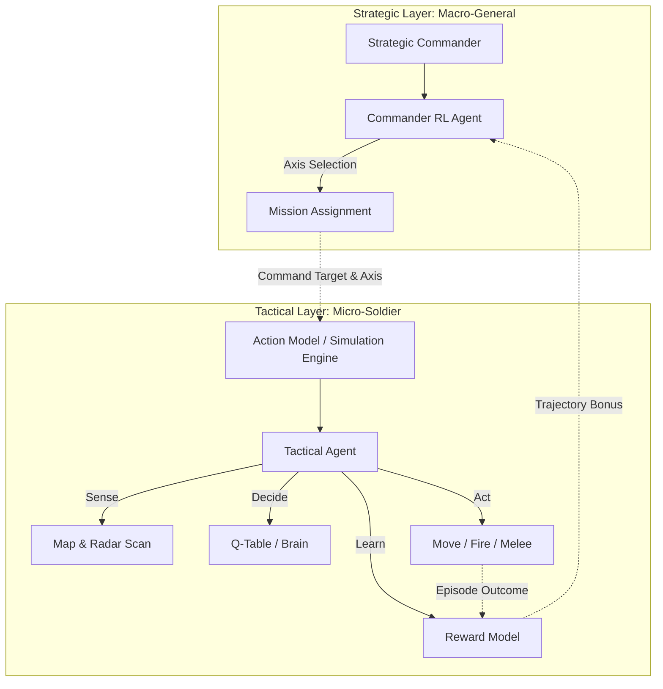
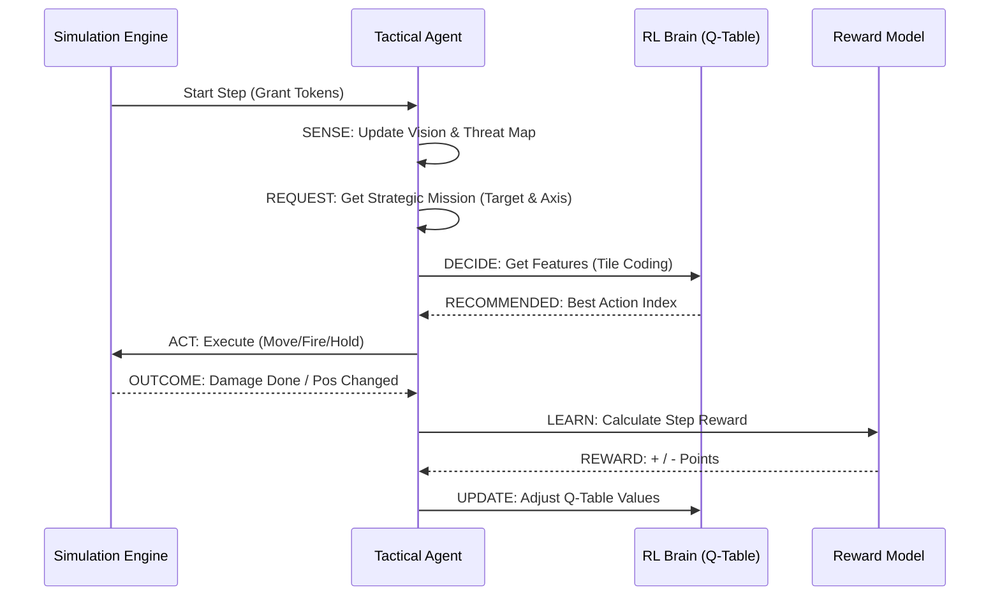

# Hex Grid Tactical Simulation: RL Engine Documentation

This document provides a highly detailed technical breakdown of the Reinforcement Learning (RL) Engine within the "War" project. It explains the dual-layer AI architecture, from high-level strategic command to low-level tactical execution, and the underlying mathematical and logic layers.

---

## 1. High-Level Architecture Overview

The system operates on two distinct layers of intelligence: the **Strategic Layer** (Macro) and the **Tactical Layer** (Micro). This separation allows the AI to handle complex objectives without getting lost in the minute details of hex-by-hex navigation.

### Dual-Layer AI Hierarchy

---

## 2. The Strategic Layer (Commander)

The `StrategicCommander` (found in `engine/ai/commander.py`) acts as the "General" of the forces. 

### Core Responsibilities:
1.  **Mission Evaluation**: Analyzes the map to find goal zones or priority enemies.
2.  **Assignment**: Issues `AgentCommand` objects (MOVE, CAPTURE, DEFEND).
3.  **Axis Selection**: Uses the `CommanderRLAgent` to decide the **Strategic Routing Tactic** (Movement Axis).

### Movement Axes:
- **Axis 0 (Direct)**: Standard terrain-only path. Optimized for distance.
- **Axis 1 (Safe)**: Heavily penalizes enemy Line-of-Fire (LOF). Optimized for survival.
- **Axis 2 (Fast)**: Ignores terrain penalties. Optimized for geometric speed.

### Commander Learning:
The `CommanderRLAgent` uses **Trajectory-Based Learning**. At the end of an episode, the total reward earned by a unit is propagated back through its strategic decisions using a **Discount Factor** ($\gamma = 0.95$). This helps the commander learn which axes lead to successful missions in the long term.

---

## 3. The Tactical Layer (Action Model)

The `ActionModel` (found in `engine/simulation/act_model.py`) is the simulation's heartbeat. It executes a **Sense-Decide-Act-Learn** loop for every agent on the grid.

### The Turn Loop

### State Representation: Tile Coding & Hashing
To handle the infinite permutations of a hex grid, the `StateActionEncoder` uses **Tile Coding**:
1.  **Grid Tiling**: 8 overlapping grids are laid over the map.
2.  **Hashing**: Spatial coordinates are hashed into a fixed-size feature vector (4096 indices).
3.  **Context Injection**: Casualty status and cumulative reward are XORed into the hash, making the "Brain" aware of its physical health and success level.

---

## 4. The Action System (Tokens & Costs)

The simulation uses an **Action Point (Token) System** to ensure realism. Every unit starts a step with tokens based on its `speed` attribute.

| Action Type | Token Cost | Notes |
| :--- | :--- | :--- |
| **Move (Clear)** | 1.0 | Standard hex move. |
| **Move (Rough)** | 2.0 | Moving through forests, slopes, or obstacles. |
| **Fire** | 2.0 | Initiates a direct fire engagement. |
| **Close Combat** | 2.0 | Melee engagement. |
| **Hold / Wait** | ALL | Ends the unit's turn for the current step. |

---

## 5. The Reward Logic (The Coach)

The `RewardModel` (`engine/ai/reward.py`) defines the AI's "Personality".

### Key Reward/Penalty Tokens:
- **Success Events**:
    - **Goal Completed**: $+400$
    - **Enemy Eliminated**: $+150$ (+ $+50$ per hit)
    - **Closing Distance**: $+30$ (Aggression bonus)
    - **Evasion**: $+5$ (Moving while under fire)
- **Failure Events**:
    - **Unit Lost**: $-400$
    - **Damage Taken**: $-2$ per point
    - **Retreating**: $-40$ (Cowardice penalty)
    - **Backtracking**: $-10$ (Looping prevention)
    - **Step Penalty**: $-1$ (Encourages efficiency)

---

## 6. Training Dynamics (Explorer vs Veteran)

The engine maintains two separate Q-Tables:
1.  **Ephemeral (The Explorer)**: 
    - **Epsilon**: High (~1.0).
    - **Purpose**: Rapidly tries new, random tactics. Used during training sessions.
2.  **Persistent (The Veteran)**:
    - **Epsilon**: Very Low (0.01).
    - **Purpose**: Uses "Hard-coded" experience. Used for production/difficult AI.

**Experience Replay**: The system uses a `ReplayBuffer` to sample batches of moves (Batch Size: 32) every 10 steps, stabilizing learning and preventing the AI from "forgetting" early-game lessons.

---

## 7. Directory & Code Reference

To understand or modify the RL Engine, refer to the following key files:

### Strategic Layer (Macro)
- **`engine/ai/commander.py`**: The "General". Contains the `StrategicCommander` class which evaluates the map and assigns high-level missions and targets.
- **`engine/ai/commander_rl.py`**: The "Strategy Brain". Manages the `CommanderRLAgent`, which uses trajectory-based learning to select movement axes.
- **`engine/simulation/command.py`**: Defines the `AgentCommand` object which bridges the Commander's orders to the Tactical Agent's execution.

### Tactical Layer (Micro)
- **`engine/simulation/act_model.py`**: The "Heart". Contains the `ActionModel`, which runs the main simulation loop, coordinates sensors, and handles the RL decision-making for every agent.
- **`engine/ai/reward.py`**: The "Rulebook". Defines the `RewardModel` and the point values for every success or failure in the game.
- **`engine/ai/encoder.py`**: The "Translator". Implements `StateActionEncoder` and `TileCoder`, converting raw hex data into mathematical features for the RL agent.
- **`engine/ai/q_table.py`**: The "Memory Manager". Handles saving, loading, and updating the Q-Tables (Brains) on disk and in memory.
- **`engine/ai/replay_buffer.py`**: The "Past Experiences". Manages a buffer of recent agent moves to allow for stable batch training.

### Execution Tools
- **`engine/simulation/move.py`**: Logic for physical hex movement and terrain cost deduction.
- **`engine/simulation/fire.py`**: Logic for direct fire engagements and target acquisition.
- **`engine/simulation/close_combat.py`**: Logic for melee (melee) combat resolution.
- **`engine/simulation/commit.py`**: Logic for objective-based interactions (e.g. capturing a point).
