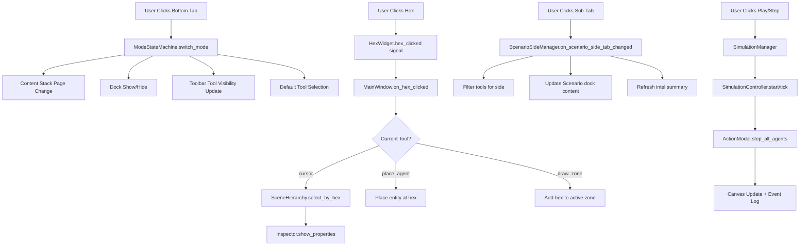

# Wargame Engine — UI Design Guide

> **Purpose**: This document is the definitive reference for the **structure, flow, design, and functionality** of the Wargame Engine's user interface. It explains every section, subsection, tab, button, dock, and panel — what it does, when it is visible, and how it should look and behave.

---

## Table of Contents

1. [Architecture Overview](#1-architecture-overview)
2. [Global Design System](#2-global-design-system)
3. [Application Modes (Master Navigation)](#3-application-modes)
4. [Layout Anatomy](#4-layout-anatomy)
5. [Menu Bar](#5-menu-bar)
6. [Left Toolbar (Tool Palette)](#6-left-toolbar)
7. [Central Canvas (Hex Widget)](#7-central-canvas)
8. [Right Panel — Inspector Dock](#8-right-panel--inspector-dock)
9. [Right Panel — Scene Hierarchy Dock](#9-right-panel--scene-hierarchy-dock)
10. [Right Panel — Scenario Manager Dock](#10-right-panel--scenario-manager-dock)
11. [Right Panel — Mission Control / Timeline Dock](#11-right-panel--mission-control-dock)
12. [Map Gallery View](#12-map-gallery-view)
13. [Dashboard / Analytics View](#13-dashboard--analytics-view)
14. [Sub-Tabs (Theater Header)](#14-sub-tabs-theater-header)
15. [Status Bar](#15-status-bar)
16. [Keyboard Shortcuts](#16-keyboard-shortcuts)
17. [Current Issues and Proposed Improvements](#17-current-issues--proposed-improvements)

---

## 1. Architecture Overview

### Application Shell

The application is built with **PyQt5** and uses `/ui/views/main_window.py` (~2000 lines) as the root controller.

```
┌──────────────────────────────────────────────────────────┐
│  MENU BAR   [File] [Edit] [View] [Simulation] [Help]    │
├──────┬───────────────────────────────────┬───────────────┤
│      │                                   │               │
│ LEFT │    CENTRAL CONTENT STACK          │  RIGHT PANEL  │
│TOOL  │    (QStackedWidget)               │  DOCKS        │
│BAR   │                                   │  (Inspector,  │
│      │  Index 0: Map Gallery             │  Hierarchy,   │
│      │  Index 1: Theater (Map Canvas)    │  Scenario,    │
│      │  Index 2: Dashboard               │  Timeline)    │
│      │  Index 3: Report                  │               │
│      │  Index 4: Master Data             │               │
│      │                                   │               │
├──────┴───────────────────────────────────┴───────────────┤
│  BOTTOM DOCK: Navigation Tabs                            │
│  [ MAPS | TERRAIN | SCENARIO | PLAY | DATABASE ]         │
├──────────────────────────────────────────────────────────┤
│  STATUS BAR      Ready                    12:34:56       │
└──────────────────────────────────────────────────────────┘
```

### Key Architectural Principles

| Component | File | Role |
|---|---|---|
| `MainWindow` | `main_window.py` | Root controller, layout, menus, dock setup |
| `ModeStateMachine` | `mode_state_machine.py` | Toggles dock visibility per mode |
| `ToolbarController` | `toolbar_controller.py` | Left toolbar tools and visibility |
| `ScenarioSideManager` | `scenario_side_manager.py` | Side assignment and sub-tab logic |
| `SimulationManager` | `simulation_manager.py` | Simulation lifecycle (play/pause/step) |
| `ShortcutRegistry` | `shortcut_registry.py` | Centralized keyboard shortcuts |
| `Theme` | `theme.py` | Design tokens, fonts, colors, QSS |

---

## 2. Global Design System

### 2.1 Color Palette

| Token | Hex | Usage |
|---|---|---|
| `BG_DEEP` | `#0d0d0d` | Main window background, deepest layer |
| `BG_SURFACE` | `#1a1b1c` | Panel backgrounds, dock surfaces |
| `BG_INPUT` | `#242628` | Input fields, hover states, selected items |
| `ACCENT_ALLY` | `#4d94ff` | Blue team color, active/selected indicators, primary CTA |
| `ACCENT_ENEMY` | `#ff4d4d` | Red team color, danger, destructive actions |
| `ACCENT_WARN` | `#ffcc00` | Warnings, Pause state, caution labels |
| `ACCENT_NEUTRAL` | `#8c8c8c` | Neutral entities, inactive state |
| `OLIVE_DRAB` | `#4b5320` | Army-style buttons, "EXECUTE MISSION" |
| `SAND_DESERT` | `#c2b280` | Tertiary accent for charts |
| `TEXT_PRIMARY` | `#f2f2f2` | Main body text, headings, labels |
| `TEXT_DIM` | `#a0a4a8` | Secondary text, timestamps, hints |
| `BORDER_STRONG` | `#3a3d41` | Panel borders, separators |
| `BORDER_SUBTLE` | `#2d3033` | Internal dividers within panels |

### 2.2 Typography

| Token | Font Family | Usage |
|---|---|---|
| `FONT_HEADER` | `Inter` | Section headers, tab labels, group titles |
| `FONT_BODY` | `Inter` | Body text, descriptions, general UI |
| `FONT_MONO` | `Cascadia Code` | Data values, coordinates, agent IDs, status bar clock |

### 2.3 Font Sizes (Current — Needs Standardization)

| Context | Current Size | Recommended |
|---|---|---|
| Mode tab labels | 10px | **11px** — increase for readability |
| Section headers (e.g., "TERRAIN ANALYSIS") | 10px bold | **11px bold** — slightly larger |
| Property labels (e.g., "Sector Classification") | 10px | 10px — OK |
| Property values (data) | 11px mono | 11px mono — OK |
| Form labels (draw zone, place agent) | Default (~13px) | **10px** — reduce to match panels |
| Button text (EXECUTE MISSION) | 12px | 12px — OK |
| Status bar | 11px mono | 11px mono — OK |
| Tooltips | 12px | 12px — OK |

### 2.4 Spacing and Padding Constants

| Element | Current | Recommended |
|---|---|---|
| Panel content margins | Variable (0, 5, 10, 15px) | **Standardize to 12px** |
| Card internal padding | Variable | **10px consistent** |
| Group header spacing | Variable | **8px top margin, 4px bottom** |
| Button padding | 6–10px | **8px vertical, 16px horizontal** |
| Dock border radius | 0px | 0px (sharp tactical look) — OK |

### 2.5 Global QSS Entry Points

All global styles are defined in `Theme.get_main_qss()`. This returns a single stylesheet string applied via `self.setStyleSheet(Theme.get_main_qss())` at init. It covers: `QMainWindow`, `QToolTip`, `QStatusBar`, `QTabWidget`, `QTabBar`, `QPushButton`, `QToolBar`, `QToolButton`, `QDockWidget`, scroll bars, inputs, combos, sliders, and spin boxes.

---

## 3. Application Modes

The bottom tab bar (`mode_tabs`) drives the entire application state. Each mode controls:
- **Which content stack page is visible** (Gallery vs Canvas vs Dashboard)
- **Which dock panels are shown/hidden**
- **Which toolbar tools are available**
- **Which sub-tabs appear above the canvas**

### Mode Visibility Matrix

| Element | MAPS | TERRAIN | SCENARIO | PLAY | DATABASE |
|---|---|---|---|---|---|
| **Content Stack** | Gallery (0) | Theater (1) | Theater (1) | Theater (1) | MasterData (4) |
| **Left Toolbar** | ❌ Hidden | ✅ Shown | ✅ Shown | ❌ Hidden | ❌ Hidden |
| **Inspector Dock** | ❌ Hidden | ✅ Shown | ✅ Shown | ❌ Hidden | ❌ Hidden |
| **Hierarchy Dock** | ❌ Hidden | ❌ Hidden | ✅ Shown | ❌ Hidden | ❌ Hidden |
| **Scenario Dock** | ❌ Hidden | ❌ Hidden | ✅ Shown | ❌ Hidden | ❌ Hidden |
| **Timeline Dock** | ❌ Hidden | ❌ Hidden | ❌ Hidden | ✅ Shown | ❌ Hidden |
| **Theater Sub-Tabs** | ❌ Hidden | ❌ Hidden | ✅ Shown | ❌ Hidden | ❌ Hidden |
| **Default Tool** | — | `draw_zone` | `place_agent` | `cursor` | — |

### Mode-Specific Tool Availability

| Tool | TERRAIN | SCENARIO (Attacker) | SCENARIO (Defender) | PLAY (Attacker) | PLAY (Defender) |
|---|---|---|---|---|---|
| Select (cursor) | ✅ | ✅ | ✅ | ✅ | ✅ |
| Edit | ✅ | ✅ | ✅ | ❌ | ❌ |
| Eraser | ✅ | ✅ | ✅ | ❌ | ❌ |
| Place Agent | ❌ | ✅ | ✅ | ❌ | ❌ |
| Draw Zone | ✅ | ✅ | ✅ | ❌ | ❌ |
| Paint Tool | ✅ | ❌ | ❌ | ❌ | ❌ |
| Draw Path | ✅ | ✅ | ✅ | ❌ | ❌ |
| Assign Goal | ❌ | ✅ | ❌ | ✅ | ❌ |

---

## 4. Layout Anatomy

### 4.1 Central Content Stack (`QStackedWidget`)

This is the main area of the window. Only one page is visible at a time:

| Index | Page Widget | When Visible |
|---|---|---|
| 0 | `MapsWidget` (Gallery) | MAPS mode |
| 1 | `main_splitter` → Theater Container (Sub-tabs + HexWidget) | TERRAIN, SCENARIO, PLAY |
| 2 | `DashboardWidget` | (Not directly used via mode tabs currently) |
| 3 | `ReportWidget` | (Not directly used via mode tabs currently) |
| 4 | `MasterDataWidget` | DATABASE mode |

### 4.2 Theater Container

When in TERRAIN / SCENARIO / PLAY modes, the theater container is visible:

```
┌─────────────────────────────────────────────┐
│ [ATTACKER] [DEFENDER] [COMBINED] [RULES]    │  ← Sub-tabs (only in SCENARIO mode)
├─────────────────────────────────────────────┤
│                                             │
│           HEX WIDGET (Map Canvas)           │  ← Full remaining space
│                                             │
└─────────────────────────────────────────────┘
```

### 4.3 Right Panel Dock Layout

Docks are tabified (stacked behind each other with tabs). Order:
1. **Inspector** (tool options + object properties)
2. **Scenario Manager** (mission profiles + rules)
3. **Scene Hierarchy** (layer tree)
4. **Timeline / Mission Control** (simulation controls)

All are `Qt.RightDockWidgetArea`. They can be dragged, floated, or re-tabified.

---

## 5. Menu Bar

### File Menu

| Item | Shortcut | Action |
|---|---|---|
| New Project | `Ctrl+Shift+N` | Creates project folder structure |
| Open Project | `Ctrl+Shift+O` | Opens folder containing `Terrain.json` |
| New Map | `Ctrl+N` | Creates new map within current project |
| Save Map | `Ctrl+S` | Saves terrain + all scenarios |
| Load Scenario | — | File dialog for `.json` scenario |
| Save Scenario | — | Saves active scenario with custom name |
| Exit | `Ctrl+Q` | Closes application |
| Restart Application | `Ctrl+R` | Full restart via `os.execl()` |
| Reload Master Data | — | Hot-reloads JSON catalogs |

### Edit Menu

| Item | Shortcut | Action |
|---|---|---|
| Undo | `Ctrl+Z` | Reverts last terrain/property change |
| Redo | `Ctrl+Y` | Re-applies undone change |
| Resize Map | — | Dialog with width/height spinboxes |
| Agent Allocation | — | Batch-place agents on map |
| Border Setup | — | Draws dividing line, triggers side assignment |
| Clear Map | — | Wipes all terrain and zones (with confirmation) |

### View Menu

| Item | Shortcut | Action |
|---|---|---|
| Zoom In | `Ctrl++` | Zooms canvas by 1.2x factor |
| Zoom Out | `Ctrl+-` | Zooms canvas by 1/1.2x factor |
| Reset Camera | `Ctrl+0` | Resets zoom and pan to defaults |
| Infinite Grid | — | Toggle: bounded vs infinite grid |
| Show Coordinates | — | Toggle: show hex `[q, r]` labels |
| Show Threat Map | — | Toggle: AI-calculated danger overlay |
| Switch Theme | — | Toggles between dark/light themes |

### Simulation Menu

| Item | Shortcut | Action |
|---|---|---|
| Step | `F10` | Advance simulation by one step |
| Play | `F5` | Start/resume continuous simulation |
| Pause | `F6` | Pause simulation at current step |
| Reset Environment | — | Reload scenario to starting state |

### Help Menu

| Item | Action |
|---|---|
| Manual | Opens `USER_MANUAL.md` in a dialog |
| About | Shows app version info |

---

## 6. Left Toolbar (Tool Palette)

**File**: `ui/core/toolbar_controller.py`  
**Visibility**: Hidden in MAPS, DATABASE, PLAY modes. Shown in TERRAIN, SCENARIO.  
**Position**: Left vertical dock (`Qt.LeftDockWidgetArea`)

| Tool | Icon Key | Shortcut | Description |
|---|---|---|---|
| **Select** | `cursor` | `S` | Click-to-inspect, drag-to-pan |
| **Edit** | `edit` | `E` | Click hex → edit terrain in Inspector |
| **Eraser** | `eraser` | `X` | Click on objects to delete them |
| **Place Agent** | `place_agent` | `A` | Drop new unit (configure in Inspector first) |
| **Draw Zone** | `draw_zone` | `Z` | Click hexes to define named regions |
| **Paint Tool** | `paint_tool` | `P` | Click-drag to brush terrain types |
| **Draw Path** | `draw_path` | `D` | Click hexes sequentially for routes |
| **Assign Goal** | `assign_goal` | `G` | Set movement objective for a unit |

### Tool Selection Behavior

- Tools are **mutually exclusive** (`QButtonGroup`, exclusive=True)
- Default tool: `cursor` (always checked on startup)
- When mode changes, active tool is reset to the mode's default
- If current tool becomes invisible due to mode change, auto-resets to `cursor`

### Tool Options Panel (Dynamic)

When certain tools are selected, a **Tool Options** form appears in the Inspector dock above the Object Properties widget:

| Tool | Options Shown |
|---|---|
| `draw_zone` | Zone Name (text), Zone Type (dropdown), Sub-Type (dropdown), "Right Click to Commit" hint |
| `draw_path` | Path Name (text), Path Type (dropdown + "+" button), Draw Mode (Center-to-Center / Edge-Aligned), "Right Click to Commit" hint |
| `place_agent` | Side (Attacker/Defender radio), Agent Type (dropdown from Master DB), Personnel (spinbox) |
| Others | Hidden (no options) |

---

## 7. Central Canvas (Hex Widget)

**File**: `ui/views/hex_widget.py`  
**Role**: The interactive hexagonal grid map where all visual gameplay happens.

### Core Features

- Renders terrain with color-coded hexes (plains, forest, water, mountain, urban)
- Draws units with NATO-style icons and IFF (friend/foe) coloring
- Shows zones as colored overlays with labels
- Draws paths as colored lines connecting hex centers or edges
- Supports zoom (scroll wheel), pan (middle-click/drag), and tool-based interactions
- Emits `hex_clicked` signal when a hex is clicked

### Visual Overlays (Toggleable)

| Overlay | Toggle Location | Default |
|---|---|---|
| Hex coordinates | View → Show Coordinates | Off |
| Infinite grid | View → Infinite Grid | Off |
| Threat map | View → Show Threat Map | Off |
| Movement trails | Timeline → "Movement Trails" checkbox | On |
| Engagement FX | Timeline → "Engagement FX" checkbox | On |
| Territory sections | Scene Hierarchy → "Territory Sections" toggle | Off |
| Map borders | Scene Hierarchy → "Map Borders" toggle | Off |

---

## 8. Right Panel — Inspector Dock

**Title**: "Inspector"  
**File**: `ui/views/main_window.py` (setup), `ui/components/object_properties_widget.py` (widget)  
**Visibility**: TERRAIN, SCENARIO modes only  
**Position**: Right dock area, first tab

### Structure

```
┌─────────────────────────────────┐
│ [Inspector] [Scenario] [Hier]  │  ← Dock tab bar
├─────────────────────────────────┤
│ ┌─────────────────────────────┐ │
│ │ TOOL OPTIONS (Dynamic)      │ │  ← Only shown when draw_zone / draw_path / place_agent
│ │ Zone Name: [________]       │ │
│ │ Zone Type: [Dropdown    ▼]  │ │
│ └─────────────────────────────┘ │
│ ┌─────────────────────────────┐ │
│ │ OBJECT PROPERTIES           │ │  ← Always present
│ │                             │ │
│ │ (Content varies by          │ │
│ │  selection / mode)          │ │
│ └─────────────────────────────┘ │
└─────────────────────────────────┘
```

### Object Properties Widget Content

#### Default View (Nothing Selected)

Depends on mode:

- **TERRAIN mode**: Header "TERRAIN SCULPTOR", shows quick tips for terrain editing shortcuts
- **SCENARIO mode**: Header "SCENARIO DESIGNER", shows quick tips for unit placement

#### When a Hex is Selected (`kind="map"`)

| Section | Fields |
|---|---|
| **TERRAIN ANALYSIS** | Sector Classification (segmented: PLA/FOR/WAT/MTN/URB), Verticality/Elev (slider 0–5) |
| **STRATEGIC AO SCALE** | AO Width (spinbox 10–10000), AO Height (spinbox 10–10000) |

#### When a Unit is Selected (`kind="entity"`)

| Section | Fields |
|---|---|
| **TACTICAL IDENTITY** | Designation/Callsign (text), Classification (dropdown from Master DB) |
| **COMMAND ARCHITECTURE** | Affiliation/IFF (segmented: NEU/ATK/DEF), Echelon Level (dropdown: Squad/Platoon/Company/Battalion) |
| **OPERATIONAL STATUS** | Combat Readiness (progress bar), Direct Override (spinbox, personnel count) |

#### When a Zone is Selected (`kind="zone"`)

| Section | Fields |
|---|---|
| **IDENTITY** | Zone Label (text) |
| **VISUAL MARKERS** | Aura Color (dropdown: Red/Blue/Orange/Green/Cyan) |

#### When a Path is Selected (`kind="path"`)

| Section | Fields |
|---|---|
| **IDENTITY** | Route Name (text) |
| **VISUAL MARKERS** | Vector Color (dropdown: 6 colors) |

---

## 9. Right Panel — Scene Hierarchy Dock

**Title**: "Scene Hierarchy"  
**File**: `ui/components/scene_hierarchy_widget.py`  
**Visibility**: SCENARIO mode only (alongside Inspector)

### Layout

A `QTreeWidget` with columns: `[HIERARCHY | VIZ]`

```
SCENE ROOT
├── ZONES
│   ├── Objective Alpha
│   └── Restricted Zone B
├── UNITS
│   ├── [ATK] ALPHA SQUAD        [✔]
│   ├── [ATK] BRAVO TEAM         [✔]
│   ├── [DEF] DELTA PLATOON      [✔]
│   └── [DEF] ECHO COMPANY       [X]
├── PATHS
│   ├── SUPPLY LINE NORTH
│   └── CANAL SOUTH
└── Scenario Elements
    ├── Territory Sections        [  ]    ← Toggle
    └── Map Borders               [  ]    ← Toggle
```

### Behavior

- **Clicking a Unit/Zone/Path** → emits `item_selected(kind, ident)` → Inspector loads its properties
- **Clicking a Toggle** → flips the visibility flag → canvas updates
- **Color coding**: Attackers use `ACCENT_ALLY` (blue), Defenders use `ACCENT_ENEMY` (red)
- **Status column**: Shows `[✔]` if health > 0, `[X]` if dead

---

## 10. Right Panel — Scenario Manager Dock

**Title**: "Scenario Manager"  
**File**: `ui/components/scenario_manager_widget.py`, `ui/components/rules_widget.py`  
**Visibility**: SCENARIO mode only

### Structure

Uses a `QStackedWidget` that swaps between:
- **Index 0**: `ScenarioManagerWidget` — Mission profiles + intel
- **Index 1**: `RulesWidget` — Win/loss conditions editor

The swap is controlled by the **Theater Sub-Tabs**: clicking "RULES" shows index 1, anything else shows index 0.

### ScenarioManagerWidget Layout

```
┌─────────────────────────────────┐
│  MISSION OPERATIONS             │  ← TacticalHeader
├─────────────────────────────────┤
│  MISSION PROFILES               │  ← TacticalCard title
│  ┌─────────────────────────────┐│
│  │  Scenario 1                 ││  ← QListWidget items
│  │  Scenario 2 (selected)      ││
│  │  Counterattack Alpha        ││
│  └─────────────────────────────┘│
│  ┌─────────────────────────────┐│
│  │  TACTICAL INTEL SUMMARY     ││  ← Intel section
│  │  DEPLOYED ASSETS: 12        ││
│  │  OP THEATER: KASHMIR        ││
│  └─────────────────────────────┘│
├─────────────────────────────────┤
│  [ INITIALIZE NEW MISSION ]     │  ← Create scenario button
└─────────────────────────────────┘
```

### Buttons

| Button | Action |
|---|---|
| **INITIALIZE NEW MISSION** | Opens name dialog, creates blank scenario, switches to Scenario tab |

---

## 11. Right Panel — Mission Control Dock

**Title**: "Mission Control"  
**File**: `ui/views/timeline_panel.py`  
**Visibility**: PLAY mode only

### Full Layout

```
┌─────────────────────────────────────┐
│  MISSION PARAMETERS                 │  ← Section header
│  ─────────────────────────────────  │
│  Cycle Mode:  [Visual/Standard  ▼]  │  ← QComboBox
│  Target:      [___100___ EPISODES]  │  ← QSpinBox
│  Time Limit:  [___500___ MINS    ]  │  ← QSpinBox
├─────────────────────────────────────┤
│  COMMAND DECK                       │  ← Section header
│  ┌─────────────┬───────────────────┐│
│  │ INITIATE    │ EXECUTE MISSION   ││  ← Two primary buttons
│  │ LEARNING    │                   ││
│  └─────────────┴───────────────────┘│
│  ┌─────────────┬───────────────────┐│
│  │ PAUSE       │ WIPE INTELLIGENCE ││  ← Two secondary buttons
│  └─────────────┴───────────────────┘│
├─────────────────────────────────────┤
│  STATUS REPORT                      │
│  ● STANDBY                         │  ← Status label
│  ╔═════════════════════════════╗    │
│  ║ EPISODE 0 / 100            ║    │  ← Progress bar
│  ╚═════════════════════════════╝    │
│  STEP TIMER: 00:00                  │  ← Timer label
├─────────────────────────────────────┤
│  SIMULATION CONTROLS                │
│  [ STEP ] [▶ PLAY] [⏸ PAUSE] [↻ ] │  ← 4 command buttons
├─────────────────────────────────────┤
│  MONITORING LAYERS                  │
│  ☑ Movement Trails                 │  ← QCheckBox
│  ☑ Engagement FX                   │  ← QCheckBox
├─────────────────────────────────────┤
│  EVENT LOG                          │
│  [12:30:01] ATK moved N             │  ← Scrollable log
│  [12:30:01] DEF fired → HIT         │
│  [Pop Out]                          │  ← Float/unfloat button
└─────────────────────────────────────┘
```

### Button Reference

| Button | Style | Action |
|---|---|---|
| **INITIATE LEARNING** | Blue outline on dark | Batch-trains AI silently for N episodes |
| **EXECUTE MISSION** | Olive green background, white text | Starts live visual simulation |
| **PAUSE** | Dark bg, gold text | Pauses simulation |
| **WIPE INTELLIGENCE** | Transparent, red text/border | Deletes all AI learning data permanently |
| **STEP** | Dark command button | Advance by exactly 1 step |
| **PLAY** | Blue accent button | Start/resume continuous playback |
| **PAUSE** (sim) | Gold accent button | Halt at current step |
| **RESET** | Dark command button | Reload scenario to starting state |

---

## 12. Map Gallery View

**File**: `ui/views/maps_widget.py`  
**Visibility**: MAPS mode only (content stack index 0)

### Layout

```
┌─────────────────────────────────────────────┐
│  PROJECT MAP GALLERY                        │  ← TacticalHeader
│  ACTIVE PROJECT: OPERATION KASHMIR          │
├─────────────────────────────────────────────┤
│  ┌─────────┐  ┌─────────┐  ┌─────────┐    │
│  │ [thumb] │  │ [thumb] │  │ [thumb] │    │  ← QListWidget (Icon Mode)
│  │ Map A   │  │ Map B   │  │ Map C   │    │     220x150 thumbnails
│  └─────────┘  └─────────┘  └─────────┘    │
├─────────────────────────────────────────────┤
│  [ Open Map ] [ New Map ] [ Refresh ]       │  ← Action buttons
└─────────────────────────────────────────────┘
```

### Behavior

- **Double-click** a thumbnail → loads that map, switches to TERRAIN mode
- **Open Map** button → loads the currently selected map
- **New Map** button → creates a blank 20×20 map in current project
- **Refresh** → regenerates thumbnail list
- Thumbnails are auto-generated from `HexRenderer.render_map_to_image()` and cached as `thumbnail.png`

---

## 13. Dashboard / Analytics View

**File**: `ui/components/dashboard_widget.py`  
**Visibility**: Currently not directly accessible from mode tabs (was intended for PLAY sub-views)

### Sub-Tabs

| Tab | Widget | Content |
|---|---|---|
| **Analytics** | `AnalyticsTab` | Bar charts: Action Distribution (Move vs Fire), Decision Mode (Exploit vs Explore) |
| **Agent Brain (Live)** | `AgentBrainTab` | Agent selector dropdown, Unit Telemetry card (personnel, weapons, position), Cognitive Descriptor card (mode, state, reward), Action Value Matrix table (Q-values) |
| **Live Feed** | `LiveFeedTab` | Scrollable event log with color-coded entries |
| **Logistics (Ammo)** | `LogisticsTab` | Grid of unit cards showing TYPE, HULL bar, STATUS, AMMO |
| **Cheat Sheet** | `ReferenceTab` | RL formulas: Bellman equation, State Space encoding, Reward table |

---

## 14. Sub-Tabs (Theater Header)

**Widget**: `QTabBar` (`map_header_tabs`)  
**Visibility**: SCENARIO mode only (hidden in TERRAIN, PLAY, etc.)

| Tab | Action |
|---|---|
| **ATTACKER** | Locks tool palette to Attacker-specific tools; filters scenario intel to Attacker assets |
| **DEFENDER** | Locks to Defender tools (no Assign Goal); shows Defender intel |
| **COMBINED** | Unlocks all tools; shows intel for both sides |
| **RULES** | Swaps Scenario dock content to `RulesWidget` for editing win/loss conditions |

### Side-Locking Behavior

When on ATTACKER or DEFENDER tab:
- The **Place Agent** tool's side radio buttons are **locked** to the active tab's side
- **Assign Goal** is **disabled** for DEFENDER
- The `ScenarioManagerWidget.refresh_intel()` filters deployed unit count by side

---

## 15. Status Bar

**Position**: Bottom of window, below all docks  
**Contents**:
- **Left**: Status messages (e.g., "Ready", "Saving Project...", "Project Saved")
- **Right**: Digital clock (`HH:MM:SS` format, `Cascadia Code` font, dim gray)

---

## 16. Keyboard Shortcuts

| Key | Action | Context |
|---|---|---|
| `Ctrl+S` | Save map + scenarios | Global |
| `Ctrl+Z` | Undo | Global |
| `Ctrl+Y` | Redo | Global |
| `Ctrl+N` | New Map | Global |
| `Ctrl+Shift+N` | New Project | Global |
| `Ctrl+Shift+O` | Open Project | Global |
| `Ctrl+Q` | Exit | Global |
| `Ctrl+R` | Restart | Global |
| `Ctrl++` | Zoom In | Global |
| `Ctrl+-` | Zoom Out | Global |
| `Ctrl+0` | Reset Camera | Global |
| `F5` | Play simulation | Global |
| `F6` | Pause simulation | Global |
| `F10` | Step simulation | Global |
| `S` | Select tool | TERRAIN/SCENARIO |
| `E` | Edit tool | TERRAIN/SCENARIO |
| `X` | Eraser tool | TERRAIN/SCENARIO |
| `A` | Place Agent tool | SCENARIO |
| `Z` | Draw Zone tool | TERRAIN/SCENARIO |
| `P` | Paint tool | TERRAIN |
| `D` | Draw Path tool | TERRAIN/SCENARIO |
| `G` | Assign Goal tool | SCENARIO/PLAY |

---

## 17. Current Issues & Proposed Improvements

### 17.1 Critical Issues

#### A. Mode Tab Confusion

**Problem**: Bottom tabs say "MAPS / TERRAIN / SCENARIO / PLAY / DATABASE" but these labels don't clearly communicate the workflow. Users don't understand the progression.

**Fix**:
- Rename to: `HOME / EDITOR / DEPLOY / SIMULATE / DATA`
- Add icons to each tab
- Add a subtle breadcrumb or mode indicator in the status bar

#### B. Dashboard / Report / Analytics are Inaccessible

**Problem**: `DashboardWidget`, `ReportWidget` are in the content stack but have **no mode tab** to access them. The Dashboard has 5 rich sub-tabs that are completely unreachable.

**Fix**: Either:
- Add a "DASHBOARD" tab after "PLAY" (before DATABASE)
- **OR** embed the dashboard as a dock in PLAY mode (preferred — so analytics are visible during simulation alongside Mission Control)

#### C. Inspector Dock is Overloaded

**Problem**: The Inspector dock combines **Tool Options** (form for configuring the active tool) AND **Object Properties** (form for the selected entity) in one scrollable column. This is confusing — users don't distinguish between "settings for the tool I'm about to use" vs "properties of the thing I selected."

**Fix**:
- Split into two clearly labeled sections with distinct visual treatment
- Tool Options should have a colored header bar (e.g., blue) and a label like "🔧 TOOL: DRAW ZONE"
- Object Properties should have a different header bar color (e.g., gray) and a label like "📋 SELECTED: HEX [3, 7]"
- Add a separator/divider line between them

#### D. Dock Tabs are Hard to Discover

**Problem**: Inspector, Scenario Manager, Scene Hierarchy, and Timeline are all tabified into one dock area. Users often don't notice the dock tab bar or understand that there are multiple panels stacked behind each other.

**Fix**:
- Reduce tabification — put Scene Hierarchy as a bottom section within Inspector instead of a separate dock
- Make Inspector and Scenario Manager two separate, always-visible panels (vertical split)
- Timeline should be a full-width bottom panel in PLAY mode, not a right dock tab

### 17.2 Visual Polish Issues

#### E. Inconsistent Font Sizes

**Problem**: Font sizes range from 9px to 14px across different widgets with no clear hierarchy.

**Fix**: Adopt a strict type scale:
| Level | Size | Weight | Use |
|---|---|---|---|
| H1 | 14px | Bold, `FONT_HEADER` | Mode titles (TERRAIN SCULPTOR) |
| H2 | 11px | Bold, `FONT_HEADER`, uppercase, letter-spacing 1.5px | Section headers (TERRAIN ANALYSIS) |
| Body | 11px | Regular, `FONT_BODY` | Form labels, descriptions |
| Data | 11px | Regular, `FONT_MONO` | Values, coordinates, IDs |
| Caption | 9px | Regular, `FONT_BODY` | Hints, fine print |

#### F. Button Styles are Inconsistent

**Problem**: Some buttons use inline `setStyleSheet()`, some rely on global QSS. EXECUTE MISSION is olive green, INITIATE LEARNING is blue outline, PAUSE is gold text on dark, WIPE INTELLIGENCE is red text with border. The four command buttons (STEP/PLAY/PAUSE/RESET) use a custom `_create_command_button` method. There's no unified button taxonomy.

**Fix**: Define button levels in Theme:
| Level | Background | Text | Border | Use |
|---|---|---|---|---|
| **Primary** | `OLIVE_DRAB` | White | None | EXECUTE MISSION |
| **Secondary** | `BG_INPUT` | `ACCENT_ALLY` | 1px `ACCENT_ALLY` | INITIATE LEARNING |
| **Warning** | `BG_INPUT` | `ACCENT_WARN` | 1px `ACCENT_WARN` | PAUSE |
| **Danger** | Transparent | `ACCENT_ENEMY` | 1px `ACCENT_ENEMY` | WIPE INTELLIGENCE |
| **Command** | `#2a2a2a` | `TEXT_PRIMARY` | 1px `BORDER_STRONG` | STEP, RESET |
| **Active** | `ACCENT_ALLY` bg | White | None | PLAY (when active) |

#### G. Property Cards Need Visual Separation

**Problem**: In the Inspector, terrain properties, map dimensions, unit identity, command architecture, and operational status all look like one continuous form. Headers exist but are small and don't visually separate sections.

**Fix**:
- Give each section card a visible border-left accent (2px colored stripe)
- Use alternating background shades for cards (`BG_SURFACE` vs `BG_DEEP`)
- Add more vertical spacing (12px) between cards

### 17.3 UX Flow Improvements

#### H. No Onboarding / Empty States

**Problem**: Opening the app with no project shows a blank map gallery. No guidance on what to do.

**Fix**:
- Add an empty state to Map Gallery: "No project loaded. Click **New Project** or **Open Project** to get started."
- Add a "Getting Started" wizard or prominent action buttons on first launch
- Show workflow hints: "Step 1: Create Project → Step 2: Edit Terrain → Step 3: Deploy Units → Step 4: Run Simulation"

#### I. No Visual Feedback for Active Mode

**Problem**: The bottom tabs show which mode is selected, but there's no persistent visual feedback in the main content area. Users switching between modes may not realize the context has changed.

**Fix**:
- Add a mode indicator banner above the canvas: `[EDITOR: TERRAIN MODE]` with the mode's accent color
- Dim or tint the canvas border to match the current mode's theme color

#### J. Timeline Panel is Too Dense

**Problem**: Mission Parameters, Command Deck, Status Report, Simulation Controls, Monitoring Layers, and Event Log are all crammed into one vertical panel. It's overwhelming.

**Fix**:
- Use collapsible sections (QToolBox or custom accordion)
- Group related items: "Config" (parameters), "Execution" (buttons + status), "Output" (log + layers)
- Make the Event Log resizable or pop-outable (already partially implemented)

### 17.4 Structural Recommendations

#### K. Extract Tool Options from Inspector

Move the tool options panel out of the Inspector dock into a floating toolbar or a dedicated section above the canvas. This prevents the Inspector from constantly changing layout based on tool selection.

#### L. Consolidate Right Panel

Instead of 4 separate tabified docks:
```
Current:  [Inspector] [Scenario] [Hierarchy] [Timeline]  ← confusing tabs

Proposed:
┌──────────────────────────────────────┐
│ INSPECTOR (always visible right)     │
│ ┌──────────────────────────────────┐ │
│ │ Selected Object Properties       │ │
│ └──────────────────────────────────┘ │
│ ┌──────────────────────────────────┐ │
│ │ Scene Hierarchy (collapsible)    │ │
│ └──────────────────────────────────┘ │
└──────────────────────────────────────┘
```

In PLAY mode, replace the right panel with Mission Control:
```
┌──────────────────────────────────────┐
│ MISSION CONTROL                      │
│ ┌──────────────────────────────────┐ │
│ │ Controls (Play/Pause/Step/Reset) │ │
│ └──────────────────────────────────┘ │
│ ┌──────────────────────────────────┐ │
│ │ Status + Progress                │ │
│ └──────────────────────────────────┘ │
│ ┌──────────────────────────────────┐ │
│ │ Event Log (expandable)           │ │
│ └──────────────────────────────────┘ │
└──────────────────────────────────────┘
```

#### M. Make Scenario Manager a Left Sidebar

Currently the Scenario Manager is hidden behind a dock tab on the right. In SCENARIO mode, it should be the primary panel — move it to the left as a dedicated sidebar or make it the top section of the right panel.

---

## Appendix A: File Reference

| File | Description |
|---|---|
| `ui/views/main_window.py` | Root window, layout, menus, dock setup, tool options, hex click handling |
| `ui/views/hex_widget.py` | Interactive hex grid canvas |
| `ui/views/timeline_panel.py` | Simulation controls, event log, monitoring layers |
| `ui/views/maps_widget.py` | Project map gallery (icon-mode list) |
| `ui/views/hex_renderer.py` | Offline hex map-to-image renderer for thumbnails |
| `ui/views/inspector_panel.py` | Minimal inspector dock container (tool options + layer manager) |
| `ui/core/toolbar_controller.py` | Left toolbar setup and tool visibility |
| `ui/core/mode_state_machine.py` | Mode switching logic, dock visibility rules |
| `ui/core/scenario_side_manager.py` | Side assignment flow, sub-tab handling |
| `ui/core/simulation_manager.py` | Simulation lifecycle (start, pause, step, reset, learn) |
| `ui/core/shortcut_registry.py` | Centralized keyboard shortcut definitions |
| `ui/core/icon_painter.py` | Vector icon generation (no external icon files) |
| `ui/components/object_properties_widget.py` | Entity/hex/zone/path property editor |
| `ui/components/scene_hierarchy_widget.py` | Tree view of all map elements |
| `ui/components/scenario_manager_widget.py` | Scenario list, intel summary, new mission button |
| `ui/components/rules_widget.py` | Win/loss condition editor |
| `ui/components/dashboard_widget.py` | Analytics, agent brain, live feed, logistics, cheat sheet |
| `ui/components/themed_widgets.py` | Reusable styled widgets (TacticalCard, TacticalHeader, etc.) |
| `ui/components/master_data_widget.py` | JSON data browser (DATABASE mode) |
| `ui/components/report_widget.py` | Report generation view |
| `ui/styles/theme.py` | Design tokens, color palette, fonts, global QSS |
| `ui/dialogs/themed_dialogs.py` | Themed message boxes and dialogs |

---

## Appendix B: Signal Flow


