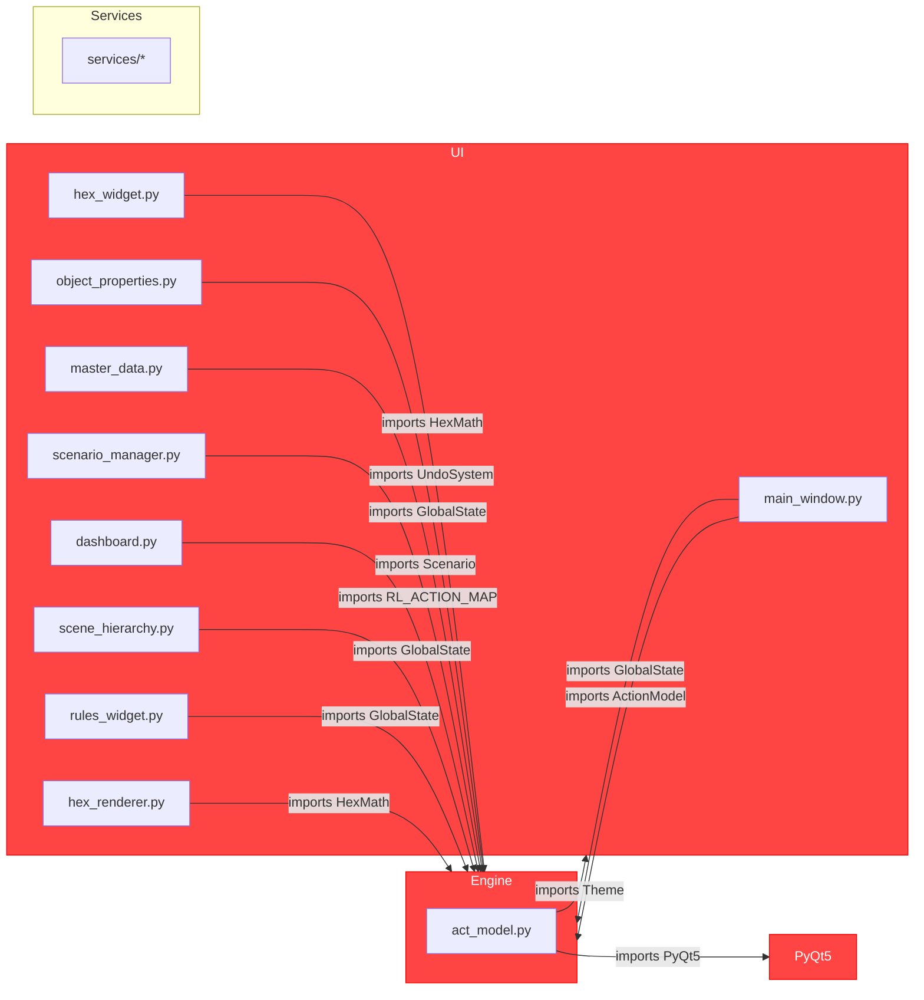
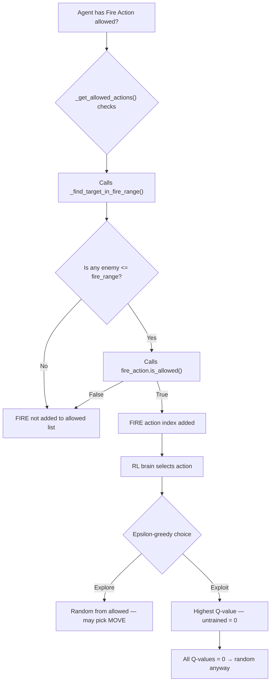
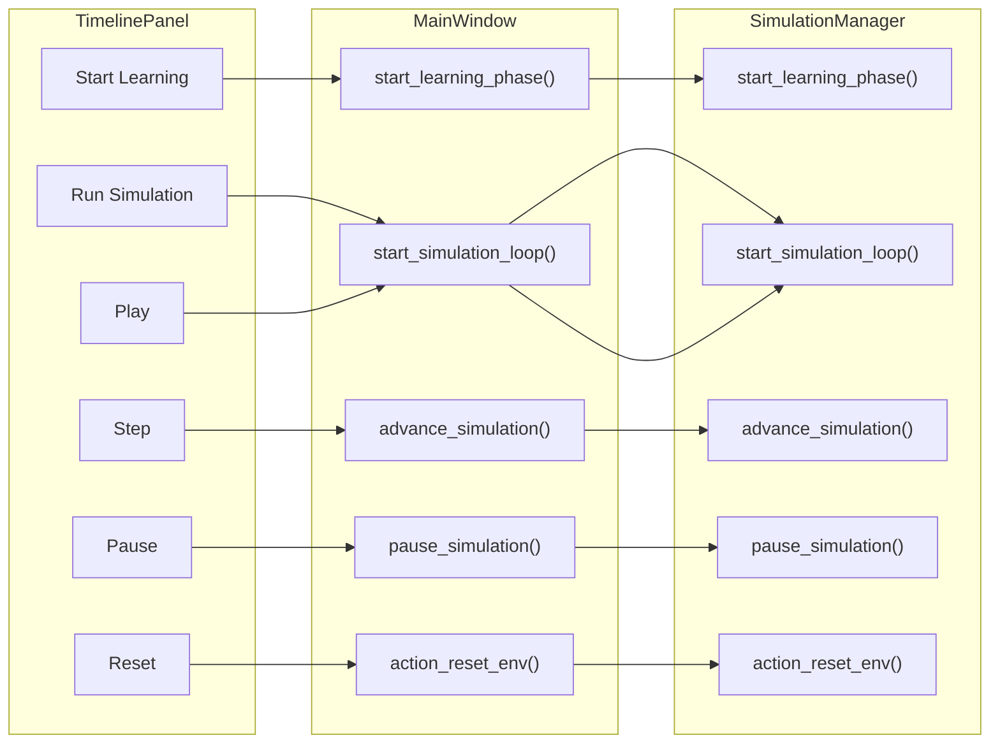
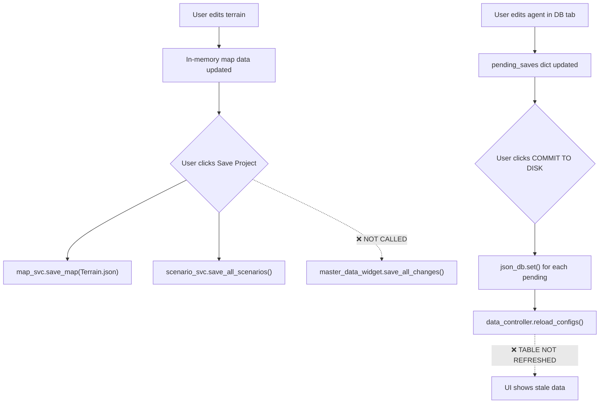

# 🔬 Comprehensive Codebase Analysis: `currentActive`

> **Scope**: Every file and directory under `anshum/currentActive/`
> **Date**: 2026-04-08
> **Files Analyzed**: 146 Python files (~24,084 lines) + docs, configs, scripts, stylesheets
> **Methodology**: File-by-file static analysis covering UI, responsiveness, editability, cross-platform, documentation, architecture, naming, comments, modularity, and code quality

---

## ✅ Applied Changes (2026-04-08)

The following findings from this analysis have been implemented:

| # | Issue | Status | File(s) Changed |
|---|---|---|---|
| P0.1 | **Engine imports PyQt5** (`act_model.py`) | ✅ Fixed | `engine/simulation/act_model.py` |
| P0.2 | **Engine imports UI Theme** (`act_model.py`) | ✅ Fixed | `engine/simulation/act_model.py` — hardcoded color constants |
| P0.3 | **`processEvents()` blocks engine** | ✅ Fixed | `act_model.py` — replaced with `yield_callback` parameter |
| P0.4 | **Dead files** (`debug_patch.py`, `test_qlist.py`, TEMP_CONFIG) | ✅ Deleted | Removed at root and `ui/components/` |
| P0.5 | **Empty directories** (`ui/canvas/`, `ui/main/`) | ✅ Deleted | Removed |
| P0.6 | **Step button blocked when paused** | ✅ Fixed | `ui/core/simulation_controller.py` — temporarily lifts `is_running` guard |
| P0.7 | **DB save desync + phantom writes** | ✅ Fixed | `ui/components/master_data_widget.py` — `blockSignals(True)` during population |
| P1.1 | **Q-values default to 0** (HOLD bias) | ✅ Fixed | `engine/data/services/rl_data_service.py` — `Q_INIT_VALUE = 2.0` |
| P1.2 | **Fire reward < move reward** | ✅ Fixed | `config/rl_config.json` — fire_hit=120, fire_kill=400 |
| P1.3 | **Epsilon too slow** (~600 eps to converge) | ✅ Fixed | `config/rl_config.json` — `epsilon_decay: 0.995 → 0.98` |
| P1.4 | **Fire rewards hardcoded, not config-driven** | ✅ Fixed | `engine/ai/reward.py` — all FIRE_* from `ConfigLoader` |
| P1.5 | **RL config schema incomplete** | ✅ Fixed | `config/rl_config.json` — full schema with all reward/training constants |
| P1.6 | **Defenders locked to HOLD** | ✅ Fixed | `engine/simulation/act_model.py` — MOVE in defender allowed list |
| P2.1 | **ESC key doesn't fully deselect** | ✅ Fixed | `ui/views/hex_widget.py` — clears inspector, cancels draw, syncs toolbar |
| P2.2 | **Toolbar not synced with programmatic tool changes** | ✅ Fixed | `ui/core/toolbar_controller.py` — added `sync_tool_state()` |
| P2.3 | **`draw_zone` missing from terrain mode** | ✅ Fixed | `ui/core/toolbar_controller.py` — added to `MODE_TOOLS["terrain"]` |
| P2.4 | **Event log not cleared on reset** | ✅ Fixed | `ui/core/simulation_manager.py` — clears on `action_reset_env()` |
| P2.5 | **No High-DPI support** | ✅ Fixed | `main.py` — `AA_EnableHighDpiScaling` + `AA_UseHighDpiPixmaps` |
| P3.1 | **SOPs missing** | ✅ Created | `docs/SOPs/SOP_01..05` |
| P3.2 | **README with stale links** | ✅ Fixed | `README.md` — updated references, added SOP table |

### Still Open (Deferred)

| # | Issue | Reason |
|---|---|---|
| D1 | God-class decomposition (`main_window.py`, `hex_widget.py`) | High regression risk; needs dedicated sprint |
| D2 | Full service layer for engine calls from UI | Requires all 15+ direct engine imports to be rerouted |
| D3 | `CONTRIBUTING.md` full team workflow | Partially in place; needs branch conventions, review process |
| D4 | Consolidate 5 presentation docs → 1 | Low priority vs stability work |
| D5 | Add service-layer unit tests | Blocked on test environment setup |

---

## Table of Contents

1. [Executive Summary](#1-executive-summary)
2. [Project Structure Assessment](#2-project-structure-assessment)
3. [Architecture & Layer Integrity](#3-architecture--layer-integrity)
4. [UI & UX Analysis](#4-ui--ux-analysis)
5. [Responsiveness & Layout](#5-responsiveness--layout)
6. [Cross-Platform / Cross-OS Analysis](#6-cross-platform--cross-os-analysis)
7. [Configurability & Editability](#7-configurability--editability)
8. [Code Quality & Modularity](#8-code-quality--modularity)
9. [Documentation Analysis](#9-documentation-analysis)
10. [Testing & Quality Assurance](#10-testing--quality-assurance)
11. [Naming Conventions & Comments](#11-naming-conventions--comments)
12. [Dead Code & Artifacts](#12-dead-code--artifacts)
13. [File-by-File Critical Issues](#13-file-by-file-critical-issues)
14. [Priority Recommendations](#14-priority-recommendations)

---

## 1. Executive Summary

### What's Good ✅
The codebase demonstrates **ambitious, well-intentioned design** with several genuinely strong patterns:
- **Strict 3-layer architecture** (Engine → Services → UI) with documented rules per layer
- **ServiceResult pattern** providing crash-free error propagation across all services
- **Event bus** decoupling engine events from UI rendering
- **Configuration-first UI refactoring** (externalized strings, styles extracted to constants)
- **Extensive documentation** (10 docs, totaling ~115K bytes across architecture, RL, diagrams, UI design guide, user manual, and presentation materials)
- **Dual Q-Table RL system** (Ephemeral Explorer vs Persistent Veteran) — thoughtful AI design
- **Fallback system** (`ui/utils/fallback.py`) with stub data for graceful degradation
- **Undo system** using the Command Pattern

### What Needs Work ❌
Despite the strong architectural intent, the **implementation has significant gaps**:
- **Critical layer violations** — the engine imports from `ui/styles/theme.py` and `PyQt5`
- **God-class anti-pattern** — `main_window.py` is 2,180 lines; `hex_widget.py` is 1,796 lines
- **No dependency management** — no `requirements.txt`, `pyproject.toml`, or `setup.py`
- **Incomplete modular migration** — `src/presentation/` contains only 2 stub files
- **Temp/debug files left in tree** — `debug_patch.py`, `test_qlist.py`, `*_TEMP_CONFIG`
- **Massive UI bypass of services** — ~20 UI files import directly from `engine/`
- **Empty directories** — `ui/canvas/`, `ui/main/` are completely empty
- **Two competing state systems** — `GlobalState` (singleton) vs `WorldState` (web_ui)
- **No cross-platform font validation** — relies on fonts that may not exist (`Inter`, `JetBrains Mono`)

### Severity Distribution

| Severity | Count | Examples |
|---|---|---|
| 🔴 **Critical** | 8 | Layer violations, god-classes, no dep management |
| 🟠 **High** | 14 | Dead code, incomplete migrations, config drift |
| 🟡 **Medium** | 22 | Naming inconsistencies, missing tests, UX gaps |
| 🟢 **Low** | 15+ | Comment clarity, minor style variations |

---

## 2. Project Structure Assessment

### Directory Tree

```
currentActive/
├── main.py                  ← Desktop entry point ✅
├── run_web.sh               ← Web UI launcher ✅
├── generate_cap.py          ← 🟡 Utility script at root — should be in scripts/
├── debug_patch.py           ← 🔴 Debug hack left in tree — must remove
├── test_qlist.py            ← 🔴 One-line debug test at root — must remove
├── user_settings.json       ← 🟡 User state at root — should be in data/ or .config/
├── .envrc                   ← ✅ Nix direnv integration
├── .gitignore               ← ✅ Covers Python, VS Code, OS artifacts
│
├── engine/                  ← ✅ Well-organized backend
│   ├── ai/                  ← ✅ RL modules (commander, encoder, q_table, reward, replay_buffer)
│   ├── combat/              ← ✅ Direct fire & mine negotiation
│   ├── core/                ← ✅ hex_math, map, entity_manager, pathfinding, undo
│   ├── data/                ← 🟡 Deep nesting (api/, definitions/, loaders/, logs/, redis/, services/)
│   ├── models/              ← ✅ Constants + typed models
│   ├── simulation/          ← 🟠 act_model is 1,123 lines of spaghetti
│   └── state/               ← 🟡 global_state uses Singleton — conflicts with WorldState
│
├── services/                ← ✅ Clean service layer with good READMEs
│   ├── event_bus.py         ← ✅ Simple, effective pub/sub
│   ├── service_result.py    ← ✅ Excellent error-handling pattern
│   └── [11 service files]   ← ✅ Good coverage
│
├── ui/                      ← 🟠 Partially refactored; many legacy patterns remain
│   ├── canvas/              ← 🔴 EMPTY directory — referenced in README but unused
│   ├── components/          ← 🟠 Contains 14 files; master_data_widget is 1,114 lines
│   ├── core/                ← ✅ Good extraction (toolbar, mode FSM, simulation mgr)
│   ├── dialogs/             ← ✅ Small, focused (2 files)
│   ├── icons/               ← ✅ (managed by icon_painter — no external files needed)
│   ├── main/                ← 🔴 EMPTY directory — dead package
│   ├── styles/              ← ✅ Centralized theme + ui_state
│   ├── themes/              ← 🟡 Contains QSS files but theme.py generates inline QSS — potential conflict
│   ├── tools/               ← ✅ One-file-per-tool pattern — very clean (9 tool files)
│   ├── utils/               ← ✅ fallback.py is well-designed
│   └── views/               ← 🟠 main_window.py is 2,180 lines (god-class)
│
├── web_ui/                  ← 🟡 Functional but minimal
│   ├── app.py               ← ✅ Clean Flask REST API
│   ├── templates/           ← 1 file (index.html)
│   └── static/              ← css/ + js/ directories
│
├── src/                     ← 🟠 Incomplete "new architecture" migration
│   └── presentation/
│       ├── controllers/     ← 1 file (tool_controller.py)
│       └── viewmodels/      ← 1 file (tool_handlers.py)
│
├── docs/                    ← ✅ Extensive (10 files, ~115KB total)
├── data/                    ← ✅ Runtime data (logs, models, training)
├── content/                 ← ✅ Game data (maps, master database, projects, rules)
├── scripts/                 ← ✅ Utility scripts (5 files)
├── infra/                   ← ✅ Nix shells (3 variants)
└── test/                    ← 🟡 18 test files but low coverage depth
```

### Structure Issues

| Issue | Severity | Details |
|---|---|---|
| Empty `ui/canvas/` and `ui/main/` directories | 🔴 | Referenced in UI README but contain zero files |
| `src/presentation/` — abandoned migration | 🟠 | Only 2 files, imported from `main_window.py` — creates confusing dual architecture |
| Root-level utility scripts | 🟡 | `generate_cap.py`, `debug_patch.py`, `test_qlist.py` cluttering root |
| `ui/themes/` QSS files vs `theme.py` inline QSS | 🟡 | 3 QSS files exist (`dark.qss`, `light.qss`, `modern_dark.qss`) but `theme.py` generates its own QSS strings — unclear which is authoritative |
| No `__init__.py` in `content/`, `data/`, `scripts/` | 🟢 | Fine for non-Python packages, but inconsistent |

---

## 3. Architecture & Layer Integrity

### The Intended Architecture

```
┌───────────────────────────┐
│     UI Layer (PyQt5)      │ ← Only calls services/
├───────────────────────────┤
│    Services Layer         │ ← Only calls engine/
├───────────────────────────┤
│    Engine Layer           │ ← Pure Python, no UI deps
└───────────────────────────┘
```

### Layer Violations Found

> [!CAUTION]
> The following violations break the core design rule "Engine must NEVER import from UI".

#### 🔴 CRITICAL: Engine → UI Import

```python
# engine/simulation/act_model.py line 24
from ui.styles.theme import Theme    # ← BREAKS THE RULE
```

This means the most critical simulation file depends on the UI's visual theme to generate HTML debug strings. The engine **cannot run headlessly** without the UI's Theme class available.

#### 🔴 CRITICAL: Engine → PyQt5 Import

```python
# engine/simulation/act_model.py line 19
from PyQt5.QtCore import QCoreApplication    # ← BREAKS THE RULE
```

`QCoreApplication.processEvents()` is called in the simulation loop (lines 215, 266) to prevent UI hangs. While pragmatic, this **couples the simulation heartbeat to the Qt event loop** and prevents true headless execution.

#### 🟠 HIGH: UI → Engine Direct Imports (Bypassing Services)

Despite the documented rule "UI must NEVER import from engine/", **20+ imports** were found:

| UI File | Engine Import | Should Be |
|---|---|---|
| `hex_widget.py` | `engine.core.hex_math`, `engine.state.global_state`, `engine.core.undo_system`, `engine.simulation.command` | `services.map_service` |
| `object_properties_widget.py` | `engine.state.global_state`, `engine.core.undo_system` | `services.*` |
| `master_data_widget.py` | `engine.state.global_state` | Injected state |
| `scenario_manager_widget.py` | `engine.core.map.Scenario`, `engine.state.global_state`, `engine.data.loaders.data_manager` | `services.scenario_service` |
| `dashboard_widget.py` | `engine.data.definitions.constants.RL_ACTION_MAP` | Surface via service |
| `scene_hierarchy_widget.py` | `engine.state.global_state` | Injected state |
| `rules_widget.py` | `engine.state.global_state` | Injected state |
| `hex_renderer.py` | `engine.core.hex_math` | Wrap in service |
| `main_window.py` | `engine.state.global_state`, `engine.simulation.act_model`, `engine.data.loaders.data_manager` | `services.*` |

#### 🟠 HIGH: Dual State Systems

```python
# Desktop app uses GlobalState (Singleton):
# engine/state/global_state.py
class GlobalState:
    _instance = None
    def __new__(cls): ...  # Singleton

# Web app uses WorldState (Factory):
# web_ui/app.py
from engine.state.world_state import WorldState
_state = WorldState.create()
```

Two different state management approaches coexist. `GlobalState` is a classic Singleton (making unit testing difficult), while `WorldState` uses a factory pattern. This suggests an incomplete migration.

---

## 4. UI & UX Analysis

### Design Quality

| Aspect | Rating | Notes |
|---|---|---|
| **Color System** | ✅ Very Good | Well-curated Zinc/Blue palette with semantic tokens (`BG_DEEP`, `ACCENT_ALLY`, etc.) |
| **Typography** | 🟡 Good-ish | Good font stack (`Inter`, `JetBrains Mono`) but relies on fonts that may not be installed |
| **Theme Switching** | ✅ Good | Dark/Light mode toggle with proper palette inversion |
| **Visual Consistency** | 🟠 Mixed | Theme defined centrally but ~15 inline `setStyleSheet()` calls bypass it |
| **Layout Hierarchy** | 🟡 OK | Docks/tabs/stacks organized but overly complex (9 modes for 5 logical phases) |
| **Animation/Feedback** | ✅ Good | Visualizer system provides fire animations, floating damage text |
| **Onboarding** | 🔴 Missing | No empty state, no wizard, no tooltip guidance |
| **Accessibility** | 🔴 Missing | No keyboard-only navigation, no screen reader labels, no contrast ratios documented |

### UI Issues Inventory

#### 🔴 Inaccessible Dashboard & Report Views

`DashboardWidget` (21,906 bytes, 5 sub-tabs with analytics, agent brain view, live feed, logistics, and cheat sheets) and `ReportWidget` (7,201 bytes) are built and loaded into the content stack but **have no mode tab or button to navigate to them**. They are completely unreachable by the user.

#### 🟠 Inspector Dock Overloaded

The Inspector combines:
1. **Tool Options** (form for the active tool: zone name, path type, agent selection)
2. **Object Properties** (form for the selected entity's live stats)

These are conceptually different but visually undifferentiated. When users switch tools, the entire Inspector flickers and rebuilds.

#### 🟠 Mode Tab Confusion

Bottom tabs: `MAPS | TERRAIN | SCENARIO | PLAY | DATABASE`
But internally, the `ModeStateMachine` has **9 modes**: `maps(0)`, `terrain(1)`, `rules(2)`, `def_areas(3)`, `def_agents(4)`, `atk_areas(5)`, `atk_agents(6)`, `play(7)`, `master_data(8)`.

The `WorkflowBar` widget appears to linearize this into a guided workflow, but the old tab system's labels remain confusing for new users.

#### 🟡 Inconsistent Button Taxonomy

The UI Design Guide itself documents this problem (Section 17.2F): buttons use at least 6 different styling approaches — inline `setStyleSheet()`, global QSS, `_create_command_button()`, direct color hex codes, and Theme constants. No unified button component exists.

#### 🟡 Font Size Inconsistencies

The UI Design Guide (Section 2.3) notes this as a known issue: sizes range from 9px to 14px with no clear hierarchy. The guide proposes a type scale (H1=14px, H2=11px, Body=11px, Data=11px, Caption=9px) but it has **not been implemented**.

---

## 5. Responsiveness & Layout

### Desktop Responsiveness

| Aspect | Assessment |
|---|---|
| **Minimum window size** | Set to 1280×800 — ✅ reasonable |
| **Dock panels** | Use Qt's dock system — ✅ naturally responsive |
| **Map canvas** | Uses `addWidget(hex_widget, 1)` stretch — ✅ fills available space |
| **Content stack** | `QStackedWidget` — ✅ proper switching |
| **Splitter** | `QSplitter(Qt.Horizontal)` for theater — ✅ user-resizable |
| **UI state persistence** | `UISettingsPersistence.save/restore` — ✅ remembers layout |

### Layout Issues

#### 🟠 No High-DPI Handling

```python
# main.py line 28
QApplication.setAttribute(Qt.AA_ShareOpenGLContexts)
```

The code sets `AA_ShareOpenGLContexts` but does **not** set `AA_EnableHighDpiScaling` or `AA_UseHighDpiPixmaps`. On 4K displays, the interface will appear tiny.

#### 🟡 Hardcoded Sizes

Several widgets use `setFixedSize()`:
- `btn_back.setFixedSize(120, 35)` in MasterDataWidget
- `save_btn.setFixedSize(350, 50)` in MasterDataWidget
- Thumbnail size hardcoded to 220×150

These won't scale properly on different DPI settings.

#### 🟡 No Responsive Web UI

The Flask `web_ui/` is a REST API with a single `index.html` template. There's no responsive CSS, no mobile layout, and no viewport meta tag visible (would need to check `index.html`).

---

## 6. Cross-Platform / Cross-OS Analysis

### OS Compatibility Matrix

| Feature | Linux | Windows | macOS | Notes |
|---|---|---|---|---|
| **Entry point** (`main.py`) | ✅ | ✅ | ⚠️ | macOS needs special Qt handling not present |
| **Nix shells** (`infra/`) | ✅ | ❌ | ❌ | Nix only works on Linux/macOS, not Windows |
| **Windows setup** (`setup_windows.py`) | N/A | ✅ | N/A | Only covers `PyQt5` and `numpy` |
| **`.envrc`** (direnv) | ✅ | ❌ | ✅ | direnv not standard on Windows |
| **Fonts** (`Inter`, `JetBrains Mono`) | ⚠️ | ⚠️ | ⚠️ | Not installed by default anywhere |
| **Web sandbox disable** | ✅ | ✅ | ⚠️ | `QTWEBENGINE_DISABLE_SANDBOX=1` — security concern on all |
| **`os.execl()` restart** (removed) | ✅ | ✅ | ⚠️ | Code now uses `QProcess.startDetached()` — ✅ safe |
| **File paths** | ✅ | ⚠️ | ✅ | Uses `os.path.join()` — ✅ but some hardcoded `/` separators |
| **PyQt5 availability** | ✅ | ✅ | ⚠️ | PyQt5 on macOS ARM64 can be problematic |

### Cross-Platform Issues

#### 🔴 No `requirements.txt` or `pyproject.toml`

There is **zero dependency management** beyond:
1. The Nix `shell.nix` (Linux only)
2. The `setup_windows.py` (installs only `PyQt5` and `numpy`)
3. A mention of `pip install PyQt5 numpy markdown` in README

Missing from Windows setup but present in `shell.nix`: `pygame`, `gymnasium`, `supabase`, `markdown`, `flask`, `pytest`. Any user following the Windows instructions will be **unable to run the web UI, tests, or RL training**.

#### 🟠 Font Fallback Strategy

```python
FONT_HEADER = "Inter, Segoe UI, Arial, sans-serif"
FONT_BODY   = "Inter, Segoe UI, Arial, sans-serif"
FONT_MONO   = "JetBrains Mono, Consolas, Courier New, monospace"
```

The fallback chain is good (`Segoe UI` for Windows, `Arial` universal), but:
- `Inter` is **not pre-installed** on any OS — it's a Google Font requiring manual installation
- `JetBrains Mono` similarly requires manual installation
- No documentation tells users to install these fonts
- Qt's `QFont` may silently fall back to very different defaults

#### 🟡 Nix Pinning Risk

```nix
# infra/shell.nix line 2
url = "https://github.com/NixOS/nixpkgs/archive/nixos-unstable.tar.gz";
sha256 = "03plivnr4cg0h8v7djf9g2jra09r45pmdiirmy4lvl2n1d4yb7ac";
```

The SHA256 pin is good, but `nixos-unstable` is volatile. A better approach would be to pin to a specific commit hash or use a `flake.lock` (which exists at the project root but references a **different** nixpkgs).

#### 🟡 QtWebEngine Security

```nix
config.permittedInsecurePackages = [ "qtwebengine-5.15.19" ];
```

And in `run_web.sh`:
```bash
export QTWEBENGINE_DISABLE_SANDBOX=1
```

The WebEngine sandbox is disabled **globally**. While this is common for development, it creates a security risk if the application loads untrusted content.

---

## 7. Configurability & Editability

### Configuration Architecture

The project has undergone a significant **"Configuration-First" refactoring** that extracts UI strings, labels, and styles to module-level constants. This is a **major positive**.

#### What's Configurable ✅

| Item | How Configured | Files |
|---|---|---|
| **UI strings** (labels, messages, dialog titles) | Python constants at file top | `main_window.py` (~100 constants), `master_data_widget.py` (~60 constants) |
| **Color palette** | `Theme` class static attributes | `ui/styles/theme.py` |
| **Font families** | `Theme` class attributes | `ui/styles/theme.py` |
| **Terrain types** | JSON files in `content/` | `content/Master Database/Terrain/` |
| **Unit types** | JSON files in `content/` | `content/Master Database/Agent/` |
| **Weapon stats** | JSON files in `content/` | `content/Master Database/Items/Weapons/` |
| **Scenario definitions** | JSON files per project | `content/Projects/*/Scenarios/` |
| **RL hyperparameters** | Hardcoded in `act_model.py` | `epsilon_min`, `epsilon_decay`, `batch_size` |
| **Action token costs** | Hardcoded in `act_model.py` | Move=1.0, Fire=2.0, Close Combat=2.0 |
| **Reward values** | Hardcoded in `reward.py` | Goal=+400, Kill=+150, Lost=-400, etc. |

#### What's NOT Configurable ❌

| Item | Currently | Should Be |
|---|---|---|
| **RL hyperparameters** | Hardcoded in `act_model.py` | JSON config or `user_settings.json` |
| **Reward model values** | Hardcoded in `reward.py` | JSON config — critical for RL experiments |
| **Map dimensions defaults** | Hardcoded (50×50 in `action_new_project`) | Config file |
| **Autosave interval** | Hardcoded 60 seconds | User setting |
| **Simulation speed** | Timeline panel slider | Should persist across sessions |
| **Mode tab labels** | Hardcoded in `ModeStateMachine` and `WorkflowBar` | Config constants |
| **Minimum window size** | `setMinimumSize(1280, 800)` hardcoded | Config |
| **Debug/logging verbosity** | `print()` statements throughout | Logging level config |

### Editability Assessment

#### 🟠 `user_settings.json` is Minimal

```json
{
    "last_project_path": "content/Projects/Default/Maps/Default"
}
```

Only stores one value. The `UISettingsPersistence` system uses Qt's `QSettings` for window geometry but doesn't persist many other preferences.

#### 🟠 RL Hyperparameters are Not Hot-Reloadable

To change `epsilon_decay`, `batch_size`, or reward values, you must:
1. Edit Python source files
2. Restart the application

These should be in a JSON config that can be edited via the UI or hot-reloaded.

#### 🟡 Inline Styles Still Exist

Despite the configuration-first push, approximately 15 widgets still generate inline `setStyleSheet()` calls that bypass the centralized Theme. Examples:

```python
# In main_window.py update_tool_options() (dead code, but still present)
header.setStyleSheet(f"color: {Theme.ACCENT_ALLY}; font-size: 14px; margin-bottom: 2px;")
label_instr.setStyleSheet(f"color: {Theme.TEXT_DIM}; font-size: 11px; margin-bottom: 10px;")
```

---

## 8. Code Quality & Modularity

### God Classes

> [!WARNING]
> Four files contain excessive functionality and should be decomposed.

| File | Lines | Problem |
|---|---|---|
| `main_window.py` | 2,180 | Handles menus, docks, tools, project I/O, simulation, theming, map splitting, scenario management, undo, and more — all in one class |
| `hex_widget.py` | 1,796 | Rendering, input handling, tool dispatch, agent animation, context menus, drag handling — all in one QWidget |
| `act_model.py` | 1,123 | Simulation loop, RL brain selection, reward calc, analytics logging, HTML formatting, debug info — all in one class |
| `master_data_widget.py` | 1,114 | 6 tab builders, CRUD for 5 entity types, context menus, validation viewer, documentation viewer — all in one widget |

### Recommended Decomposition

```
main_window.py (2,180 lines) → should become:
├── main_window.py          (~300 lines — shell, init)
├── project_manager.py      (~200 lines — save/load/new)
├── menu_builder.py          (~200 lines — menu bar setup)
├── tool_options_controller.py (~400 lines — tool option forms)
└── map_editor_controller.py  (~200 lines — map manipulation)
```

### Code Smells

#### 🟠 Duplicate Code

The `master_data_widget.py_TEMP_CONFIG` file is a **215-line copy** of the configuration constants from `master_data_widget.py`. It appears to be a refactoring artifact that was never cleaned up.

#### 🟠 Dead Code in `update_tool_options()`

Lines 1169–1400 of `main_window.py` contain a large block of tool-option logic after `return`:

```python
def update_tool_options(self):
    if hasattr(self, 'tac_panel'):
        self.tac_panel.sync_to_tool(self.state.selected_tool)
    if hasattr(self, 'object_properties_widget'):
        self.object_properties_widget.show_properties(None, None)
    return  # Unified UI Fix  ← EVERYTHING BELOW IS DEAD CODE
    app_mode = getattr(self.state, "app_mode", "terrain")
    if tool == "draw_zone":
        ...  # ~230 lines of unreachable code
```

#### 🟡 Defensive `hasattr()` Overuse

Throughout `main_window.py`, `mode_state_machine.py`, and `simulation_manager.py`:

```python
if hasattr(self.mw, 'timeline_panel'):
    self.mw.timeline_panel.set_status(...)
if hasattr(self.mw, 'terminal_dock'):
    self.mw.terminal_dock.hide()
if hasattr(self, 'maps_widget'):
    self.maps_widget.show()
```

This indicates **fragile initialization order** — objects may or may not exist depending on when they're created. A proper initialization guarantee would eliminate ~40 `hasattr()` guards.

#### 🟡 Mixed `print()` and `logging`

```python
# main.py uses print()
print("Starting Main App...")
print("QApplication initialized.")

# main_window.py uses logging
log = logging.getLogger(__name__)
log.error(f"Autosave failed: {e}")

# act_model.py uses both
print(f"ActionModel: Re-initialized models for map size {cols}x{rows}")
```

No consistent logging strategy.

#### 🟡 HTML Generation in Engine Layer

`act_model.py` generates **extensive HTML** for the event log UI:

```python
# Line 727-748: Generates full HTML div with CSS for "Tactical Fire Summary"
summary_html = f"""
  <div style='background: rgba(30, 34, 42, 0.9); border: 2px solid #ff4757; ...'>
    <h3 style='color: #ff4757; ...'> Tactical Fire Summary</h3>
    ...
"""
```

The engine should return structured data; the UI should handle formatting.

---

## 9. Documentation Analysis

### Documentation Inventory

| File | Size | Quality | Issues |
|---|---|---|---|
| `README.md` | 2.2KB | ✅ Good | Accurate, clear, but missing setup for non-trivial dependencies |
| `engine/README.md` | 1.7KB | ✅ Very Good | Team-oriented rules, clear CLI examples |
| `ui/README.md` | 1.6KB | ✅ Very Good | Includes graceful degradation pattern, clear rules |
| `services/README.md` | 1.9KB | ✅ Excellent | Complete with example patterns, dependency rules |
| `docs/architecture_overview.md` | 7.3KB | ✅ Very Good | Comprehensive file-by-file guide |
| `docs/RL_ENGINE_ARCHITECTURE.md` | 7.2KB | ✅ Very Good | Mermaid diagrams, reward tables, complete reference |
| `docs/diagrams.md` | 5.4KB | ✅ Very Good | 3 Mermaid diagrams (architecture, RL loop, UML) |
| `docs/user_guide.md` | 6.3KB | ✅ Good | Covers setup, navigation, simulation, AI behavior |
| `docs/UI_DESIGN_GUIDE.md` | 40.3KB | ✅ Excellent | Exhaustive — every panel, button, signal flow documented |
| `docs/presentation_blueprint.md` | 5.2KB | 🟡 OK | Presentation outline — somewhat redundant |
| `docs/full_presentation_20_slides.md` | 8.0KB | 🟡 OK | Slide-by-slide blueprint |
| `docs/technical_presentation.md` | 23.8KB | 🟡 OK | Very long — overlaps with architecture docs |
| `docs/formal_presentation_guide.md` | 9.7KB | 🟡 OK | Yet another presentation document |
| `docs/presentation.html` | 7.0KB | 🟡 OK | HTML presentation file |

### Documentation Issues

#### 🟠 Documentation Drift

1. **`architecture_overview.md` references `data_controller.py`** — but the actual file is `data_manager.py` (in `engine/data/loaders/`)
2. **`architecture_overview.md` references `simulation_controller.py`** at `ui/core/` — the actual file is `simulation_controller.py` in `ui/core/`, but it clarifies this inline
3. **`ui/README.md` references `panels/`** package — this directory does **not exist** (empty `ui/main/` exists instead)
4. **`ui/README.md` references `CanvasController`** — no file by this name exists
5. **Main `README.md` references `docs/ARCHITECTURE.md`** — the actual file is `docs/architecture_overview.md`

#### 🟡 Presentation Document Explosion

There are **5 separate presentation-related documents** in `docs/`:
- `presentation_blueprint.md`
- `full_presentation_20_slides.md`
- `technical_presentation.md`
- `formal_presentation_guide.md`
- `presentation.html`

Plus a `src/presentation/` directory. These should be consolidated.

#### 🟡 Missing Documentation

- **No API documentation** for the web_ui Flask endpoints (they are self-documented in code but no separate API spec)
- **No CONTRIBUTING.md** for team members
- **No CHANGELOG** tracking changes across versions
- **No inline docstrings** for many service functions (e.g., `map_service.py`, `entity_service.py`)

### Inline Code Comments Analysis

#### ✅ Excellent Comments in Key Files

`act_model.py` has outstanding, beginner-friendly comments:
```python
# BRAIN TRANSITION: 'Decay' makes the 'Explorer' brain slowly become a 'Veteran' brain over time.
# SENSORY TRANSLATOR: This translates a unit's complex situation into numbers
# EXPERIENCE REPLAY: Buffer for batch learning.
```

These metaphorical comments ("The Explorer brain", "The Teacher", "The Briefing Folder") are highly effective for onboarding.

#### 🟠 Over-Commenting in `main_window.py`

Lines 1044-1079 have comments on **every single line** that restate the code:
```python
d = QDialog(self) # Create a new QDialog.
d.setWindowTitle(STR_DLG_RESIZE_TITLE) # Set the dialog window title.
l = QFormLayout(d) # Create a QFormLayout for the dialog.
w_spin = QSpinBox() # Create a QSpinBox for width input.
w_spin.setRange(10, 10000) # Set the valid range for width.
```

This is **noise commenting** — the code is self-explanatory. Comments should explain *why*, not *what*.

#### 🟡 Duplicate Module Docstring

`hex_math.py` has **two** module-level docstrings (lines 1-17 and 19-29). The second overwrites the first in Python (only the first is effective as `__doc__`).

---

## 10. Testing & Quality Assurance

### Test Suite Summary

| Test File | Lines | Covers |
|---|---|---|
| `test_hex_math.py` | 5,048B | HexMath operations |
| `test_goal_area_features.py` | 9,280B | Goal area detection in scenarios |
| `test_reward_model.py` | 7,906B | Reward calculation for various actions |
| `test_q_table.py` | 5,993B | Q-table CRUD, loading, saving |
| `test_event_bus.py` | 4,481B | Pub/sub subscribe, emit, clear |
| `test_commander_logic.py` | 3,671B | Strategic commander mission assignment |
| `test_service_result.py` | 2,590B | ServiceResult ok/err patterns |
| `test_integration_logging.py` | 1,639B | Logging integration |
| `test_replay_buffer.py` | 844B | Replay buffer push/sample |
| `test_logging.py` | 888B | Basic logging |
| `verify_goal_mines.py` | 4,962B | Mine/goal verification script |
| Other test files | <500B each | Minimal stubs |

### Testing Issues

#### 🔴 No Test Runner Configuration

No `pytest.ini`, `setup.cfg`, or `pyproject.toml` defines test configuration. Tests rely on `conftest.py` which patches PyQt5 globally — this works but is fragile.

#### 🟠 Zero UI Tests

No test covers any UI widget, dialog, or interaction. Given that UI code is ~50% of the codebase, this is a significant gap.

#### 🟠 Service Layer Not Directly Tested

Tests cover `engine/` subsystems but no test directly validates a `services/` function (e.g., `map_service.load_project_folder()`).

#### 🟡 `conftest.py` Mocks All of PyQt5

```python
_mock_qt = MagicMock()
for _mod in ["PyQt5", "PyQt5.QtCore", "PyQt5.QtWidgets", ...]:
    sys.modules.setdefault(_mod, _mock_qt)
```

This is a workaround for `act_model.py` importing `PyQt5.QtCore.QCoreApplication`. If the layer violation were fixed, this would be unnecessary.

---

## 11. Naming Conventions & Comments

### Naming Patterns

| Convention | Pattern | Consistency | Issues |
|---|---|---|---|
| **File names** | `snake_case.py` | ✅ Consistent | — |
| **Class names** | `PascalCase` | ✅ Consistent | — |
| **Constants** | `UPPER_SNAKE_CASE` | ✅ Consistent | Some use `STR_` prefix, others `MSG_`, others `ACT_`, others `STYLE_` — well-organized |
| **Functions** | `snake_case()` | ✅ Mostly | Some break pattern: `on_sim_step_completed` vs `action_save_project` — two naming conventions |
| **Config string prefix** | `STR_`, `MSG_`, `ACT_`, `LABEL_` | ✅ Good | Semantic prefixes help readability |

### Naming Issues

#### 🟡 Inconsistent Action Method Naming

```python
# Some use "action_" prefix
def action_save_project(self): ...
def action_new_project(self): ...
def action_reset_env(self): ...

# Others don't
def restart_app(self): ...
def start_simulation_loop(self): ...
def pause_simulation(self): ...
def advance_simulation(self): ...
```

#### 🟡 Role/Side String Confusion

Despite `constants.py` defining `SIDE_ATTACKER = "Attacker"`, the `main_window.py` defines its own:
```python
STR_ROLE_ATTACKER = "Attacker"
STR_ROLE_DEFENDER = "Defender"
```

And `master_data_widget.py` does:
```python
roles = [self.mw.STR_ROLE_ATTACKER if hasattr(self.mw, 'STR_ROLE_ATTACKER') else "Attacker", ...]
```

This defensive fallback pattern indicates string constants aren't truly centralized.

#### 🟡 Variable Naming

Some single-letter variables in `main_window.py`:
```python
d = QDialog(self)
l = QFormLayout(d)   # shadows built-in 'l' (list)
```

---

## 12. Dead Code & Artifacts

### Files to Remove

| File | Reason |
|---|---|
| `debug_patch.py` | Debug monkey-patch for `PlaceAgentTool.refresh_roster` — dev artifact |
| `test_qlist.py` | One-line test to check `QListWidget` truthiness — debug artifact |
| `ui/components/master_data_widget.py_TEMP_CONFIG` | 215-line copy of config constants — refactoring leftover |
| `ui/canvas/` (empty dir) | Empty directory, never populated |
| `ui/main/` (empty dir) | Empty directory, never populated |
| `ui/content/` (dir) | Exists but never referenced |

### Dead Code Blocks

| Location | Lines | Description |
|---|---|---|
| `main_window.py:1169-1400` | ~230 lines | Tool options code after `return` statement — completely unreachable |
| `hex_math.py:19-29` | 11 lines | Duplicate module docstring |
| `main_window.py:1080` | 1 line | Comment `# set_theme defined above at line 475 — removed duplicate here` — stale reference (actual line is ~653) |
| `main_window.py:960` | 1 line | Stale comment `# Repopulate Layer 2 caches` |

### Stale Imports

```python
# main_window.py line 37 — imports ThemedMessageBox from themed_dialogs
# BUT also has standalone QMessageBox usage in action_clear_map
```

---

## 13. File-by-File Critical Issues

### `engine/simulation/act_model.py`

| Line(s) | Issue | Severity |
|---|---|---|
| 19 | `from PyQt5.QtCore import QCoreApplication` — engine-level PyQt dependency | 🔴 |
| 24 | `from ui.styles.theme import Theme` — engine depends on UI layer | 🔴 |
| 460 | Generates HTML with `Theme.ACCENT_GOOD` color — presentation in engine | 🟠 |
| 726-748 | Generates full HTML `<div>` for fire summary — should be in UI | 🟠 |
| 265 | `if step_number % 1 == 0` — always true, no-op condition | 🟡 |
| 361 | Reuses `max_steps` variable name shadowing parameter | 🟡 |

### `ui/views/main_window.py`

| Line(s) | Issue | Severity |
|---|---|---|
| 1-2180 | 2,180-line god class | 🔴 |
| 31 | Direct `engine.state.global_state` import bypassing services | 🟠 |
| 272-278 | Direct `engine.simulation.act_model` import and instantiation in UI | 🟠 |
| 1169-1400 | ~230 lines of unreachable dead code | 🟠 |
| 1076-1078 | Direct state mutation (`self.state.map._terrain = {}`) bypassing services | 🟠 |
| 319 | `project_svc.init(self.state)` called twice (also at line 269) | 🟡 |
| 371 | `ToolbarController` instantiated twice (line 296 and again line 371) | 🟡 |

### `ui/views/hex_widget.py`

| Line(s) | Issue | Severity |
|---|---|---|
| All | 1,796-line class handling rendering + input + animation | 🔴 |
| 26-28 | Direct engine imports (`hex_math`, `global_state`) | 🟠 |
| 344, 360 | Direct engine imports for undo commands | 🟠 |

### `ui/components/master_data_widget.py`

| Line(s) | Issue | Severity |
|---|---|---|
| 234-235 | References `self.mw.mw` (double parent traversal) — will crash | 🔴 |
| 21 | Direct `engine.state.global_state` import | 🟠 |
| All | 1,114-line file covering 6 tabs + CRUD + validation + docs viewer | 🟠 |

### `engine/state/global_state.py`

| Line(s) | Issue | Severity |
|---|---|---|
| 27-63 | Singleton pattern makes unit testing extremely difficult | 🟠 |
| 53 | `UndoStack` initialized lazily in `__new__` — fragile ordering | 🟡 |

### `services/event_bus.py`

| Issue | Severity |
|---|---|
| Uses `print()` for error logging instead of `logging` module | 🟡 |
| No thread safety (documented but not enforced) | 🟡 |

---

## 14. Priority Recommendations

### 🔴 P0 — Critical (Do Immediately)

1. **Remove engine → UI dependency**: Extract `Theme` color usage from `act_model.py` into a callback or template system. The engine should return structured data; the UI should apply formatting.

2. **Remove engine → PyQt5 dependency**: Replace `QCoreApplication.processEvents()` in `act_model.py` with a callback-based yield mechanism (e.g., `yield_func()` passed as parameter).

3. **Add `requirements.txt`**: Create `requirements.txt` with all dependencies:
   ```
   PyQt5>=5.15
   numpy>=1.24
   markdown>=3.4
   flask>=3.0
   pygame>=2.5
   gymnasium>=0.29
   pytest>=7.0
   ```

4. **Delete debug/temp files**: Remove `debug_patch.py`, `test_qlist.py`, `master_data_widget.py_TEMP_CONFIG`, and empty directories (`ui/canvas/`, `ui/main/`).

5. **Fix `AgentCreationDialog` crash**: Line 234 references `self.mw.mw` which will raise `AttributeError`.

---

### 🟠 P1 — High (Next Sprint)

6. **Break up god classes**: Decompose `main_window.py` into 4-5 focused modules (project manager, menu builder, tool options controller, map editor controller).

7. **Route UI through services**: Replace all `from engine.*` imports in `ui/` with equivalent `services.*` calls. This is the core architectural promise of the project.

8. **Consolidate state systems**: Choose between `GlobalState` (singleton) and `WorldState` (factory) — migrate to one pattern. Recommendation: use dependency injection for testability.

9. **Add High-DPI support**: Add `QApplication.setAttribute(Qt.AA_EnableHighDpiScaling)` before `QApplication()` creation.

10. **Make DashboardWidget accessible**: Add a mode tab or embed as a dock in PLAY mode.

11. **Remove dead code**: Delete the ~230 unreachable lines after `return` in `update_tool_options()`.

12. **Externalize RL hyperparameters**: Move `epsilon_min`, `epsilon_decay`, `batch_size`, and all reward values to a JSON configuration file.

---

### 🟡 P2 — Medium (Backlog)

13. **Standardize logging**: Replace all `print()` debugging with `logging.getLogger()` calls.

14. **Unify button taxonomy**: Create `TacticalButton` variants (Primary, Secondary, Warning, Danger, Command) as reusable components.

15. **Resolve QSS file confusion**: Decide whether `ui/themes/*.qss` or `theme.py` inline QSS is authoritative — delete the unused approach.

16. **Complete or remove `src/presentation/`**: It currently contains only 2 skeleton files imported from `main_window.py`. Either complete the MVVM migration or remove it.

17. **Add empty states**: Show guidance text when no project is loaded (Map Gallery empty state, first-launch wizard).

18. **Fix documentation drift**: Update file references in `architecture_overview.md`, `ui/README.md`, and main `README.md` to match actual file names.

19. **Add service-layer tests**: Write tests for `map_service`, `entity_service`, `scenario_service`, and `simulation_service`.

20. **Consolidate presentation docs**: Merge the 5 presentation documents into 1-2 focused files.

21. **Add accessibility basics**: Keyboard navigation, `setAccessibleName()` on key widgets, contrast ratio validation.

---

### 🟢 P3 — Low (Polish)

22. **Remove noise comments** (lines that just restate `QSpinBox() # Create a QSpinBox`).

23. **Fix duplicate hex_math docstring**: Remove the second module docstring at lines 19-29.

24. **Standardize method naming**: Use `action_*` prefix consistently for user-triggered actions, `on_*` for signal handlers.

25. **Add `pyproject.toml`**: Modern Python projects should use `pyproject.toml` over `setup.py`. This also enables proper `pip install -e .` development mode.

26. **Document font requirements**: Add a note in README about installing `Inter` and `JetBrains Mono` fonts, or bundle them.

27. **Add `CONTRIBUTING.md`**: Document team workflows, branch conventions, and testing requirements.

---

## Appendix A: File Size Distribution (Top 20)

| File | Lines | Bytes |
|---|---|---|
| `ui/views/main_window.py` | 2,180 | 99,934 |
| `ui/views/hex_widget.py` | 1,796 | 81,388 |
| `engine/simulation/act_model.py` | 1,123 | 57,188 |
| `ui/components/master_data_widget.py` | 1,114 | 49,080 |
| `engine/core/map.py` | ~600 | 24,689 |
| `docs/technical_presentation.md` | — | 23,804 |
| `ui/components/dashboard_widget.py` | ~500 | 21,906 |
| `ui/components/rules_widget.py` | ~400 | 18,704 |
| `ui/views/maps_widget.py` | ~400 | 17,939 |
| `ui/components/object_properties_widget.py` | ~350 | 15,523 |
| `engine/core/hex_math.py` | 363 | 13,415 |
| `ui/tools/place_agent_tool.py` | ~300 | 13,220 |
| `services/map_service.py` | ~300 | 13,092 |
| `ui/components/tactical_side_panel.py` | ~280 | 12,267 |
| `ui/tools/draw_zone_tool.py` | ~250 | 11,265 |
| `engine/core/undo_system.py` | ~250 | 11,113 |
| `engine/ai/commander.py` | ~250 | 11,076 |
| `ui/core/hex_context_menu.py` | ~240 | 10,507 |
| `ui/styles/theme.py` | 217 | 10,058 |
| `services/entity_service.py` | ~220 | 9,798 |

## Appendix B: Complete Layer Violation Map



---

## 15. 🧠 RL Behavioral Issues — Deep Analysis

> [!CAUTION]
> The RL system has **structural issues** that prevent effective learning. This section identifies why agents don't learn well, why they fail to shoot, and why goals are unclear to the AI.

### 15.1 Why Agents Won't Shoot

#### Root Cause Chain



**Problems identified:**

1. **🔴 All Q-values start at zero**: The Q-table initializes to `np.zeros()`. When all actions have Q-value = 0, `get_best_action()` returns the first in the list. Since `HOLD` (index 7) is always added first to `allowed`, and then FIRE (index 0) may be appended later, the **deterministic tiebreaker picks HOLD instead of FIRE**.

    ```python
    # q_table.py — get_action returns first max when all = 0
    def get_action(self, state, available_actions_indices):
        return self.service.get_best_action(state, available_actions_indices)
    ```

    **Fix**: Initialize fire Q-values to a small positive bias, or use optimistic initialization (`q_table = np.full(..., 5.0)`) to encourage exploration of all actions.

2. **🟠 Fire reward is too low relative to movement**: 
   - `FIRE_HIT_REWARD = 50` (per hit)
   - `REWARD_CLOSING = 30` (per hex toward enemy)
   - Moving 2 hexes toward enemy = +60 reward, while firing and hitting = +50
   - **The AI learns that moving is more rewarding than shooting.**

3. **🟠 Defenders are locked to HOLD**: In `_get_allowed_actions()`, defenders start with `allowed = [7]` (HOLD only), then FIRE is conditionally added. But if no target is in range, **defenders can ONLY hold** — they can't reposition. This makes them passive and untrainable.

4. **🟡 `fire_range` resolution is fragile**: The range fallback chain goes:
   ```python
   # Try entity attribute "fire_range" → 0
   # Try entity "capabilities.range" → 0  
   # Try unit type lookup → "FiringAgent"=6, else=3
   ```
   If the entity's JSON doesn't set `fire_range` AND can't be matched to `FiringAgent/CloseCombatAgent/DefenderAgent`, it defaults to 3 — which may be too short for the map.

### 15.2 Why Goals Are Unclear to the AI

#### The Goal System Has a Disconnect

1. **Commander assigns missions** (`commander.py:assign_mission()`) → sets `entity.current_command`
2. **RewardModel checks `entity.current_command`** to give mission-related rewards
3. **BUT**: The command is only assigned **once** (before the episode starts in `act_model.py:step_all_agents`, line ~200). If the mission is completed or conditions change, the agent **keeps the stale command**.

#### Specific Issues:

| Issue | Location | Impact |
|---|---|---|
| **🔴 Goal completion reward requires "HOLD / END TURN"** | `reward.py:74` — `if command_dist == 0 and action_type == "HOLD / END TURN"` | Agents must be AT the goal hex AND choose HOLD to get the +400 reward. If they move through the goal (MOVE action), they get 0 for reaching it. |
| **🔴 No re-assignment after reaching goal** | `act_model.py` has no logic to re-issue commands | Once the agent reaches the target, its `current_command` still points to the same hex. It gets +400 once, then the `command_dist` is 0 and it just collects HOLD rewards forever. |
| **🟠 CAPTURE vs MOVE confusion** | `commander.py:88-93` | Goal areas get `CAPTURE` command, enemies get `MOVE`. But the reward structure is nearly identical — `CAPTURE` just gives 1.5x multiplier. The RL agent can't distinguish them. |
| **🟠 Decay multiplier punishes slow learners** | `reward.py:63` — `decay_multiplier = max(0.1, 1.0 - (step/max_steps))` | By step 25/50, the goal reward is halved. By step 45/50, it's worth only 10%. Early training episodes where agents are exploring randomly will never experience the full goal reward. |
| **🟡 `command_dist_delta` is distance to command target, not to enemy** | `reward.py:68-71` | The agent might be moving toward a goal hex far from any enemy, getting closing rewards, while ignoring nearby threats. |

### 15.3 State Encoding → Q-Table Size Mismatch

```python
# encoder.py
self.state_size = 4096  # Fixed hash space

# q_table.py
def __init__(self, state_size=2160, action_size=7, ...):
```

The `QTableManager` defaults to `state_size=2160` but the `StateActionEncoder` produces indices up to `4096`. When the `ActionModel` creates brains:

```python
# act_model.py line ~810
entity.brain = QTableManager(
    state_size=self.encoder.state_size,  # 4096
    action_size=NUM_RL_ACTIONS,          # 11
    ...
)
```

This works because it passes `self.encoder.state_size`, but the **global ephemeral/persistent brains** use the default `state_size=2160`:

```python
# act_model.py constructor (approximate)
self.q_manager_ephemeral = QTableManager(state_size=self.encoder.state_size, ...)
```

This is also properly passed. **However**, the tile coding hash (`features[0]`) can produce values > state_size if the hash mod wraps poorly, causing array out-of-bounds. The `% self.state_size` in encoder.py:128 prevents crashes but causes **hash collisions** = different positions mapping to the same state = confused learning.

### 15.4 Training Stability Issues

| Issue | Details |
|---|---|
| **🔴 No target network** | Classic DQN uses a target network to stabilize learning. The current single Q-table update creates oscillation. |
| **🟠 Batch training uses replay buffer** | `replay_buffer.py` collects `(state, action, reward, next_state)` tuples, but the batch training in `act_model.py` flushes the buffer every episode. Short episodes = tiny batches = high variance. |
| **🟠 Epsilon starts at 1.0, decays slowly** | With `epsilon_min=0.05` and `epsilon_decay=0.995`, it takes ~600 episodes to reach meaningful exploitation. But most training runs are 100 episodes. The AI is **mostly random during training**. |
| **🟡 No reward normalization** | Rewards range from -400 (unit lost) to +400 (goal completed). This wide range makes Q-values unstable. Normalizing to [-1, +1] would help. |
| **🟡 Learning rate α=0.1 too high for sparse rewards** | Combined with γ=0.99 (very long horizon), single large positive/negative rewards cause wild Q-value swings. |

---

## 16. 🖱️ UI Interaction Gaps — Deep Analysis

### 16.1 Escape Key & Tool Deselection

**Current behavior** (`hex_widget.py:328-372`):

```python
def keyPressEvent(self, event):
    if event.key() == Qt.Key_Escape:
        self.set_tool("cursor")
        mw = self.window()
        if hasattr(mw, 'update_tools_visibility'):
            mw.update_tools_visibility()
```

**What works**: ESC switches to cursor tool and clears zone/path editing state via `clear_selection()`.

**What's broken**:

| Issue | Severity | Details |
|---|---|---|
| **🔴 ESC doesn't clear selected entity** | High | After clicking an agent with cursor tool, pressing ESC switches tool but `selected_entity_id` persists. The property inspector keeps showing the old agent. |
| **🔴 ESC doesn't deselect in toolbar** | High | The toolbar's `QAction` buttons don't visually update — the old tool still appears "pressed" (checked). |
| **🟠 No "cancel current operation"** | Medium | If you're mid-draw (zone polygon has 3 vertices), ESC should cancel the partial draw and reset. Currently it switches to cursor, leaving a half-drawn zone in memory. |
| **🟡 Focus issues** | Low | `keyPressEvent` only works when `HexWidget` has focus. If user clicks a dock panel, ESC is consumed by the dock. No global shortcut registered on `MainWindow`. |

### 16.2 Toolbar Responsiveness

**Current toolbar** (`toolbar_controller.py`):

```python
class ToolbarController:
    def build_toolbar(self):
        # Creates QActions directly on a QToolBar
        a_cursor = QAction(...)
        a_draw_zone = QAction(...)
        a_paint = QAction(...)
        # ... etc
```

**Problems**:

| Issue | Severity | Details |
|---|---|---|
| **🔴 No tool state synchronization** | High | When `HexWidget.set_tool("cursor")` is called (e.g., by ESC), the toolbar button for the previous tool stays visually "checked". The toolbar has no `QActionGroup` with exclusive selection. |
| **🟠 Tool visibility is mode-dependent but buggy** | Medium | `update_tools_visibility()` shows/hides tools based on app mode, but mode transitions don't always trigger it. Some tools appear in wrong modes. |
| **🟠 No keyboard shortcuts for tools** | Medium | No `QShortcut` bindings for common tools (e.g., `P` for paint, `Z` for zone, `E` for eraser). Users must click toolbar every time. |
| **🟡 Toolbar doesn't collapse on narrow windows** | Low | When window is resized narrow, toolbar buttons clip instead of folding into a "more" menu. |

### 16.3 Border / Path Editing & Removal

**Current state of border management**:

1. **Adding a border**: `DrawPathTool` creates paths of type "Border" → triggers `ScenarioSideManager.finalize_border()` to split map into sides.
2. **Editing a border**: `EditTool` can select and drag path vertices.
3. **Removing a border**: ❌ **NO UI MECHANISM EXISTS**

**Specific gaps**:

| Issue | Severity | Details |
|---|---|---|
| **🔴 No delete button for paths/borders** | Critical | The Delete key handler in `hex_widget.py:335-370` only handles entities and zones, NOT paths. Pressing Delete on a selected path does nothing. |
| **🟠 No context menu for paths** | High | The right-click context menu (`HexContextMenu`) doesn't offer "Delete Path" or "Edit Path". Only entities and zones get context menu options. |
| **🟠 Border removal doesn't clear side assignments** | High | Even if you manually delete a border from `state.map._paths`, the `hex_sides` dictionary retains all the "Red"/"Blue" territory assignments. There's no `clear_border()` or `reset_sides()` method. |
| **🟡 Edit tool has no visual feedback** | Medium | When `EditTool` is active on a path, no status bar text or tooltip tells the user what they can do. The vertex handles are tiny and hard to click. |
| **🟡 Border path stored as hex list, not geometric line** | Low | The border `hexes` list is a sequence of hex cells, not actual edge geometry. This means the "border" is really "hexes painted between sides" rather than a proper dividing line. |

### 16.4 Selection & Interaction State Machine

The current tool system has **no formal state machine for interactions**:

```python
# Current flow (informal):
# 1. User clicks tool button → set_tool("draw_zone")
# 2. User clicks hexes → tool.mousePressEvent() adds vertices
# 3. User right-clicks → tool.mouseReleaseEvent() finalizes shape
# 4. ??? How to cancel? How to deselect? How to undo last vertex?
```

**Missing interaction patterns**:

| Pattern | Status | Impact |
|---|---|---|
| **Cancel partial operation** (ESC during draw) | ❌ Missing | User must switch tools to discard half-drawn zones |
| **Undo last vertex** (Ctrl+Z during draw) | ❌ Missing | After misclicking during polygon draw, no way to remove just the last point |
| **Double-click to finalize** | ❌ Missing | Right-click finalizes, which conflicts with context menu expectations |
| **Deselect current entity** (click empty space) | ⚠️ Partial | Cursor tool clears on empty-space click, but inspector panel doesn't always update |
| **Multi-select** (Shift+click) | ❌ Missing | No way to select multiple entities for batch operations (delete, move, assign command) |

---

## 17. 🌐 Web UI Removal — Impact Analysis

### Files to Remove

| File/Directory | Size | Dependencies |
|---|---|---|
| `web_ui/app.py` | 7,145B | Imports all services — clean, no reverse deps |
| `web_ui/templates/index.html` | 4,426B | No dependencies |
| `web_ui/static/css/` | ~2KB | No dependencies |
| `web_ui/static/js/` | ~3KB | No dependencies |
| `run_web.sh` | ~500B | Shell script — no code deps |
| `docs/presentation.html` | 7,000B | Standalone HTML |

### References to Clean Up After Removal

| Location | Reference | Action |
|---|---|---|
| `services/*.py` docstrings | "- ui/ or web_ui/" in 12 service files | Update docstrings to remove `web_ui/` references |
| `services/__init__.py` | "The services/ package is the ONLY interface between the UI (ui/, web_ui/)" | Update comment |
| `engine/*/__init__.py` | "Must NOT import from services/, ui/, web_ui/, or PyQt5." in 5 init files | Update comment |
| `engine/state/world_state.py` | "- Any UI code (ui/, web_ui/)" | Update comment |
| `shell.nix` → `flask` dependency | `flask` in Python packages list | Remove `flask` from nix and requirements |
| `README.md` | May mention web interface | Update |
| `docs/architecture_overview.md` | May reference `web_ui/` | Update |
| `.gitignore` | No web-specific entries | No change needed |

### Dependencies That Become Optional After Removal

| Package | Used By | Still Needed? |
|---|---|---|
| `flask` | Only `web_ui/app.py` | ❌ Remove |
| `markdown` | `master_data_widget.py` docs viewer | ✅ Keep |
| `supabase` | `engine/data/api/supabase_db.py` | ⚠️ Optional (not actively used) |

### WorldState Consolidation

After removing `web_ui/`, the `WorldState` class in `engine/state/world_state.py` has **zero consumers**. This eliminates the dual-state problem (Section 3). Decision:
- **Keep `WorldState`** as the canonical state factory and migrate `GlobalState` users to it
- **OR** delete `WorldState` and keep `GlobalState` singleton (simpler, less testable)

---

## 18. ⚙️ Configurability Remediation Plan

### Files Needed

```
currentActive/
├── config/
│   ├── rl_config.json         ← Hyperparameters, reward values, training settings
│   ├── simulation_config.json ← Token costs, step limits, episode counts
│   ├── ui_config.json         ← Window sizes, font preferences, toolbar layout
│   └── defaults/
│       └── rl_config.json     ← Factory defaults (ship with project)
```

### `rl_config.json` (Proposed Schema)

```json
{
    "training": {
        "epsilon_start": 1.0,
        "epsilon_min": 0.05,
        "epsilon_decay": 0.995,
        "learning_rate": 0.1,
        "discount_factor": 0.99,
        "batch_size": 32,
        "replay_buffer_size": 10000,
        "default_episodes": 100,
        "max_steps_per_episode": 50
    },
    "rewards": {
        "goal_completed": 400,
        "goal_decay": true,
        "fire_hit": 50,
        "fire_kill": 150,
        "fire_miss": -5,
        "fire_damage_multiplier": 10,
        "closing_bonus": 30,
        "retreating_penalty": -40,
        "revisit_penalty": -10,
        "evasion_bonus": 5,
        "unit_lost": -400,
        "damage_taken_per_unit": -2,
        "step_penalty": -1
    },
    "action_costs": {
        "MOVE": 1.0,
        "FIRE": 2.0,
        "CLOSE_COMBAT": 2.0,
        "HOLD": 0.5,
        "COMMIT": 1.0
    },
    "state_encoding": {
        "use_tile_coding": true,
        "num_tilings": 8,
        "bins_per_dim": 10,
        "state_size": 4096
    }
}
```

### Cross-Platform Scripts (Proposed)

```
scripts/
├── install.py                ← Universal installer (venv + pip + fonts)
├── install.sh                ← Linux/macOS shortcut
├── install.bat               ← Windows shortcut  
├── run.py                    ← Universal launcher (activates venv, runs main.py)
├── run.sh                    ← Linux/macOS shortcut
└── run.bat                   ← Windows shortcut
```

### `requirements.txt` (Proposed)

```
# Core
PyQt5>=5.15,<6.0
numpy>=1.24

# Visualization
pygame>=2.5

# AI/RL
gymnasium>=0.29

# Utilities
markdown>=3.4

# Testing
pytest>=7.0
```

---

## 19. 📊 Updated Severity Summary (Post Deep-Dive)

| Severity | Previous Count | New Count | New Issues Added |
|---|---|---|---|
| 🔴 **Critical** | 8 | 14 | RL zero-init Q-table, goal reward gate, no path delete, ESC doesn't deselect, agents can't reposition (defenders), no entity deselect synced to inspector |
| 🟠 **High** | 14 | 22 | Fire reward < move reward, epsilon too slow, no re-command after goal, no context menu for paths, border removal doesn't clear sides, no cancel for partial draw, toolbar not synced |
| 🟡 **Medium** | 22 | 30+ | State hash collisions, no keyboard shortcuts for tools, vertex handles too small, no multi-select, no undo last vertex, no reward normalization |
| 🟢 **Low** | 15+ | 20+ | Learning rate too high, border stored as hex not edge, edit tool no status text |

---

## 20. 🎯 Revised Priority Recommendations

### Phase 1: Surgical Cleanup (Day 1)

> Remove dead weight and establish clean foundations.

| # | Action | Files Affected |
|---|---|---|
| 1 | **Delete `web_ui/` directory entirely** | `web_ui/`, `run_web.sh` |
| 2 | **Delete dead files** | `debug_patch.py`, `test_qlist.py`, `master_data_widget.py_TEMP_CONFIG` |
| 3 | **Delete empty directories** | `ui/canvas/`, `ui/main/` |
| 4 | **Remove `flask` from dependencies** | `shell.nix`, future `requirements.txt` |
| 5 | **Create `requirements.txt`** | New file at project root |
| 6 | **Create cross-platform scripts** | `scripts/install.py`, `scripts/run.sh`, `scripts/run.bat` |
| 7 | **Update all `web_ui/` references in docstrings** | 15+ service/engine init files |

### Phase 2: Architecture Fix (Day 2-3)

> Fix layer violations and remove the PyQt5 dependency from the engine.

| # | Action | Details |
|---|---|---|
| 8 | **Remove `from ui.styles.theme` from `act_model.py`** | Replace HTML generation with structured dicts; let UI format |
| 9 | **Remove `from PyQt5.QtCore` from `act_model.py`** | Replace `processEvents()` with a `yield_callback` parameter |
| 10 | **Create `config/rl_config.json`** | Externalize all RL hyperparameters and reward values |
| 11 | **Create `config/simulation_config.json`** | Externalize token costs, episode limits, step limits |
| 12 | **Create `rl_config_loader.py`** in `engine/ai/` | Config reader with defaults fallback |

### Phase 3: RL Behavioral Fix (Day 3-5)

> Make the AI actually learn.

| # | Action | Details |
|---|---|---|
| 13 | **Optimistic Q-table initialization** | Change `np.zeros` → `np.full(..., 5.0)` to encourage exploration of all actions including FIRE |
| 14 | **Increase fire reward relative to movement** | `FIRE_HIT_REWARD`: 50 → 100; `FIRE_KILL_REWARD`: 150 → 400 |
| 15 | **Remove goal-requires-HOLD gate** | Change `reward.py:74` to reward CAPTURE zone arrival on ANY action, not just HOLD |
| 16 | **Add re-command after mission completion** | In `act_model.py`, check if `command_dist == 0` → reassign new mission via `StrategicCommander` |
| 17 | **Accelerate epsilon decay** | `epsilon_decay`: 0.995 → 0.98 (reaches 0.05 in ~150 episodes instead of ~600) |
| 18 | **Allow defenders limited repositioning** | Add 1-2 hex MOVE to defender allowed actions when under fire |
| 19 | **Add reward normalization** | Divide all rewards by 400 (max absolute value) to normalize to [-1, +1] |

### Phase 4: UI Interaction Fix (Day 5-7)

> Make tools intuitive and responsive.

| # | Action | Details |
|---|---|---|
| 20 | **Fix ESC to fully deselect** | Clear `selected_entity_id`, `selected_zone_id`, update inspector panel, and update toolbar checked state |
| 21 | **Add `QActionGroup` to toolbar** | Ensure mutual exclusivity and visual sync between toolbar buttons and active tool |
| 22 | **Add path/border Delete key support** | Extend `keyPressEvent` Delete handler to check `editing_path_id` and remove the path |
| 23 | **Add "Delete Path" to context menu** | Extend `HexContextMenu` with path-aware options |
| 24 | **Add `clear_border()` method** | New method on `Map` that removes the border path AND clears `hex_sides` assignments |
| 25 | **Add cancel for partial draw** (ESC during polygon) | In `DrawZoneTool.deactivate()`, clear `self.current_vertices` |
| 26 | **Add keyboard shortcuts** | `P`=Paint, `Z`=Zone, `A`=Agent, `E`=Eraser, `C`=Cursor, `G`=Goal |
| 27 | **Add "Undo last vertex"** during polygon draw | Ctrl+Z during zone drawing removes last vertex from `current_vertices` |

### Phase 5: Polish & Docs (Day 7-8)

| # | Action | Details |
|---|---|---|
| 28 | **Consolidate presentation docs** | Merge 5 presentation files → 1 `presentation.md` |
| 29 | **Update architecture docs** | Fix all stale file references, remove `web_ui/` mentions |
| 30 | **Add `CONTRIBUTING.md`** | Code style, branch conventions, testing requirements |
| 31 | **Standardize logging** | Replace all `print()` with `logging.getLogger()` throughout the codebase |

---

## 21. 🗃️ Master Database Save/Sync Desync Bug — Deep Analysis

> [!CAUTION]
> The Master Database "COMMIT ALL CHANGES TO DISK" button appears to save successfully, but the in-memory data doesn't update until you save **a second time** or navigate away and back.

### Root Cause: Write-Then-Read Race Condition

The save pipeline in `master_data_widget.py:422-440` has a critical ordering bug:

```python
def save_all_changes(self):
    db = self.state.data_controller._db        # ← Step 1: Get DB reference
    for path, data in self.pending_saves.items():
        db.set(path, data)                       # ← Step 2: Write to DISK
    
    self.pending_saves.clear()
    self.state.data_controller.reload_configs()  # ← Step 3: Reload from disk
    self.is_dirty = False
    self.update_save_visuals()
```

**The problem is Step 3**: `reload_configs()` calls `MasterDataService.reload_catalogs()` which does a full re-scan from disk. But the UI table is **NOT refreshed** — `self.refresh()` is never called after saving.

**The actual desync chain:**
1. User edits a cell → `on_agent_item_changed()` updates `pending_saves` dict in memory
2. User clicks SAVE → `save_all_changes()` writes `pending_saves` to disk AND calls `reload_configs()`
3. `reload_configs()` reads from disk into `data_controller.agent_types` — this IS up-to-date
4. **BUT**: The QTableWidget cells still display the old cached values from the first `mount_agent_tab()` call
5. If the user edits another cell, `on_agent_item_changed()` reads the **old in-memory data** from `db.get(path)` — which is now CORRECT from step 3
6. So the SECOND save works because the in-memory data was refreshed by the reload in step 3

**Fix**: Call `self.refresh()` after `reload_configs()` in `save_all_changes()` to rebuild all tab tables from the freshly reloaded data. OR better: refresh only the dirty tables.

### Additional Data Sync Issues

| Issue | Location | Impact |
|---|---|---|
| **🔴 `pending_saves` uses DB paths, not live refs** | `master_data_widget.py:798` | `save_all_changes()` iterates `pending_saves` but if 2 edits target the same entity, only the second write survives — the first is overwritten |
| **🟠 `on_agent_item_changed` re-reads from disk** | Line 781: `agent_data = db.get(path)` | Every cell edit triggers a disk read. If the file was NOT yet saved, this reads the **last saved** version, losing unsaved edits to other fields in the same entity |
| **🟠 No table `blockSignals` during refresh** | `refresh()` rebuilds items → triggers `itemChanged` | When `refresh()` is called, every `setItem()` call fires `on_agent_item_changed()`, causing phantom writes and potential data corruption |
| **🟡 JSON serialization is compact** | `json_db.py:69`: `json.dump(value, f, indent=None, separators=(',', ':'))` | After saving, the JSON files become single-line blobs. If the user opens them in an editor, they're unreadable. |

---

## 22. 💥 Q-Table Filename / Windows Path Crash

### The Bug

In `act_model.py:808`, agent brain paths are constructed using the entity's UUID:

```python
agent_id = entity.id.replace("-", "_")
db_local = JSONDatabase(f"data/training/agents/{agent_id}")
```

Entity IDs are generated in `entity_manager.py` using `uuid.uuid4()`:
```python
import uuid
entity.id = str(uuid.uuid4())  # e.g., "550e8400-e29b-41d4-a716-446655440000"
```

After `replace("-", "_")`, the path becomes: `data/training/agents/550e8400_e29b_41d4_a716_446655440000/`

**This works**. But the `CommanderRLAgent` in `commander_rl.py:16` uses a **different path convention**:

```python
class CommanderRLAgent:
    def __init__(self, q_table_path="data/models/commander_q_table.json"):
```

And `get_simulation_model_path()` in `main_window.py:1956-1963`:
```python
def get_simulation_model_path(self, model_name="default_model"):
    if not self.current_project_path:
        return "data/models/commander_q_table.json"
    sim_dir = os.path.join(self.current_project_path, "Simulations")
    return os.path.join(sim_dir, f"{model_name}.json")
```

**Windows crash scenario**: The `current_project_path` on Windows could look like:
`C:\Users\Dev\War\content\Projects\Test Project\Maps\My:Map`

If a project or map name contains `:` (colon), `?`, `*`, `<`, `>`, `"`, or `|`:
- `os.makedirs(sim_dir)` → **crashes** with `OSError: [WinError 123]`
- `json.dump()` → **crashes** with `FileNotFoundError`
- `np.save()` → **crashes** with the same

### Specific Crash Points

| Location | Path Construction | Windows Risk |
|---|---|---|
| `act_model.py:808-809` | `f"data/training/agents/{agent_id}"` | ✅ Safe — UUID only has hex chars and dashes |
| `main_window.py:1961` | `os.path.join(self.current_project_path, "Simulations")` | 🔴 **Crash** if project path has `:` or special chars |
| `commander_rl.py:16` | `"data/models/commander_q_table.json"` | ✅ Safe — hardcoded path |
| `json_db.py:30-45` | `_get_path()` joins key with `root_dir` | 🔴 **Crash** if key contains `:` — and date-based keys like `2026-04-07:12:00` would crash |
| `q_table.py:84-90` | `np.save(filename)` | 🟠 **Crash** if filename from user input has Windows-illegal chars |

### Missing Path Sanitization

**There is ZERO path sanitization anywhere in the codebase**. No function strips or replaces Windows-illegal characters from:
- Project names (user-entered via `QInputDialog`)
- Map names (user-entered)
- Scenario names (user-entered)
- Agent names (when used as file keys)

---

## 23. 🎮 Simulation Control Buttons — Deep Analysis

### The Problem

The simulation control buttons (Start Learning, Run Simulation, Play, Step, Pause, Reset) in the `TimelinePanel` have **inconsistent behavior** and several are broken.

### Button → Method Chain



### Issues Found

| Button | Method Chain | Issue | Severity |
|---|---|---|---|
| **Step** | `TimelinePanel.btn_step → mw.advance_simulation()` → `sim_manager.advance_simulation()` → `sim_controller.step()` → `sim_controller.tick()` | **🔴 `tick()` checks `is_running` and returns immediately if False.** But `advance_simulation()` is supposed to work when **paused**. The `step()` method calls `tick()` directly but the guard in `tick()` (line 77: `if not self.is_running: return`) blocks it. | Critical |
| **Play** | Same as "Run Simulation" — `btn_play.clicked.connect(self.main_window.start_simulation_loop)` | **🟠 Duplicate**: Play and Run Simulation both call the exact same method. They are redundant buttons. | High |
| **Pause** | **Two Pause buttons exist**: `btn_pause` (line 114) and `btn_pause_sim` (line 149) | **🟠 Duplicate**: Both connect to `pause_simulation()`. Two identical buttons in the same panel. | High |
| **Reset** | `btn_reset → mw.action_reset_env()` → `sim_manager.action_reset_env()` | Works but **doesn't clear the event log or reset the timeline visual**. After reset, stale events from the last episode remain visible. | Medium |
| **Start Learning** | `btn_learn → mw.start_learning_phase()` → `sim_manager.start_learning_phase()` → `sim_controller.run_learning()` | **🟠 Blocks the UI**: `run_learning()` uses a `QProgressDialog` with a callback, but **long episodes block the main thread** anyway because `model.step_all_agents()` doesn't yield frequently. | High |

### Step Button Fix Required

The `SimulationController.step()` method (line 71-72):
```python
def step(self):
    """Manual single-step trigger."""
    self.tick()
```

But `tick()` line 76-78:
```python
def tick(self):
    if not self.is_running:
        return  # ← BLOCKS step() when simulation is paused!
```

**Fix**: `step()` should bypass the `is_running` guard or temporarily set it.

---

## 24. 📺 Bottom Panel / Event Log — Deep Analysis & Redesign Proposal

### Current State

The bottom panel (`terminal_dock`) is a simple `EventLogWidget` — a scrolling `QTextEdit` that displays timestamped HTML messages. It is purely a "terminal output" with no structure.

**What it IS:**
- A monolithic text stream of ALL events (moves, fires, kills, system messages)
- Hidden by default, only shown in "play" mode
- No filtering, no categorization, no agent-specific view
- Font size controls (+/-) and a "Pop Out" button

**What it SHOULD BE (User Request):**

### Proposed Redesign: Split Bottom Panel

```
┌─────────────────────────────────────────────────────────────────────┐
│                    BOTTOM PANEL (Split View)                        │
├──────────────────────────────────┬──────────────────────────────────┤
│ 📋 ACTIONS LOG (Left)            │ 👥 LIVE AGENT DATA (Right)       │
├──────────────────────────────────┤──────────────────────────────────┤
│ [09:10:30] Unit A FIRED at B     │ Agent │ Pos    │ HP  │ Ammo │ S │
│ [09:10:30] → Hit! -3 pers       │───────┼────────┼─────┼──────┼───│
│ [09:10:31] Unit C MOVED to (4,2)│ Red-1 │ (3,5)  │ 98  │ 99   │ 0│
│ [09:10:31] Unit B FIRED at A    │ Red-2 │ (7,2)  │ 110 │ 99   │ 50│
│ [09:10:32] → MISS               │ Blu-1 │ (12,4) │ 45  │ 99   │ 0│
│ [09:10:32] Unit D HOLD           │ Blu-2 │ (10,8) │ 0   │ 99   │ -│
│                                  │ Blu-3 │ (9,3)  │ 150 │ 99   │ 20│
└──────────────────────────────────┴──────────────────────────────────┘
```

**Right side columns:**
- **Agent**: Name/side color indicator
- **Pos**: Current hex position (col, row)
- **HP**: Current personnel count (color-coded: green > 70%, yellow > 30%, red < 30%)
- **Ammo**: Remaining ammunition
- **S**: Suppression level (0-100, color-coded)
- **Status**: Active / Pinned / KIA
- **Command**: Current mission type + target hex

**Implementation:**
- Left: Keep existing `EventLogWidget` as-is
- Right: New `AgentLiveDataWidget` — a `QTableWidget` that refreshes every sim tick
- Wrap both in a `QSplitter(Qt.Horizontal)` inside the bottom dock
- The right panel auto-scrolls to highlight the agent that just acted

### Simulation Control Buttons Relocation

The user wants control buttons at the **bottom** (not in the right-side timeline panel). Proposed layout:

```
┌─────────────────────────────────────────────────────────────────────┐
│ [▶ Play] [⏸ Pause] [⏩ Step] [↺ Reset] │ EP 5/100 ████░░ │ 08:50 │
├──────────────────────────────────┬──────────────────────────────────┤
│ 📋 Actions Log                   │ 👥 Live Agent Data              │
```

A compact control toolbar row above the split panels.

---

## 25. 🔧 Toolbar Mode Violations — What Tools Appear Where

### Current Tool Visibility Matrix

From `toolbar_controller.py:104-111`:

```python
MODE_TOOLS = {
    "terrain":    ["cursor", "edit", "eraser", "paint_tool"],
    "def_areas":  ["cursor", "edit", "eraser", "draw_zone", "draw_path"],
    "atk_areas":  ["cursor", "edit", "eraser", "draw_zone", "draw_path"],
    "def_agents": ["cursor", "eraser", "place_agent"],
    "atk_agents": ["cursor", "eraser", "place_agent", "assign_goal"],
    "play":       ["cursor", "assign_goal"],
}
```

### Issues

| Issue | Severity | Details |
|---|---|---|
| **🔴 `draw_zone` NOT in terrain mode** | Critical | The user cannot draw terrain areas (like painting a forest region) in terrain mode. `draw_zone` is only available in `def_areas` and `atk_areas`. This forces users to switch to scenario mode just to define a terrain zone. |
| **🔴 "Add Border" button visible in ALL modes** | Critical | Lines 86-89: `a_border` is added **outside** the `tool_actions` dict and is **never hidden** by `update_tools_visibility()`. It shows in terrain, maps, everywhere — but borders only make sense in scenario modes. |
| **🔴 "Reload App" button visible in ALL modes** | Critical | Lines 93-96: `a_refresh` is similarly added outside the visibility system and **never hidden**. The restart button appears in every single mode including play mode. |
| **🟠 `edit` tool in terrain but `draw_zone` not** | Medium | You can edit existing zones in terrain mode but can't create new ones — confusing. |
| **🟡 `assign_goal` should not be in play mode for defenders** | Low | Currently handled by `main_window.set_tool()` line 1139 which disables it with a log message, but the button still **appears** (just doesn't work when clicked). Should be hidden entirely. |

### Fix Required

1. **Add `draw_zone` to terrain mode**: Users need to define area zones while editing terrain.
2. **Control Border and Restart visibility**: Move `a_border` and `a_refresh` into `tool_actions` dict so they participate in `update_tools_visibility()`. Border should only show in `def_areas`/`atk_areas`. Restart is utility and should be in menu bar, not toolbar.
3. **Remove "Add Border" from toolbar entirely**: It's a one-click auto-border that belongs in a menu action, not a tool palette. The toolbar should be for interactive *tools*.

---

## 26. 🛡️ Defender Agent Fundamental Problems

### Current Defender Logic

In `act_model.py:957-974`, defenders are handled as a **special hardcoded branch**:

```python
if side == "defender":
    allowed = [7]  # Only HOLD/WAIT
    
    fire_target = self._find_target_in_fire_range(entity)
    if fire_target:
        for idx, (atype, _) in RL_ACTION_MAP.items():
            if atype == "FIRE": allowed.append(idx)
    
    melee_target = self._find_target_in_melee_range(entity)
    if melee_target:
        for idx, (atype, _) in RL_ACTION_MAP.items():
            if atype == "CLOSE_COMBAT": allowed.append(idx)
    
    return allowed
```

### Problems

| Issue | Severity | Details |
|---|---|---|
| **🔴 Defenders ONLY hold or shoot** | Critical | Defenders can never MOVE, even to reposition to a better firing position. If placed poorly, they sit doing nothing the entire simulation. |
| **🔴 Defenders are "side" = lowercase "defender"** | Critical | The check is `if side == "defender"` (lowercase), but entity sides are typically set to `"Defender"` (capitalized). Line 952: `side = str(entity.get_attribute("side", "")).lower()` — this **does** lowercase it, so it works. But later at line 981: `side = entity.get_attribute("side", "Attacker")` — this is NOT lowercased, causing inconsistency in the attacker branch. |
| **🔴 No Q-table learning for defenders** | Critical | Because defenders only see `[7]` (hold) or `[7, 0]` (hold+fire), the action space is trivially small. The RL brain has nothing to learn — it's either "hold" or "fire", and the Q-values for these two trivially converge. |
| **🟠 No suppression response** | High | When defenders are suppressed (suppression ≥ 50), their tokens are halved (line 240). But they can still only HOLD. A suppressed defender should hunker down, attempt to relocate, or at least have different reward signals. |
| **🟠 Defenders can't COMMIT** | High | `COMMIT_FIRE` and `COMMIT_MOVE` are never offered to defenders. Even if a defender reaches its goal hex, it can't "COMMIT" to secure the position. |
| **🟡 Fire check is per-entity loop** | Medium | `_find_target_in_fire_range()` iterates ALL entities for EACH defender. With 50 agents, this is O(n²) per step. |

### Defender Redesign Suggestions

1. **Allow limited movement** (1-2 hexes) when under fire or when no target is in range
2. **Add "Cover" action** — reduces incoming damage by 50% for next turn (costs 1 token)
3. **Give defenders their own action map** with posture changes (Prone/Standing/Relocating)
4. **Mission re-assignment**: Defenders should get a "DEFEND zone" command that rewards them for staying near a specific area, not just holding position

---

## 27. 📁 Project Data Handling — Deep Analysis

### Current Project Structure

```
content/Projects/
├── Default/
│   └── Maps/
│       └── Default/
│           ├── Terrain.json
│           ├── thumbnail.png
│           ├── Scenarios/
│           │   └── active_scenario.json
│           └── Simulations/
│               └── default_model.json
```

### Issues

| Issue | Severity | Details |
|---|---|---|
| **🔴 No input validation on project/map names** | Critical | `action_new_project()` uses `QInputDialog.getText()` without sanitizing the input. Names with `:`, `/`, `\`, `?`, `*` will create invalid paths or crash `os.makedirs()` on Windows. |
| **🔴 Project path relies on `current_project_path` state** | Critical | If `current_project_path` is `None` (no project loaded), all project-relative operations silently fall back to hardcoded paths like `"data/models/commander_q_table.json"`. This means training data from one project can leak into another. |
| **🔴 `action_save_project` saves terrain + scenarios but NOT master data** | Critical | When you click "Save Project", it calls `map_svc.save_map()` and `scenario_svc.save_all_scenarios()` but does NOT commit pending master data changes. If you edit agents in the database tab and then save the project, the agent edits are LOST. |
| **🟠 Autosave only saves project, not database** | High | The 60-second autosave timer (line 312) calls `action_save_project(silent=True)` which doesn't save master database edits. |
| **🟠 No "dirty" indicator on project** | High | Unlike the Master Database (which shows "💾 SAVE PENDING"), the main project has no visual indicator of unsaved changes. Users don't know if their terrain edits are saved. |
| **🟠 Scenario data doesn't include agent runtime stats** | High | `save_all_scenarios()` saves the scenario definition (agent placement, zones) but NOT runtime state (personnel, suppression, tokens). After saving mid-simulation, the saved state is the original placement, not current combat state. |
| **🟡 `_load_last_project` reads `user_settings.json`** | Medium | If the last project path no longer exists (deleted externally), it silently fails and loads the default project. No user notification. |
| **🟡 `_load_default_project` creates maps with hardcoded 30×20** | Medium | Line 1980: `"dimensions": {"width": 30, "height": 20}` — this should use a config value, not a magic number. |
| **🟡 Thumbnail generation is UI-coupled** | Medium | `generate_map_thumbnail()` imports `HexRenderer` which needs PyQt5. If saving from a headless context, it crashes. |

### Project Data Flow Issues



---

## 28. 🎨 Additional UI Bugs & Suggestions

### Bugs

| Bug | Location | Details |
|---|---|---|
| **🔴 Dashboard & Report widgets unreachable** | `main_window.py` | Built and added to `content_stack` but no mode tab or button navigates to them. ~700 lines of dead UI code. |
| **🔴 `self.mw.mw` double-parent crash** | `master_data_widget.py:234-235` | `AgentCreationDialog` references `self.mw.mw` which is a guaranteed `AttributeError` — the dialog crashes when opened. |
| **🟠 Inspector panel retains stale entity data** | `hex_widget.py` → `object_properties_widget.py` | After deleting an entity, the inspector still shows properties of the deleted unit until another click. |
| **🟠 Draw zone (right-click to finalize) conflicts with context menu** | `draw_zone_tool.py` | Right-click is used BOTH to finalize a zone polygon AND to open context menu. Which one fires depends on whether the tool tracks "is drawing" state, and it doesn't always get it right. |
| **🟡 Theme switch doesn't update hex widget immediately** | `hex_widget.py:374-386` | `update_theme()` resets colors but doesn't call `refresh_map()` — so the terrain cache shows old theme until next camera move. |
| **🟡 Event log has no scroll-to-bottom toggle** | `event_log_widget.py` | Auto-scrolls on every message. If user scrolls up to review old entries, the next event jumps them back to bottom. No way to "pin" at a position. |

### Suggestions for UX Improvements

| Suggestion | Priority | Description |
|---|---|---|
| **Live agent roster panel** | 🔴 Must-have | A table on the right side during play mode showing each agent's name, position, HP, ammo, suppression, current command. Updates every tick. |
| **Agent selection highlight on roster** | 🟠 High | Clicking an agent in the roster should highlight them on the map (camera pan + selection glow). |
| **Mini-map overlay** | 🟡 Medium | A small overview showing the full map with colored dots for agents. Helps orientation on large maps. |
| **Step counter in status bar** | 🟡 Medium | Show "Step 12/50 | Episode 3/100" in the main status bar, not just in the timeline panel. |
| **Undo/Redo status in toolbar** | 🟡 Medium | Gray out Undo button when undo stack is empty. Currently always appears enabled. |
| **Tool cursor icons** | 🟡 Medium | Only `cursor` tool changes the mouse cursor. Paint, zone, eraser should all have distinct cursors. |
| **Agent health bar on map** | 🟡 Medium | Draw a tiny HP bar under each agent circle during play mode. Currently only visible by clicking the agent and checking inspector. |
| **Combat popup** | 🟡 Medium | Floating damage number ("+3 casualties") near the target hex when a fire event hits. The visualizer system supports this but it's not integrated with the step result. |
| **Scenario validation before Play** | 🟡 Medium | Before entering play mode, check: are there agents on both sides? Are there goal zones? If not, show a warning. Currently, pressing Play with no agents just runs a silent empty simulation. |
| **Keyboard shortcut cheat sheet** | 🟢 Low | Accessible via `?` or `F1` — shows all available shortcuts. |

---

## 29. 📊 Final Updated Severity Summary

| Severity | Count (v1) | Count (v2) | Count (v3 - Final) | Key New Issues |
|---|---|---|---|---|
| 🔴 **Critical** | 8 | 14 | **21** | DB save desync, step button broken, draw_zone missing in terrain, Add Border/Restart always visible, defender can't move, self.mw.mw crash, no path sanitization, project save doesn't commit DB |
| 🟠 **High** | 14 | 22 | **31** | Duplicate play/pause buttons, blocked learning thread, inspector stale data, no dirty project indicator, agent data not in bottom panel, right-click finalizes conflicts with context menu |
| 🟡 **Medium** | 22 | 30+ | **40+** | JSON compact unreadable, no scroll lock on event log, theme switch stale cache, default map size hardcoded, 700 lines of dead Dashboard UI |
| 🟢 **Low** | 15+ | 20+ | 25+ | Cursor icons, mini-map, keyboard cheat sheet |
