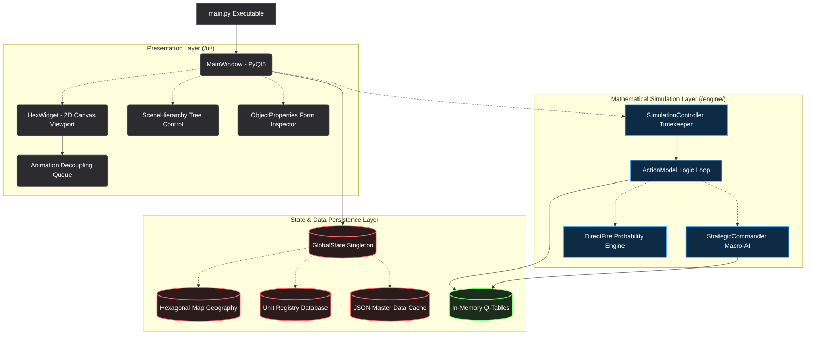
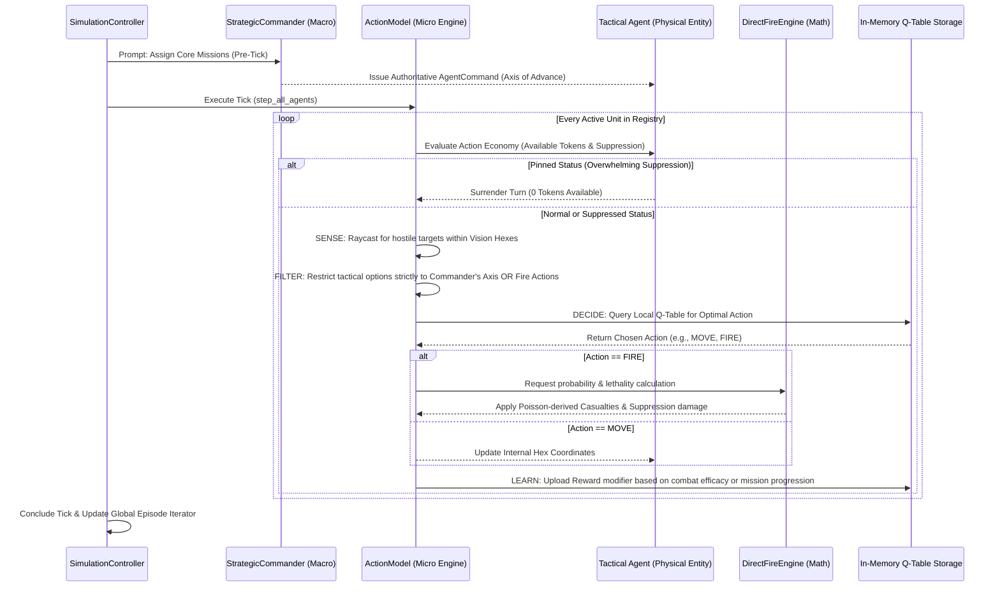
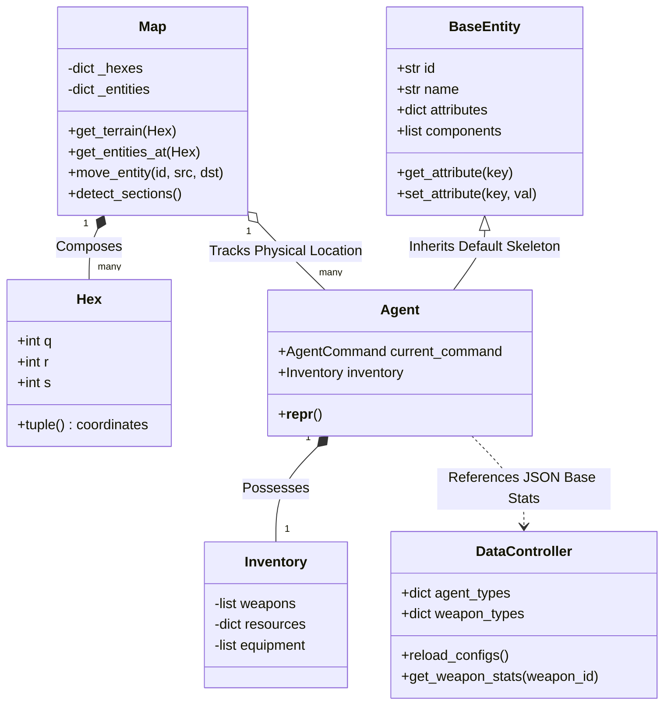

# Wargame Engine: System Interaction & UML Diagrams

This document utilizes Mermaid.js to visually articulate the data flow, complex hierarchical relationships, and precise timing loops of the Wargame Engine. It is intended to bridge the conceptual gap between high-level architecture and the specific Python implementations.

## 1. Engine Architecture (Module Interactivity)
This diagram illustrates the strict Dependency Inversion principle employed by the engine. The Presentation Layer (`/ui/`) is entirely dependent on the Simulation and State layers. Conversely, the Mathematical Simulation (`/engine/`) is completely ignorant of the UI's existence.

---

## 2. The Reinforcement Learning (RL) Event Loop
This sequence diagram visualizes the exact chronological operations occurring within a fraction of a millisecond during a single Simulation "Tick". It highlights the authoritative dynamic between the Macro Commander and the Tactical Agent.

---

## 3. Core Class UML & Entity Relationships
This diagram represents the foundational Python Object relationships orchestrating the physical map geometry, static JSON configurations, and the live, active combat units deployed during a session.

